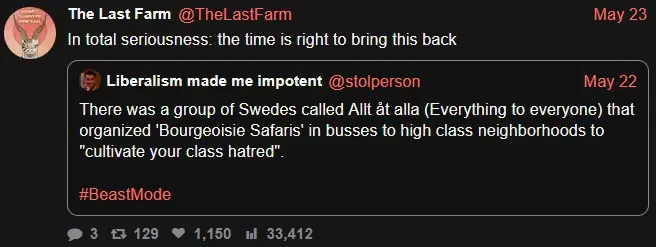

## Spotlight

### Labour Day 2026

A worker-controlled tech paradise with good music, spicy snacks, and working conditions that bring flourishing while sharing all profits. Are we there yet? Eeerrrm … maybe in 2026 not quite. All the more important to celebrate working people on May Day! This year Techwerkers joined a big parade in Amsterdam with flags, flyers, a [worker sound system](https://youtu.be/CNBmrznjm2w?si=IbwQ0Ohe30EsISIi&t=830), and of course all the necessary casual banter. Power to everyone who joined!

Make it louder still next year? ♡

### Call for input: Future perspectives

What would your dream future for (tech) workers in the Netherlands be? A 15-hour work week? Worker co-ops? Fully automated luxury queer space communism? Strategic change requires a vision. Techwerkers has been germinating for a bit now as a community for people in tech in the Netherlands. A bunch of workers feel it’s time to step up and formulate more clearly what real material changes we want to see. You’re needed in all this!

[Share your vision](mailto:hey@techwerkers.nl?subject=Vision)

<figcaption style="text-align: center;"><i>Anthropic’s revenue will compose 100% of global GDP by 2028. Can’t argue with facts.</i></figcaption>

## Upcoming events

Join one of the upcoming events to meet up with other tech workers:

- 2 June, 5:30-6:30 pm - Techwerkers Vision formulation (option 1), online
- 4 June, 3:00-4:00 pm - Techwerkers Vision formulation (option 2), online
- 5 June, 3:00-3:30 pm - [Friday Fika](https://events.techwerkers.nl/event/friday-fika-or-vrijdagsfika-8), online
- 7 June, 2:00-4:00: [Walk in the Japanese Gardens](https://events.techwerkers.nl/event/japanese-gardens-walk-or-wandeling-japanse-tuin), The Hague
- 8 June, 7:00 pm: [Organizing meetup](https://events.techwerkers.nl/event/organizing-meetup-or-organisatiebijeenkomst-10), online
- 9 June: [National Data Center Day 2026](https://events.techwerkers.nl/event/national-data-center-day-or-nationale-datacentrumdag-2026), ‘s Hertogenbosch or Amsterdam (btw are you attending the open day? [Come chat](mailto:hey@techwerkers.nl) 😉)
- 12 June, 3:00-3:30 pm - Friday Fika, online
- 19 June, 3:00-3:30 pm - Friday Fika, online
- 22 June, 7:00 pm: Organizing meetup, online
- 23 June, 7:00 pm: [Book Club: The Art of War by Sun Tzu](https://events.techwerkers.nl/event/book-club-or-boekenclub-the-art-of-war), online
- 26 June, 3:00-3:30 pm - Friday Fika, online

Do you know of an event that fellow tech workers might be interested in? [Add it to the calendar!](https://events.techwerkers.nl/)

<figcaption style="text-align: center;"><i>Ready for a safari tour through Wassenaar?</i></figcaption>

## On the radar

Some of the news items that tech workers have been following in the past month:

- [In a new advisory opinion](https://www.icj-cij.org/sites/default/files/case-related/191/191-20260521-adv-01-00-en.pdf), the International Court of Justice in Den Haag confirms that workers’ right to strike is protected under the Freedom of Association and Protection of the Right to Organize Convention of 1948. This means that in collective negotiations with your boss, you have the [protected right to withhold your labour](https://www.commondreams.org/news/icj-right-to-strike) as a pressure mechanism.
- Labour unions [FNV, CNV and VCP confirmed](https://nltimes.nl/2026/05/11/unions-warn-strikes-dutch-government-pushes-welfare-cuts) that workers across sectors are planning **nationwide strikes if the Dutch government proceeds with cuts to social security**, including to unemployment benefits (WW), disability benefits (WIA), and state pension (AOW). Industrial action is due to [kick off on 24 June](https://nltimes.nl/2026/05/20/netherlands-public-transport-strike-grind-commuter-services-halt-june) with a strike by public transport workers.
- Using the pressure tactic of an 18-day strike, the **Samsung Electronics Labor Union** negotiated an agreement to [share the company’s operating profits](https://www.dw.com/en/samsung-avoids-strike-as-workers-approve-massive-bonus-deal/a-77307043) with its workers and guarantee annual raises for the coming 10 years.

<figcaption style="text-align: center;"><i>Samsung workers won their share of the company’s profits</i></figcaption>

- After months of dithering, the Dutch government has finally [blocked the US takeover of the Dutch online authentication system DigiD](https://www.politico.eu/article/netherlands-blocks-us-takeover-vital-digital-supplier/). It should never have come this far.
- The [Autoriteit Persoonsgegevens (Dutch data protection authority) appoints Geert Potjewijd,](https://nos.nl/artikel/2614241-advocaat-van-tiktok-en-meta-wordt-voorzitter-privacywaakhond-ap) a lawyer who’s represented big tech companies including TikTok, Meta, and Uber against claims of data misuse, as its new chair. Hence don’t count on authorities when it comes to protecting your data.
- Speaking of protecting your data, how about scheduling a digital cleanup for June? The Tech Reclaimers Club has some pointers on how to [reclaim control over your digital life, devices, services and data](https://www.techreclaimers.club/).
- Workers’ nervousness about the impact of AI on their jobs, life, and future is [fertile ground for populism](https://www.savageminds.co/p/ai-populism-is-coming), British author Joseph Gelfer warns. Can you step in? If you’re looking for inspiration, the [AI Resist List](https://airesistlist.org/) is a list with 30+ examples of actions that you can take to push back against AI.
- Even Pope Leo XIV has spoken out against AI, in their [40,000+ word treatise _Magnifica Humanitas_](https://www.vatican.va/content/leo-xiv/en/encyclicals/documents/20260515-magnifica-humanitas.html). ([Here’s a summary](https://time.com/article/2026/05/25/pope-leo-encyclical-ai-magnifica-humanitas/) if you’re in a rush.) The Pope’s condemning AI opens the way for anyone who holds the Roman Catholic religion to claim **conscientious objection to working with generative AI.** It's literally the head of the Catholic church who says so.
- In a time where [streaming platforms are killing music](https://techwerkers.nl/en/posts/music-as-art/), what could be better than good old peer-to-peer (P2P) file sharing? Some tech workers recently set up [FriendNet server](https://friendnet.org/) to spread the joy. Reach out if you’d like to get involved!
- [In memoriam Karin Spaink](https://www.spaink.net/2026/05/08/exit-spaink/) (1957-2026), founder of Bits of Freedom 🖤 In their final blog post, Spaink writes:

> “I mostly wish you lots of love, courage, wisdom and meaningful resistance in the tough times ahead, both politically and ecologically, and also in terms of fake news, [surveillance and AI](https://www.linkedin.com/feed/update/activity:7441171601691172864/). Know that you _never_ have to give (or tolerate) more than you personally want to or can bear. You’re _always_ allowed to set your own limits, and live by those – or die for them.”

<figcaption style="text-align: center;"><i>Karin Spaink in 1991 (pic by Gon Buurman)</i></figcaption>

## Articles of note

Tech workers discussed the following articles during recent book club meetups:

### [The Fetishism of AI](https://monthlyreview.org/articles/the-fetishism-of-ai/) 
_Monthly Review,_ May 2026  

John Bellamy Foster argues that under ‘computational capitalism’ (hey, another flavour of capitalism!), such a large portion of the global economy is enmeshed with the AI and data centre hype, such that when—not if—the bubble bursts, it’ll drag the rest of the economy with it into a global recession; all the while it doesn’t even create anything of material value.

### [At the 20th Collective Study Session of the CCP Central Committee Politburo, Xi Jinping Stresses: Persist in Being Self-Reliant, Be Strongly Oriented Toward Applications, and Push the Orderly Development of Artificial Intelligence](https://cset.georgetown.edu/publication/xi-politburo-collective-study-ai-2025/) 
Xinhua News Agency, April 2025  

The study session concluded that AI technology can be a public good that enriches humanity, as long is it’s used for discovery in science and technology, paired with stimulating education at all levels, and takes place within an internationally agreed set of (global) governance frameworks, standards, and norms.

---

That's it for now!

Is there something you’d like to share, like a cool book, inspiring video, or cute anti-capitalist cat meme? Yes please! Send it to `hey@techwerkers.nl`, or drop a message on [Mastodon](https://mastodon.nl/@techwerkers), [LinkedIn](https://www.linkedin.com/company/techwerkers-nl/posts/?feedView=all), [Bluesky](https://bsky.app/profile/techwerkers.bsky.social), or [Instagram](https://www.instagram.com/techwerkers).
