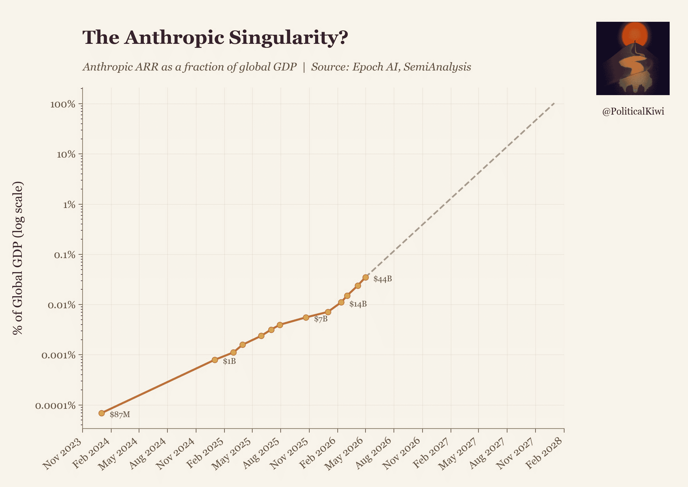
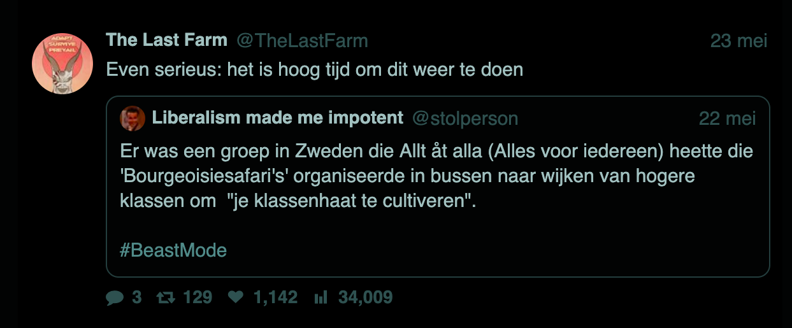

## Uitgelicht

### Dag van de Arbeid(er) 2026

Een techparadijs met goede muziek, pittige snacks, heerlijke arbeidsomstandigheden waarbij alle winst wordt gedeeld. Zijn we er al? Ehhm... misschien in 2026 nog niet helemaal. Des te belangrijker om op 1 mei werkende mensen te vieren! Dit jaar deed Techwerkers mee aan een grote parade in Amsterdam met vlaggen, sticker, [een eigen geluidssysteem](https://youtu.be/CNBmrznjm2w?si=IbwQ0Ohe30EsISIi&t=830) en natuurlijk het nodige gezellige geklets. Hulde aan iedereen die meedeed!

Volgend jaar nog luider? ♡

### Oproep: Jouw toekomstvisie voor werkers

Hoe ziet jouw droomtoekomst voor (tech)werkers in Nederland eruit? Een 15-urige werkweek? Werkerscoöperaties? Volledig geautomatiseerd, luxueus, _queer_ ruimtecommunisme? Strategische verandering vereist een visie. Techwerkers bubbelt al een tijdje als gemeenschap voor mensen in tech in Nederland. Sommige werkers achten het nu tijd om de handen uit de mouwen te steken voor materiële verandering. Jij bent hierbij nodig!

[Deel je visie](mailto:hey@techwerkers.nl?subject=Visie)

<figcaption style="text-align: center;"><i>De omzet van Anthropic zal in 2028 100% van het wereldwijde BBP uitmaken. Feiten zijn feiten.</i></figcaption>

## Aankomende activiteiten

Ontmoet andere techwerkers bij één van de aankomende activiteiten:

- 2 juni, 17:30-18:30 uur - Techwerkersvisieformulering (tijdsvak 1), online
- 4 juni, 15:00-16:00 uur - Techwerkersvisieformulering (tijdsvak 2), online
- 5 juni, 15:00-15:30 uur - [Vrijdagsfika](https://events.techwerkers.nl/event/friday-fika-or-vrijdagsfika-8), online
- 7 juni, 14:00-16:00 uur: [Wandeling in de Japanse Tuinen](https://events.techwerkers.nl/event/japanese-gardens-walk-or-wandeling-japanse-tuin), Den Haag
- 8 juni, 19:00 uur: [Organisatiebijeenkomst](https://events.techwerkers.nl/event/organizing-meetup-or-organisatiebijeenkomst-10), online
- 9 juni: [Nationale Datacenterdag 2026](https://events.techwerkers.nl/event/national-data-center-day-or-nationale-datacentrumdag-2026), Hertogenbosch of Amsterdam (ga je naar deze open dag? [Kom even kletsen](mailto:hey@techwerkers.nl) 😉)
- 12 juni, 15:00-15:30 uur - Vrijdagsfika, online
- 19 juni, 15:00-15:30 uur - Vrijdagsfika, online
- 22 juni, 19:00 uur: Organisatiebijeenkomst, online
- 23 juni, 19:00 uur: [Boekenclub: _De Kunst van de Oorlog_, van Sun Tzu](https://events.techwerkers.nl/event/book-club-or-boekenclub-the-art-of-war), online
- 26 juni, 15:00-15:30 uur - Vrijdagsfika, online

Weet je nog een evenement dat andere techwerkers misschien zou interesseren? [Voeg het toe!](https://events.techwerkers.nl/)

<figcaption style="text-align: center;"><i>Klaar voor een safaritocht door Wassenaar?</i></figcaption>

## Op de radar

Een paar nieuwtjes die techwerkers de afgelopen maand tegenkwamen:

- [In een nieuw advies](https://www.icj-cij.org/sites/default/files/case-related/191/191-20260521-adv-01-00-en.pdf) bevestigt het Internationaal Gerechtshof in Den Haag dat het recht van werkers om te staken wordt beschermd door het Verdrag Inzake de Vrijheid van Vereniging en de Bescherming van het Recht om zich te Organiseren van 1948. Dit betekent dat je tijdens collectieve onderhandelingen met je baas het [beschermde recht hebt om je werk neer te leggen](https://www.commondreams.org/news/icj-right-to-strike) als drukmiddel.
- Vakbonden [FNV, CNV en VCP bevestigden](https://nltimes.nl/2026/05/11/unions-warn-strikes-dutch-government-pushes-welfare-cuts) dat werkers in alle sectoren van plan zijn om **landelijk te staken als de Nederlandse overheid doorgaat met het uithollen van de sociale zekerheid**, waaronder de werkloosheidsuitkering (WW), de arbeidsongeschiktheidsuitkering (WIA) en het staatspensioen (AOW). De actie zal naar verwachting [op 24 juni van start gaan](https://nltimes.nl/2026/05/20/netherlands-public-transport-strike-grind-commuter-services-halt-june) met een staking van openbaarvervoerswerkers.
- Met een 18-daagse staking als drukmiddel heeft de **Samsung-electronicavakbond** een overeenkomst bereikt om de winst van het bedrijf te delen met de werkers en jaarlijkse loonsverhogingen voor de komende 10 jaar te garanderen.

<figcaption style="text-align: center;"><i>Werkers bij Samsung wonnen hun deel van de bedrijfswinst</i></figcaption>

- Na maandenlang getreuzel heeft de Nederlandse overheid eindelijk [de Amerikaanse overname van het Nederlandse online authenticatiesysteem DigiD geblokkeerd](https://www.politico.eu/article/netherlands-blocks-us-takeover-vital-digital-supplier/). Het had nooit zover moeten komen.
- De [Autoriteit Persoonsgegevens](https://nos.nl/artikel/2614241-advocaat-van-tiktok-en-meta-wordt-voorzitter-privacywaakhond-ap) benoemt Geert Potjewijd, een advocaat die grote techbedrijven zoals TikTok, Meta en Uber heeft verdedigd in zaken over gegevensmisbruik, tot haar nieuwe voorzitter. Reken dus niet op de autoriteiten als het gaat om de bescherming van je gegevens.
- Over gegevensbescherming gesproken, wat dacht je ervan om in juni een digitale opschoonactie te plannen? De Tech-terugclaimclub geeft tips over hoe je [de controle over je digitale leven, apparaten, diensten en gegevens terug kunt grijpen](https://www.techreclaimers.club/).
- Veel werkers zijn nerveus over de impact van AI op hun banen, leven en toekomst. Da’s [een vruchtbare bodem voor populisme](https://www.savageminds.co/p/ai-populism-is-coming), waarschuwt de Britse auteur Joseph Gelfer. Kun jij ingrijpen? Als je inspiratie zoekt, de [AI-verzetslijst](https://airesistlist.org/) noemt meer dan 30 voorbeelden van wat je kunt doen om je tegen AI te verzetten.
- Zelfs paus Leo XIV heeft zich uitgesproken tegen AI, in zijn [meer dan 40.000 woorden-tellende traktaat _Magnifica Humanitas_](https://www.vatican.va/content/leo-xiv/en/encyclicals/documents/20260515-magnifica-humanitas.html). ([Hier is een samenvatting](https://time.com/article/2026/05/25/pope-leo-encyclical-ai-magnifica-humanitas/) als je haast hebt.) De veroordeling van AI door de paus maakt het voor iedereen die het rooms-katholieke geloof aanhangt mogelijk om zich te beroepen op **gewetensbezwaren tegen het werken met generatieve AI.** Het is letterlijk het hoofd van de katholieke kerk die dit zegt.
- In een tijd waarin [afspeelplatforms muziek om zeep helpen](https://techwerkers.nl/nl/posts/music-as-art/), wat is er leuker dan ouderwets peer-to-peer (P2P) bestanden delen? Een aantal techwerkers heeft onlangs een [FriendNet-server](https://friendnet.org/) opgezet om de vreugde te verspreiden. Neem contact op als je mee wilt doen!
- [In memoriam Karin Spaink](https://www.spaink.net/2026/05/08/exit-spaink/) (1957-2026), oprichter van Bits of Freedom 🖤 In diens laatste blogpost schrijft Spaink:

> “Ik wens jullie vooral veel liefde, moed, wijsheid en zinnig verzet toe in de barre tijden die in aantocht zijn, zowel politiek en ecologisch als qua nepnieuws, [surveillance en AI](https://www.linkedin.com/feed/update/activity:7441171601691172864/). Besef daarbij dat je _nooit_ meer hoeft in te leveren (of te verdragen) dan je zelf wilt of aankunt. Je mag _altijd_ je eigen grenzen stellen, en daarnaar leven – of ervoor sterven.”

<figcaption style="text-align: center;"><i>Karin Spaink in 1991 (foto door Gon Buurman)</i></figcaption>

## Markante artikelen

Techwerkers bespraken de volgende artikelen tijdens recente bijeenkomsten van de boekenclub:

### [Het fetisjisme van AI](https://monthlyreview.org/articles/the-fetishism-of-ai/) 
_Monthly Review,_ mei 2026

John Bellamy Foster betoogt dat onder het ‘computationeel kapitalisme’ (hé, alweer een nieuwe kapitalisme-variant!) een zo groot deel van de wereldeconomie verweven is met de hype rond AI en datacentra, dat wanneer—niet als—de bubbel barst, de rest van de economie meegesleurd zal worden in een wereldwijde recessie; en dat alles zonder ook maar iets van materiële waarde te creëren.

### [Tijdens de 20e collectieve studiebijeenkomst van het Politbureau van het Centraal Comité van de CCP benadrukt Xi Jinping: Blijf zelfredzaam, wees sterk gericht op toepassingen en stimuleer de ordelijke ontwikkeling van kunstmatige intelligentie](https://cset.georgetown.edu/publication/xi-politburo-collective-study-ai-2025/) 
Xinhua Nieuwsbureau, april 2025  

De studiebijeenkomst concludeerde dat AI-technologie een gemeenschappelijk goed kan zijn dat de mensheid verrijkt, zolang het wordt gebruikt voor ontdekkingen in wetenschap en technologie, in combinatie met het stimuleren van onderwijs op alle niveaus, en zolang het plaatsvindt binnen een internationaal overeengekomen reeks (wereldwijde) bestuurskaders, standaarden en normen.

---

Da's alles voor nu!

Heb je iets dat je wilt delen, bijvoorbeeld een leuk boek, een inspirerende video of een schattige anti-kapitalistische kattenmeme? Ja graag! Mail naar `hey@techwerkers.nl`, of stuur een bericht via [Mastodon](https://mastodon.nl/@techwerkers), [LinkedIn](https://www.linkedin.com/company/techwerkers-nl/posts/?feedView=all), [Bluesky](https://bsky.app/profile/techwerkers.bsky.social) of [Instagram](https://www.instagram.com/techwerkers).
