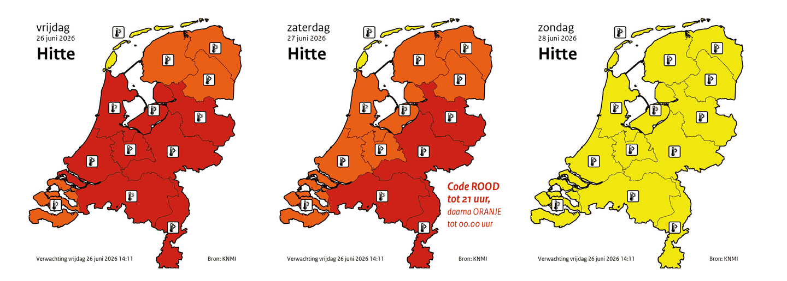
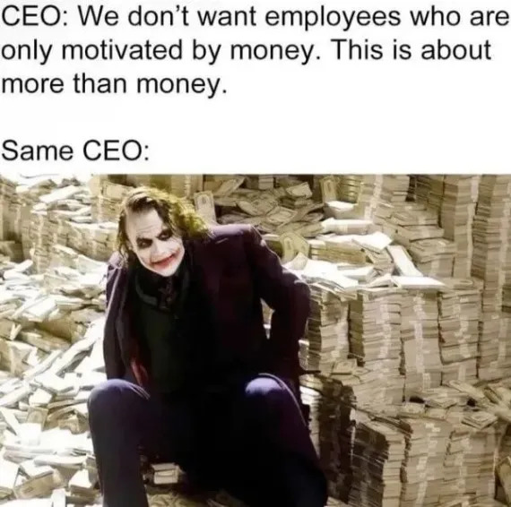
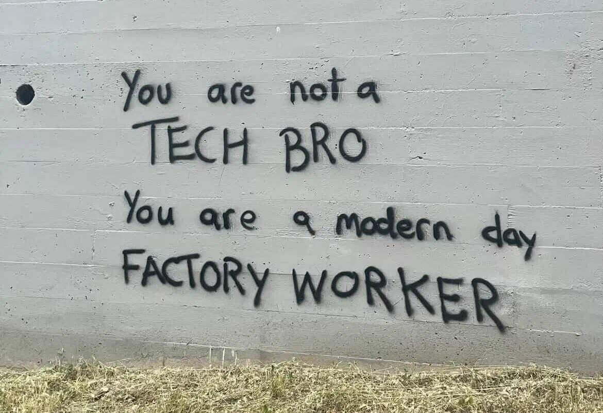
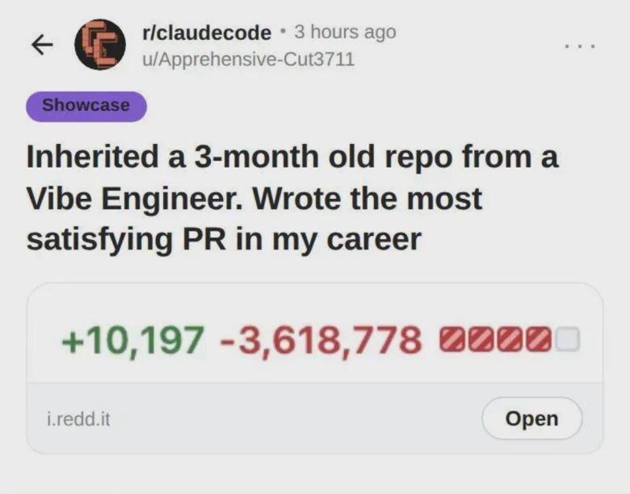

## Te warm om te werken. Hittestaking dan maar?

Hoe ga je om met de hitte? Terwijl ik dit schrijf, loopt de temperatuur binnenshuis op tot bijna 28 °C, wat [volgens het Arboportaal](https://www.arboportaal.nl/vraag-en-antwoord/alle-vragen-en-antwoorden/wat-is-te-warm) de maximale temperatuur is om veilig 'licht kantoorwerk binnenshuis' te verrichten. Als je werk bestaat uit het leggen van glasvezelkabels of andere vormen van zeer inspannende fysieke arbeid, dan mag je maximaal werken bij temperaturen van 23 °C (of 25 °C als er een flinke wind staat). (Let wel, dit zijn *aanbevolen* temperaturen, geen wettelijk bindende maxima.)

<figcaption style="text-align: center;"><i>Voorspelling van gevaarlijke hittegolf van het KNMI voor eind juni 2026</i></figcaption>

Werken in een te warme werkomgeving kan gevaarlijk zijn. Uitputting kan ervoor zorgen dat jij en je collega's zich niet meer kunnen concentreren, wat kan leiden tot fouten en letsel. [Je loopt risico op hitte-gerelateerde aandoeningen](https://www.arboportaal.nl/onderwerpen/fysische-factoren/warmte) zoals uitdroging, een hitteberoerte of zelfs overlijden. Hitte wordt voor veel werkers in Nederland een dagelijks arbeidsrisico, en realistisch gezien zal het alleen maar erger worden.

Als het te warm is op je werk, kan je baas verplicht zijn [maatregelen te nemen](https://www.arboportaal.nl/onderwerpen/fysische-factoren/warmte/wat-zegt-de-wet), zoals: het aanbieden van persoonlijke beschermingsmiddelen, gekoelde dranken, of het inkorten of zelfs helemaal schrappen van de werkdag. Je mag de arbodienst raadplegen over deze maatregelen.

Maar wat als je baas niets doet? In het Verenigd Koninkrijk pleit een coalitie van vakbonden en milieuorganisaties, waaronder het Trades Union Congress, de Bakers, Food and Allied Workers Union, de Fire Brigades Union en Extinction Rebellion, voor wettelijk bindende maximumtemperaturen en [roepen ze werkers op tot een hittestaking](https://www.thecanary.co/uk/news/2026/06/24/heat-strike-coalition/) als de temperatuur boven een bepaald niveau stijgt. Idee?

<figcaption style="text-align: center;"><i>Bazen blijven bazen</i></figcaption>

## Agenda

Wil je andere techwerkers ontmoeten? Sluit je aan bij een van de komende evenementen:

- 2 juli, 19.30 uur: [Zomerboekenclub: *A Radical Enterprise*](https://events.techwerkers.nl/event/radically-collaborative-self-organizing-or-summer-2026-reading-group), ch. 1 + inleiding, online
- 3 juli, 15.00 uur: [Vrijdagsfika](https://events.techwerkers.nl/event/friday-fika-or-vrijdagsfika-16), online
- 3-5 juli: [tbd NOTACAMP](https://tbd.camp/), Het Groene Veld, Amsterdam
- 6 juli, 19.00 uur: [Organisatiebijeenkomst](https://events.techwerkers.nl/event/organizing-meetup-or-organisatiebijeenkomst-12), online
- 9 juli, 19.30 uur: [Zomerboekenclub: *A Radical Enterprise*](https://events.techwerkers.nl/event/radically-collaborative-self-organizing-or-summer-2026-reading-group), ch. 2, online
- 10 juli, 15.00 uur: [Vrijdagsfika](https://events.techwerkers.nl/event/friday-fika-or-vrijdagsfika-17), online
- 16 juli, 19.30 uur: [Zomerboekenclub: *A Radical Enterprise*](https://events.techwerkers.nl/event/radically-collaborative-self-organizing-or-summer-2026-reading-group), ch. 3, online
- 17 juli, 15.00 uur: [Vrijdagsfika](https://events.techwerkers.nl/event/friday-fika-or-vrijdagsfika-18), online
- 20 juli, 19.00 uur: [Organisatiebijeenkomst](https://events.techwerkers.nl/event/organizing-meetup-or-organisatiebijeenkomst-13), online
- 23 juli, 19.30 uur: [Zomerboekenclub: *A Radical Enterprise*](https://events.techwerkers.nl/event/radically-collaborative-self-organizing-or-summer-2026-reading-group), ch. 4, online
- 24 juli, 15.00 uur: [Vrijdagsfika](https://events.techwerkers.nl/event/friday-fika-or-vrijdagsfika-19), online
- 30 juli, 19.30 uur: [Zomerboekenclub: *A Radical Enterprise*](https://events.techwerkers.nl/event/radically-collaborative-self-organizing-or-summer-2026-reading-group), ch. 5, online
- 31 juli, 15.00 uur: [Vrijdagsfika](https://events.techwerkers.nl/event/friday-fika-or-vrijdagsfika-20), online

Voeg ook gerust interessante evenementen toe [aan de kalender](https://events.techwerkers.nl/).

## Nieuwe video en artikel

### Neem je tech terug!

Leer hoe u afstand kunt nemen van de grote technologieplatforms en uw gezond verstand, privacy en controle over uw gegevens kunt terugwinnen. Van zoekmachines tot messengers tot het beheren van uw eigen e-mail. Een nieuwe videogids om u op weg te helpen.

[Bekijk de video](https://techwerkers.nl/nl/resources/reclaim-your-tech/)

### Er is geen 'midden' tussen werken en bezitten

Hoe komt het dat veel techwerkers zichzelf niet echt als werkers zien? Dit artikel duikt in de verderfelijke ‘mythe van de middenklasse’: het idee dat er een klassecategorie bestaat tussen die van *werker* en *eigenaar*, waarbij er altijd maar één startup verwijderd is van het worden van miljonair. En raad eens? Het is een afleidingstrucje.

[Lees het artikel](https://techwerkers.nl/nl/posts/myth-of-middle-class/)

<figcaption style="text-align: center;"><i>Ah! De geneugten van een goede schoonmaakbeurt</i></figcaption>

## Op de radar

Enkele nieuwskruimels die deze maand de aandacht van techwerkers trokken:

- Staakt! Werkers bij zuivelhandelaar [FrieslandCampina Leeuwarden](https://effat.org/in-the-spotlight/friesland-campina-leeuwarden-workers-strike-for-fair-compensation/) staken voor een loonsverhoging van 4%, werkers bij slijterij [Gall & Gall](https://www.asatunews.co.id/en/gall-gall-employees-strike-sunday-pay) tegen een ca. 5% loonsverlaging, en [openbaar vervoerwerkers](https://nltimes.nl/2026/06/19/ns-trains-4-hours-wednesday-workers-strike-social-benefits-cuts) tegen voorgestelde bezuinigingen op de sociale zekerheid.
- Het kantoor van de studentenvakbond [ASVA in Amsterdam werd vernield](https://techwerkers.nl/nl/posts/asva-aanval-studentenvakbond/) in de vroege uren van zaterdag 21 juni. ASVA-voorzitter Sahand Mozdbar vermoedt dat de aanval doelgericht was, maar gaf aan dat de werker zich niet laten intimideren.
- Vakbondsgeschiedenis: Middelbare scholier Christian Martina interviewt werker Wim van Seeters over diens rol in het [1969 protest van werkende vakbondsjongeren in Den Haag](https://vakbondshistorie.nl/dossiers/wim-van-seeters-over-de-kwj/), voor het recht op onderwijs en beter loon.
- Als LLM's mensachtige eigenschappen hebben, dan [dat geldt ook voor Age of Empires II](https://arxiv.org/pdf/2605.31514).
- Moet je je identificeren tegenover de staat? Maak eerst maar eens een Google-account of Apple ID aan. Althans… [dat vindt de Nederlandse overheid prima voor NL Wallet](https://archive.is/aR8YC), de vermeende opvolger van het huidige DigiD-systeem.
- [Noorwegen verbiedt het gebruik van LLM's](https://www.security.nl/posting/941488/Noorwegen+verbiedt+AI+in+basisonderwijs%3A+%27Kinderen+moeten+eigen+antwoorden+vinden%27) in het basisonderwijs, want 'Kinderen moeten hun eigen antwoorden vinden'.
- Wie vertraagt ​​loontransparantie? [Nederland vertraagt loontransparantie!](https://www.etuc.org/en/pressrelease/just-three-countries-meet-pay-transparency-deadline) (tot minimaal 2027)
- [Het Ministerie van Defensie gaat partnerschappen aan met instellingen voor hoger onderwijs](https://konfrontatie.nl/thema-s/oorlog-en-ontwapening/militarisering-van-het-onderwijs) om meer studenten het leger in te werven. De Algemene Onderwijsbond neem maar geen standpunt in.
- Miljarden uitgeven aan wapens, maar [zogenaamd 'geen geld' heeft om het huidige luchtalarmsysteem in stand te houden](https://www.security.nl/posting/940003/Kabinet+gaat+luchtalarm+vervangen+door+'nieuw+innovatief+sirenenetwerk')?
- De Bijstandsbond voor mensen met een laag inkomen [wordt dit jaar 50](https://solidariteit.nl/overgenomen/2026/o566-2_sociale-solidariteit-is-een-keuze.html). Gefeliciteerd!

Da's alles voor nu! techwerkers verenig je ✌️

<i>✧･ﾟ* geschreven door mensen *･ﾟ✧</i>

