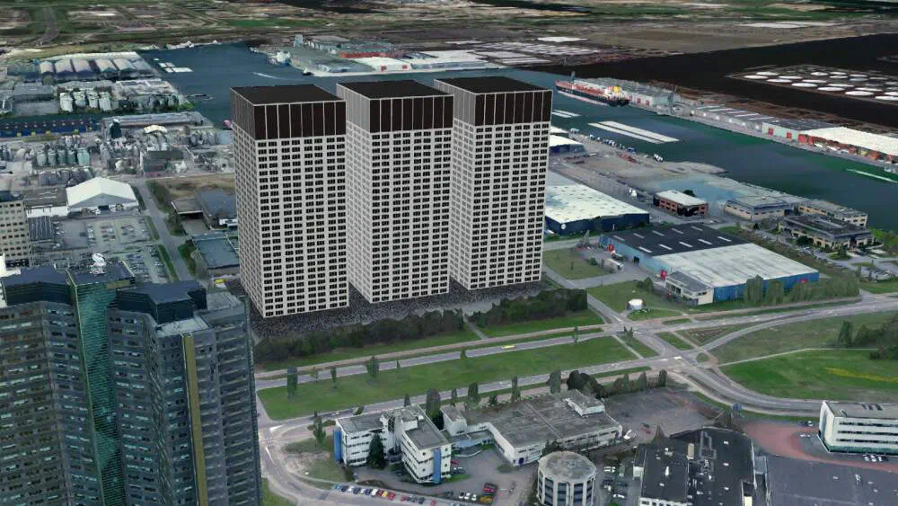
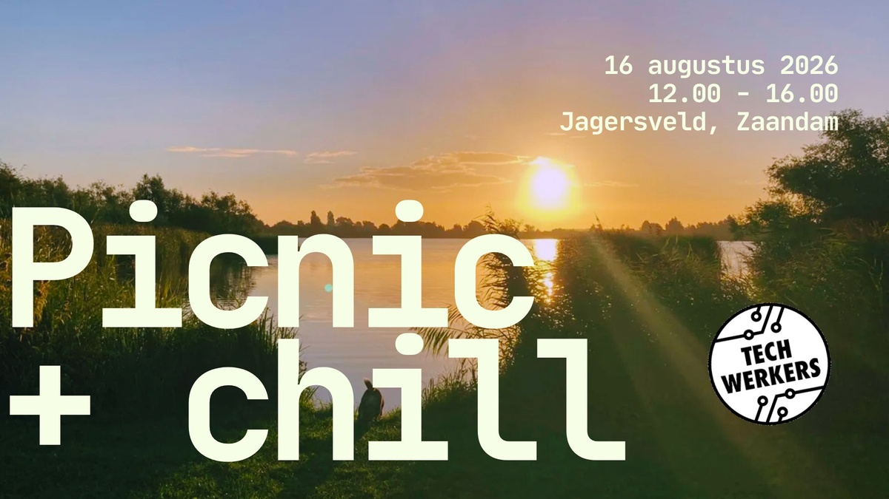
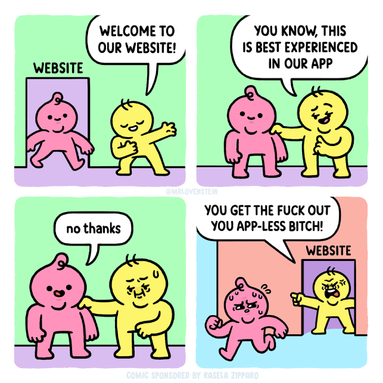
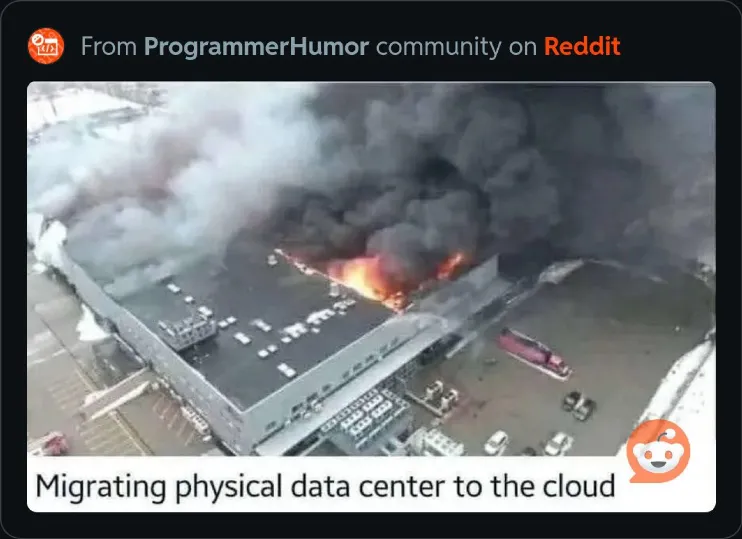
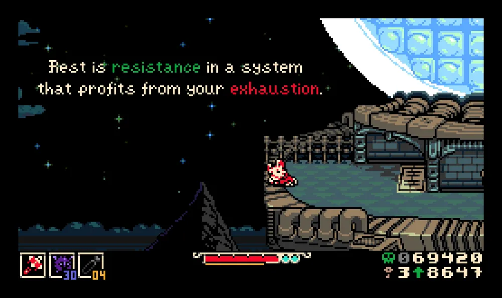

[COVER IMAGE]

## Nieuw

### ‘We gebruikten zuur om de bouw van Microsoft hyperscale datacentrum te saboteren’

Temidden van groeiend verzet van werkers tegen AI-faciliteiten in Nederland, valt klimaatactiegroep Extinction Rebellion de bouwplaats van een Microsoft-datacentrum in Amsterdam aan.

[Lees het stuk](https://techwerkers.nl/en/posts/aanval-microsoft-ai-datacentrum/)

### Kom naar de picknick op 16 augustus

Kom een ​​ontspannen middag doorbrengen met andere techwerkers. Om 14.00 uur is er een optionele *onconferentie* (= geïmproviseerde, doe-het-zelf-conferentie) over elk tech-gerelateerd onderwerp dat je maar wilt. Neem gerust een collega, partner, kind, vriend of huisdier mee. Alleen geen bazen, mensen-managers of stakingsbrekers 🙂

[Bekijk activiteit](https://events.techwerkers.nl/event/picnic-chill)

<figcaption style="text-align: center;"><i>Hulde aan de app-loze b*tches</i></figcaption>

## Agenda

Wil je andere techwerkers ontmoeten? Doe mee aan een van de aankomende activiteiten:

- 3 augustus, 19.00-20:00 uur - [Organisatiebijeenkomst](https://events.techwerkers.nl/event/organizing-meetup-or-organisatiebijeenkomst), online
- 4 augustus, 19.00 uur - Strategiewerkgroep: Doeleninfosessie, online
- 6 augustus, 19.30 uur - [Zomerboekenclub: *A Radical Enterprise*](https://events.techwerkers.nl/event/radically-collaborative-self-organizing-or-summer-2026-reading-group), hoofdstuk 6, online
- 7 augustus, 3:00 uur - [Friday Fika](https://events.techwerkers.nl/event/friday-fika-or-vrijdagsfika-21), online
- 14 augustus, 15.00 uur - [Vrijdagsfika](https://events.techwerkers.nl/event/friday-fika-or-vrijdagsfika-22), online
- 16 augustus, 12.00-16.00 uur - [Picnic + chill](https://events.techwerkers.nl/event/picnic-chill), Jagersveld, Zaandam. Inclusief een onconferentie (nomineer je favoriete onderwerpen!) en de afsluitende sessie van de [zomerboekenclub over](https://www.techwerkers.nl/en/posts/summer-reading-2026/) [_A Radical Enterprise_](https://events.techwerkers.nl/event/radically-collaborative-self-organizing-or-summer-2026-reading-group)
- 17 augustus, 19.00 uur - Organizing meetup, online
- 21 augustus, 15.00 uur - [Vrijdagsfika](https://events.techwerkers.nl/event/friday-fika-or-vrijdagsfika-23), online
- 28 augustus, 15.00 uur - [Vrijdagsfika](https://events.techwerkers.nl/event/friday-fika-or-vrijdagsfika-24), online
- 31 augustus, 19.00 uur - [Organisatiebijeenkomst](https://events.techwerkers.nl/event/organizing-meetup-or-organisatiebijeenkomst), online

Voeg gerust je eigen interessante activiteiten toe [aan de agenda](https://events.techwerkers.nl/).

<figcaption style="text-align: center;"><i>Zin in een datacentrummigratie?</i></figcaption>

## Op de radar

Wat nieuwtjes die deze maand de aandacht van techwerkers trokken:

- [Nederlandse werkplekken zijn niet voorbereid op veilig werken in de hitte](https://nltimes.nl/2026/07/11/dutch-workplaces-ready-rising-heat-labor-union-warns), lconcludeert vakbond CNV op basis van een enquête onder 1.500 werkers die op locatie werken.
- "Het is inherent aan een systeem als AI dat het je geobsedeerd wil krijgen (...). Dat moeten we voorkomen." Techwerker Olivia Guest en collega's [bekritiseren een op chatbots gerichte schrijfcursus van de Radboud Universiteit](https://www.voxweb.nl/en/scientists-critical-of-radbouds-into-languages-ai-courses-language-centre-emphasises-the-responsible-use-of-chatbots), welke niet voldoet aan academische normen en de expertise van werkers ondermijnt.
- Werkers in verschillende sectoren in Nederland leggen het werk neer uit protest tegen de door de overheid voorgestelde bezuinigingen op de sociale zekerheid. Op 3 juli [staakten werkers van grote bedrijven in de regio Eindhoven](https://www.bnr.nl/nieuws/economie/10605054/stakingsacties-bij-daf-en-asml-mensen-in-de-metaal-maken-zich-grote-zorgen), waaronder ASML en DAF. [Transportwerkers zijn van plan hetzelfde te doen](https://www.nu.nl/economie/6404936/heel-openbaar-vervoer-gaat-plat-door-staking-op-woensdag-9-september.html) op 9 september.
- Het Iraanse Revolutionaire Gardekorps heeft [de centrale datahub van Amazon in Bahrein vernietigd als vergelding voor Amerikaanse aanvallen op Iraanse infrastructuur](https://nitter.net/HormuzReport/status/2079449486527762876). De Revolutionaire Garde heeft 18 VS technologiebedrijven, waaronder Microsoft, Intel, Cisco en Google, geïnformeerd dat ze legitieme doelwitten zijn.
-  Werkers bij Wikimedia hebben zich verenigd in een vakbond. [Wikimedia zegt dat het vakbond niet vrijwillig zal erkennen.](https://www.404media.co/wikimedia-waits-until-after-its-massive-conference-to-say-it-wont-voluntarily-recognize-union/)
- "Ik ben ervan overtuigd dat er momenteel hele bedrijven zijn die lijden aan een zware AI-psychose en dat het onmogelijk is om daar rationele gesprekken over te voeren." Nikhil Suresh over hoe [de AI-manie de wereldwijde besluitvorming ondermijnt](https://ludic.mataroa.blog/blog/ai-mania-is-eviscerating-global-decision-making).
- Omdat ze niet kunnen voorkomen dat hun klanten naar de concurrentie overstappen, [waarschuwen aanbieders van gesloten-bron LLM-gereedschappen tegen het gebruik van open-gewicht-modellen](https://www.axios.com/2026/07/22/openai-anthropic-open-models-trump-china).
- Wist je dat de capaciteit van datacentra de vraag al [met een factor 15 overtreft](https://thenextrecession.wordpress.com/2026/07/23/ai-and-productivity/)? En toch willen bedrijven er in Nederland koste wat kost nóg meer gaan bouwen...
- Hoe kan informatie-terugvinden de maatschappij ten goede komen? [Presentatie](https://mastodon.social/@bmitra/117003838454044213) van Bhaskar Mitra die werkers in (AI-ondersteund) informatie-vinden aanmoedigt om zich meer bewust te zijn van de politieke dimensie van hun werk.
- Veel managers willen het gebruik AI verplichten. Wat ze niet weten is dat veel werkers de technologie juist actief vermijden, of zelfs saboteren. Hier een paar [tips over hoe je je kunt verzetten tegen LLM-verplichtingen](https://aftermath.site/ai-resistance-tips-workforce-llm-workers/).
- [Nieuwe Dahabflex](https://youtu.be/MDcM5tN00VU?si=i3mn7idagmuVBxtz) is uit!

<figcaption style="text-align: center;"><i>Image credit: Leftist gamer memes</i></figcaption>
