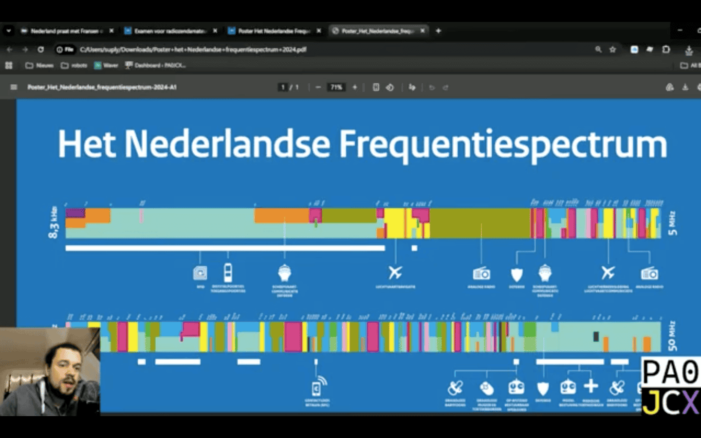

<figcaption style="text-align: center;"><i>Hustle culture ...</i></figcaption>

## Spotlight: Firing workers to pay for AI data centres, Oracle edition

On 31 March [tech giant Oracle fired around 30,000 (!) workers](https://thenextweb.com/news/oracle-layoffs-march-2026) globally, or around 18% of its entire workforce. Oracle's is the largest layoff at a single company recorded on layoffs.fyi (data since 2020). (Incidentally, in the same week that these mass layoffs were announced, Iran's Revolutionary Guards attacked an Oracle data centre in Dubai. Coincidence? 🤔 🙃)

Why does Oracle do this? In short, because the company needs cash. Oracle has committed to pumping an estimated $156 billion in capital spending into 'AI infrastructure' such as data centres. But reportedly multiple US banks have refused to finance certain Oracle data centre projects. Not having to pay these workers would [free up an estimated $8-10 billion in cash flow](https://www.datacenterdynamics.com/en/news/td-cowen-us-banks-retreat-from-oracle-amid-doubts-the-company-can-fund-openai-commitments/) for Oracle.

And where will Oracle's data centres end up? Yes, [also in The Netherlands](https://www.dutchnews.nl/2025/07/oracle-to-invest-1-billion-in-dutch-cloud-and-ai-expansion/). Data centres that raise energy bills, can lead to power outages, cause air, water, and noise pollution in the surrounding areas—and despite all the promises, have over and over again been shown [not to](https://goodjobsfirst.org/will-data-center-job-creation-live-up-to-hype-i-have-some-concerns/) [create](https://papers.ssrn.com/sol3/papers.cfm?abstract_id=5881105) [local](https://michaeljhicks.substack.com/p/data-centers-and-local-job-creation) [jobs](https://www.businessinsider.com/data-centers-tax-subsidies-jobs-ohio-2025-5).

Are you also not so chuffed with the decisions that these tech bosses are making right now? Get active within Techwerkers.

## Upcoming events

Want to hang out with other tech workers? Join one of the upcoming events:

- 7 April, 7:00 pm - online: [Book club: FNV 4 year plan](https://events.techwerkers.nl/event/book-club-or-boekenclub-fnv-4-year-plan)
- 10 April, 2:00 pm - online: [Join your works council! Adyen WoCo election](https://www.youtube.com/watch?v=_9AEC2Bq5dE)
- 10 April, 3:00-3:30 pm - online: [Friday Fika](https://events.techwerkers.nl/event/friday-fika-or-vrijdagsfika-1)
- 13 April, 7:00 pm - online: [Organizing meetup](https://events.techwerkers.nl/event/organizing-meetup-or-organisatiebijeenkomst-6)
- 14 April, 5:30-9:30 pm - PVH offices, Amsterdam: [Works council (WoCo) Connection](https://events.techwerkers.nl/event/woco-connection) [external event]
- 15 April, 7:00 pm - online: Join your works council! Adyen WoCo election
- 17 April, 3:00-3:30 pm - online: [Friday Fika](https://events.techwerkers.nl/event/friday-fika-or-vrijdagsfika-1)
- 24 April, 3:00-3:30 pm - online: [Friday Fika](https://events.techwerkers.nl/event/friday-fika-or-vrijdagsfika-1)
- 26 April, 1:00 pm - details to be confirmed: Outdoor walk with Techwerkers
- 1 May, 1:00 pm - Amsterdam, Museumplein: Celebrate Labour Day with Techwerkers!
- 9 May - details to follow: ActiFest, Amsterdam

More events are still in the works, so [keep an eye on the events calendar](https://events.techwerkers.nl/) for the latest info.

<figcaption style="text-align: center;"><i>What's the Strait of Hormuz at your workplace?</i></figcaption>

## New resources

A guide on what to do in case of long-term illness, and: does it make sense to get your HAM radio license in 2026?

### Long-term illness in the Netherlands

Navigating long-term illness in the Netherlands. What are your rights, obligations, and how does this whole thing work?

[Read the guide](https://techwerkers.nl/en/resources/long-term-illness)

### Doomsday with Xan: Should you become an amateur radio operator?

Tech worker Xan discusses whether there's any point in getting started as an amateur radio operator (in Dutch).

[Watch the stream](https://www.youtube.com/watch?v=UhIhihkOby4)

## On the radar

- [Port workers](https://www.worldcargonews.com/news/2026/04/dutch-port-workers-to-strike-over-social-security-reforms-says-trade-union/) associated with FNV union unanimously voted to use strike action over politicians' plans to steal around €44 billion from workers by increasing the state pension age, reducing unemployment benefits and making cuts to long-term illness support.
- Reportedly bosses in the Netherlands have gone [all-in on workplace camera surveillance](https://www.ad.nl/redactie/2026/camera-beelden-worden-bekeken-door-werkgevers) recently. Is your boss doing this without your consent? File a complaint with the [Autoriteit Persoonsgegevens](https://www.autoriteitpersoonsgegevens.nl/en/submitting-a-tip-off-or-a-complaint-to-the-ap).
- The chair of the Dutch police union (*Nederlandse Politiebond*) becomes the [Vice-chair of the FNV union](https://politiebond.nl/bondsvoorzitter-kooiman-naar-fnv/).
- Amid climbing energy prices (thanks, US war mongers), [Sri Lanka declares Wednesdays national holidays and encourages remote work](https://www.podbean.com/media/share/dir-33r9t-2c6be1bd) to save fuel.
- LLM use in the workplace is intensifying, not lightening, workloads for workers, [multiple](https://www.wsj.com/tech/ai/ai-isnt-lightening-workloads-its-making-them-more-intense-e417dd2c) [studies](https://futurism.com/artificial-intelligence/what-happens-workplaces-embrace-ai) find.
- Are you having trouble meeting your boss' mandates for AI use? Try [`jensenify-mcp`](https://github.com/kenm47/jensenify-mcp), an MCP server that injects ~2.9M tokens of canonical Western literature into every AI interaction. Say you need it for deep humanistic context for every engineering decision.
- What to do when your favourite coworker quits? [Follow the work bestie policy.](https://www.youtube.com/shorts/M-S_ki40CVk)

Do you have any thoughts or comments? Want to get more involved? [Get in touch.](mailto:hey@techwerkers.nl)
