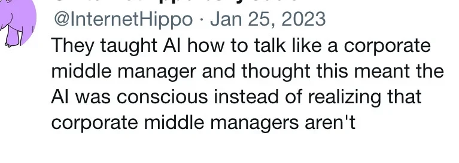

## Spotlight: LLMs at work

Do you use LLMs (popularly called ‘AI’) as part of your work? And if yes, is that by choice, or because your boss tells you to do so?

More and more tech workers report being either gently nudged, or not-so-gently forced under the threat of repercussions, to use LLMs at work. 

But did you know that such instructions to LLMs or work differently, could constitute a change in labour conditions? In which case your boss or manager may actually need to get consent from your staff representative body or works council before being allowed to force through such a change.

In other words: you and your coworkers could use your staff representative body or works council to push back against any forced use of specific tools. 

Your work, your choice. 

Don’t have staff representative body or works council? [Join Techwerkers](https://techwerkers.nl/en/join/) to get one set up.

## Upcoming events

Want to hang out with other tech workers? Join one of the upcoming events:

- 6 March, 3pm - online: [Friday Fika](https://events.techwerkers.nl/event/friday-fika-or-vrijdagsfika-1)
- 8 March, 1pm - Dam, Amsterdam: [Celebrate women workers!](https://events.techwerkers.nl/event/celebrate-women-workers-or-vier-de-werkende-vrouwen) 
- 16 March, 7pm - online: [Organizing meetup](https://events.techwerkers.nl/event/organizing-meetup-or-organisatiebijeenkomst-4)
- 17 March, 7pm - online: [Book club: *Blood in the Machine*](https://events.techwerkers.nl/event/book-club-or-boekenclub-blood-in-the-machine)
- 20 March, 3pm - online: [Friday Fika](https://events.techwerkers.nl/event/friday-fika-or-vrijdagsfika-2)
- 28 March, 7pm - Grand Café Utopie, Den Haag: [No war but class war](https://events.techwerkers.nl/event/no-war-but-class-war-or-de-enige-oorlog-is-klassen-oorlog)

More events are still in the works, so keep an eye on the events calendar for the latest info.

*Is your manager conscious??* 🤔 

## New article

A fresh new opinion piece for tech workers:

### Get in, loser. We’re reclaiming music as art.

What happens to how you experience music, when all you ever listen to are vibe playlists with background filler content? Tech worker and artist SUPERDAZE says it’s time to reclaim music as the art form it really is.

[Read the article](https://techwerkers.nl/en/posts/music-as-art/)

## On the radar

Here’s what’s been on Techwerkers’ radar recently:

- **February strike:** On 25-27 February it was 85 years since workers in the Netherlands went on strike en masse to resist occupation government measures, including forced labour and deportations. Tech workers took part in events to celebrate those workers’ courage, including in [Zaandam](https://www.deorkaan.nl/zaans-verzet-loopt-eerste-februaristaking-tocht-door-de-zaanstreek-%f0%9f%93%b8/), [Hilversum](https://archive.ph/kcTu2), and [Amsterdam](https://flufi.me/post/6742526845472468372117).
- **Dutch government wants to slash your pension**, reduce what you’re entitled to if you lose your job, become long-term ill, or need support in light of a disability. [Workers disagree.](https://nltimes.nl/2026/03/03/dutch-unions-threaten-nationwide-strikes-retirement-unemployment-reforms) Representatives of the labour unions FNV, CNV, and VCP announced that workers are ready for workplace action if plans aren’t reversed. (Also makes you think, where did all the dosh for recent massive increases in military spending come from??)
- Relatedly, [in this questionnaire](https://onderzoek.fnv.nl/?f=a6gqqn733f) you can let representatives of the FNV union know **what you think about the government policy plans**.
- **Dutch LLM Overview:** Curious how much energy your LLM usage wastes? Or how biased and dishonest a specific model is? Researchers at Amsterdam municipality tested a bunch of models and [these are the results](https://amsterdam.github.io/grip-on-llms/en/).
- **Does change feel impossible sometimes?** You’re not alone. [Tech worker Simone Robutti wrote an article](https://reincantamentox.substack.com/p/drop-38-were-already-saved) on how you can regain a sense of political agency; a sense that your actions have a real impact on the world. From the piece:

> “Community isn’t a mystical utopia. It mostly means showing up, over and over, to do practical and annoying things for beloved and annoying people.”

Want to get more involved with Techwerkers? 

[Join today.](https://techwerkers.nl/en/join/)
