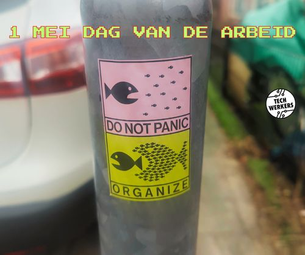
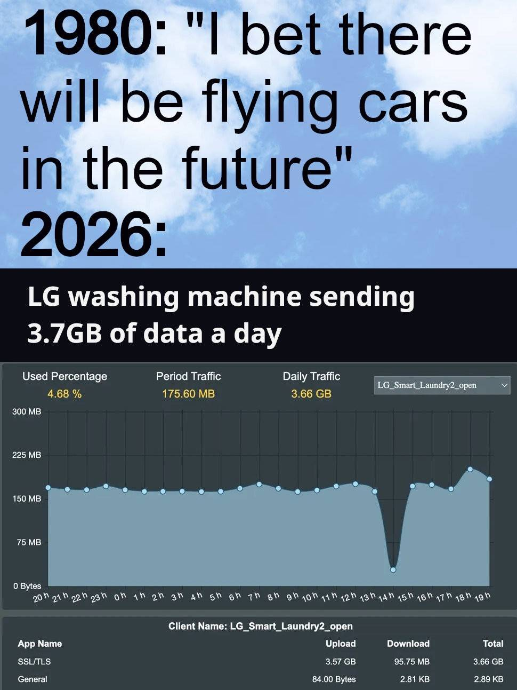

## Dag van de Arbeid 2026

Kom op vrijdag 1 mei om 13.00 uur naar het Museumplein in Amsterdam om de [Dag van de Arbeid te vieren met Techwerkers](https://techwerkers.nl/nl/posts/labour-day-2026/)! Test je meshcore-apparaat, speel een spelletje AI-bingo, blader door stickers en zines, of klets gewoon even met andere mensen in tech. Ben jij erbij? 😀

## Jarenlang uitzendkracht? Een vast contract!

Heb je 36 maanden of langer als uitzendkracht voor dezelfde werkgever gewerkt? Dan heb je recht op een vast contract. Dit [oordeelde de rechter in Den Haag](https://www.rechtspraak.nl/organisatie-en-contact/organisatie/rechtbanken/rechtbank-den-haag/nieuws/albert-heijn-moet-uitzendkracht-distributiecentrum-in-vaste-dienst-nemen) in een zaak aangespannen door werker Paweł Rudzki tegen supermarktketen Albert Heijn. 

<figcaption style="text-align: center;"><i>Paweł Rudzki, die een rechtszaak tegen Albert Heijn won (foto via Doorbraak.eu)</i></figcaption>

Rudzki werkte sinds 18 juni 2018 voor Albert Heijn, maar altijd via een uitzendbureau (dat bovendien een deel van zijn loon inhield). Europese wetgeving bepaalt echter dat uitzendwerk tijdelijk moet zijn, niet vast. Albert Heijn heeft daarom misbruik gemaakt van de uitzendregelgeving. Rudzki moet nu alsnog een vast contract krijgen én al het loon ontvangen dat hij sinds 2021 is misgelopen.

Werk je langer dan 36 maanden als uitzendkracht of met een tijdelijk contract? Dan heeft deze uitspraak ook gevolgen voor jou. Kun je wel wat hulp gebruiken om je rechten te laten gelden? [Neem contact op met Techwerkers.](mailto:hey@techwerkers.nl)

## Agenda

Wil je andere techwerkers ontmoeten? Kom dan naar één van de aankomende evenementen:

- 1 mei, 13:00 uur - [Dag van de Arbeid met Techwerkers!](https://events.techwerkers.nl/event/labour-day-or-dag-van-de-arbeid) Museumplein, Amsterdam
- 8 mei, 15:00-15:30 uur - [Vrijdagsfika](https://events.techwerkers.nl/event/friday-fika-or-vrijdagsfika-8), online
- 9 mei, 13:00 uur - [Actifest](https://www.artcollectiveforpeace.org/actifest), Amsterdam (extern evenement)
- 9 mei, 8:30 uur - [Samen naar Dutch Clojure Days](https://events.techwerkers.nl/event/dutch-clojure-days-2026)), Weesp (extern evenement)
- 11 mei, 19:00 uur - [Organisatiebijeenkomst](https://events.techwerkers.nl/event/organizing-meetup-or-organisatiebijeenkomst-8), online
- 15 mei, 15:00-15:30 uur - Vrijdagfika, online
- 18-23 mei - [Samen naar Rust-week](https://events.techwerkers.nl/event/attend-rust-week-together-or-samen-naar-rust-week), Utrecht (extern evenement)
- 22 mei, 15:00-15:30 uur - Vrijdagsfika, online
- 25 mei, 19:00 uur - Organisatiebijeenkomst, online
- 26 mei, 19:00 uur - Boekenclub (boekkeuze volgt), online
- 29 mei, 15:00-15:30 uur - Vrijdagsfika, Online

[Houd de agenda in de gaten](https://events.techwerkers.nl/) voor de laatste informatie.

## Nieuwe bron

### Ontslagen? Dit is wat je moet doen om een zieke smak geld te krijgen

Je bazen zullen altijd proberen om het maximale uit jou als werker te knijpen. Zo doe je hetzelfde als je ontslagen dreigt te worden. Dit artikel was te heet 🔥 voor Reddit.

[Lees de bron →](https://techwerkers.nl/nl/resources/negotiation/)

<figcaption style="text-align: center;"><i>Wat wil je nou echt van je wasmachine?</i></figcaption>

## Op de radar

De volgende nieuwtjes kwamen recent langs op de Techwerkersradar:

- Bedrijven moeten werkers vanaf 1 juni [verplicht transparantie bieden](https://www.iamexpat.nl/career/employment-news/dutch-companies-required-disclose-salaries-hiring-process-new-eu-law) over salaris en betalingen.
- [Achter het fascisme staat het techkapitaal](https://www.globalinfo.nl/achtergrond/achter-het-fascisme-staat-het-tech-kapitaal/), en meer inzichten van de recente Cables of Resistance-conferentie in Berlijn.
- Keert het tij? [Fintechbedrijf TradeRepublic dumpt AI-chatbots](https://www.emerce.nl/nieuws/trade-republic-dumpt-aichatbots-stelt-1000-mensen) en neemt 1.000 werkers aan voor diens klantenservice.
- [Nulurencontracten worden verboden](https://business.gov.nl/amendments/zero-hours-contracts-banned/) in Nederland vanaf 1 januari 2027.
- Microsoft gaat [correcte geografische verwijzingen naar Palestina](https://7amleh.org/post/7amleh-secures-inclusion-of-palestinian-geographic-terminology-en:) opnemen in de landkaarten op al haar platformen, en misleidende namen voor de Westelijke Jordaanoever verwijderen.
- Hoogstgevoelige medische gegevens van tenminste 218.000 mensen in Nederland (ca. 1.2% van de bevolking) is [buitgemaakt bij een systeemgijzelingaanval op ChipSoft](https://www.agconnect.nl/maatschappij/security/gegevens-van-218000-mensen-buitgemaakt-bij-chipsoft-hack), een bedrijf dat software levert aan gezondheidsinstellingen. Een boete of operatieverbod op het bedrijf is totnogtoe niet bevestigd.
- Hoe lastig is het om je [los te maken van techreuzen](https://www.nrc.nl/nieuws/2026/04/24/hoe-moeilijk-is-het-om-los-te-komen-van-big-tech-dit-kleine-groepje-nederlanders-probeert-het-a4926099)? Ga zelf aan de slag, of doe het lekker samen met Techwerkers!

Dat was het voor nu. Zie je wie weet op 1 mei! ✊ 
