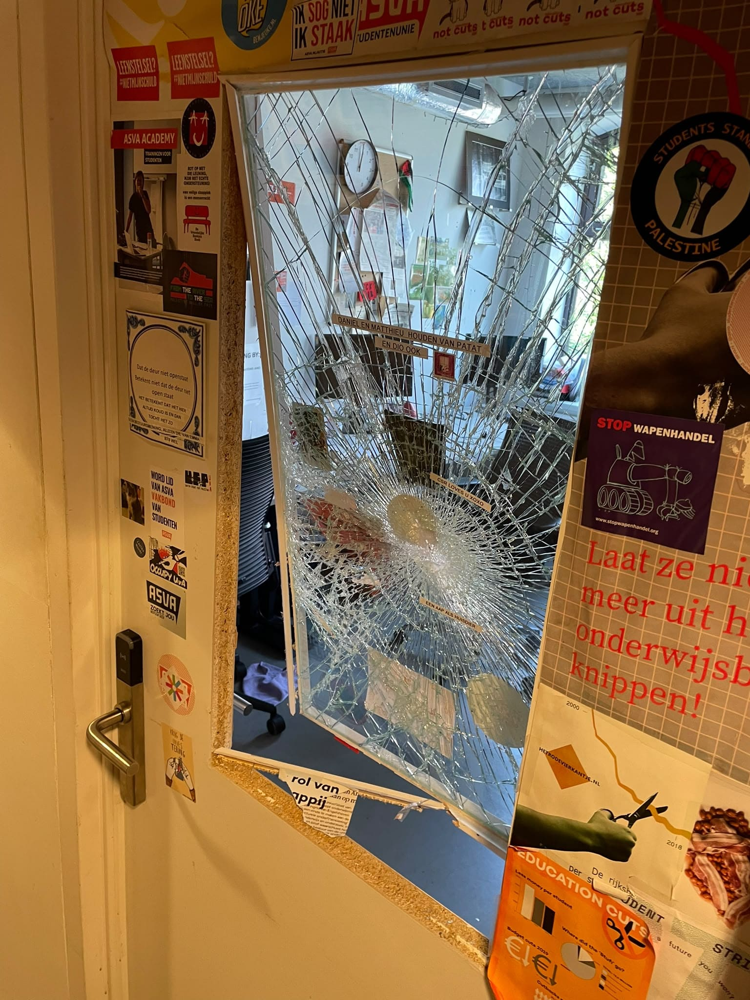
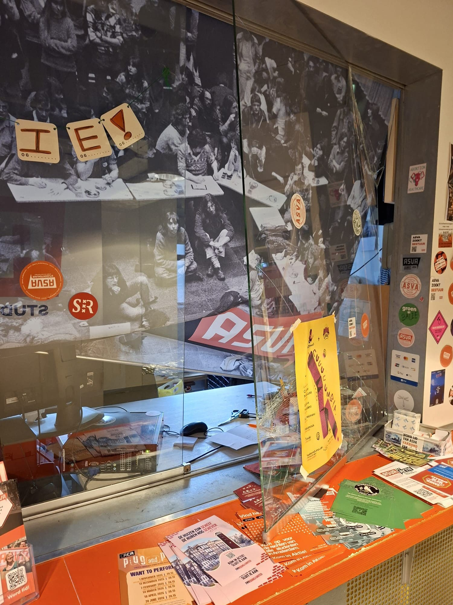

In het kantoor van de [Amsterdamse studentenvakbond ASVA](https://asva.nl/) is in de vroege uren van zondag 21 juni ingebroken en er zijn vernielingen aangericht. Ruiten van twee deuren en de balie van de studentenservicedesk werden stukgemaakt. Het lijkt om een gerichte actie tegen de studentenvakbond te gaan. Andere kantoren in het CREA-gebouw op de Amsterdamse Roeterseilandcampus zijn onbeschadigd gebleven.

Het is nog niet duidelijk wie er achter de vernielingen in het kantoor van de bond zit, maar volgens ASVA-voorzitter Sahand Mozdbar wijst de uitvoering doelbewuste intimidatie. “Dingen zijn kapotgemaakt, archiefstukken op de grond gegooid en er is tegen de muur gepist”. Voor zover Mozdbar kon zien is er niets van financiële waarde gestolen.

<figcaption style="text-align: center;"><i>Een vernield binnenraam op het ASVA-kantoor</i></figcaption>

In een persbericht plaatst ASVA de gebeurtenis in een context van recente vernielingen bij andere studentenbonden. Ze noemen dat eerder de studentenvakbonden SRVU (Vrije Universiteit Amsterdam) en AKKU (Nijmegen) al getroffen werden door vernielingen en vandalisme.

Op dit moment is het afwachten of überhaupt duidelijk zal worden wie er achter deze actie zit. ASVA zal samen met de Universiteit van Amsterdam aangifte doen. Maar aanvallen op vakbonden moeten serieus genomen worden. Niet alleen hebben ze de potentie om de organisatie van werkers materieel te ontregelen, ze kunnen tevens een voorbode zijn. In het begin van 1933 waren vakbondskantoren één van de eerste doelwitten van Hitlers knokploeg, de zogenaamde Bruinhemden (*Sturmabteilung*, SA).

{}

*Wij zijn bovenal geschrokken, maar laten ons absoluut niet van de wijs brengen --- Sahand Mozdbar, ASVA voorzitter*

{}

Zou een extreemrechtse groep voor de aanval op ASVA verantwoordelijk kunnen zijn? Desgevraagd zegt Mozdbar niet bekend te zijn met een actieve extreemrechtse studentenbeweging op de Universiteit van Amsterdam. ‘Maar op de VU heb je die wel, al is die op het ogenblik nogal versplinterd.’ Ook in andere universiteitssteden zijn extreemrechtse studentenverenigingen actief. In Nijmegen, Leiden en Utrecht zijn bijvoorbeeld afdelingen van de Groot-Nederlandse Studentenvereniging (GNSV), een extreemrechtse organisatie die in 2021 werd opgericht en nauwe banden heeft met de wit-suprematistische Geuzenbond. Er is op dit moment geen aanleiding om te denken één van deze organisaties iets met de vernielingen in Amsterdam van doen heeft.

<figcaption style="text-align: center;"><i>Vernielingen aan de balie van het ASVA-kantoor</i></figcaption>

“Wij zijn bovenal geschrokken, maar laten ons absoluut niet van de wijs brengen”, benadrukt Mozdbar. “Als deze daad inderdaad vanuit intimidatie is gepleegd, dan heeft men het doel volledig voorbijgeschoten. ASVA is juist strijdbaarder dan ooit. Wij laten ons niet het zwijgen opleggen door dit soort laffe acties. Het is een schrijnend voorbeeld van de toenemende repressie en intimidatiepogingen waar progressieve stemmen mee te maken krijgen.”

Techwerkers drukt steun uit aan studentenvakbond ASVA en staat eensgezind met alle andere vakbonden en organisaties waarbinnen werkers samen opkomen voor hun belangen.