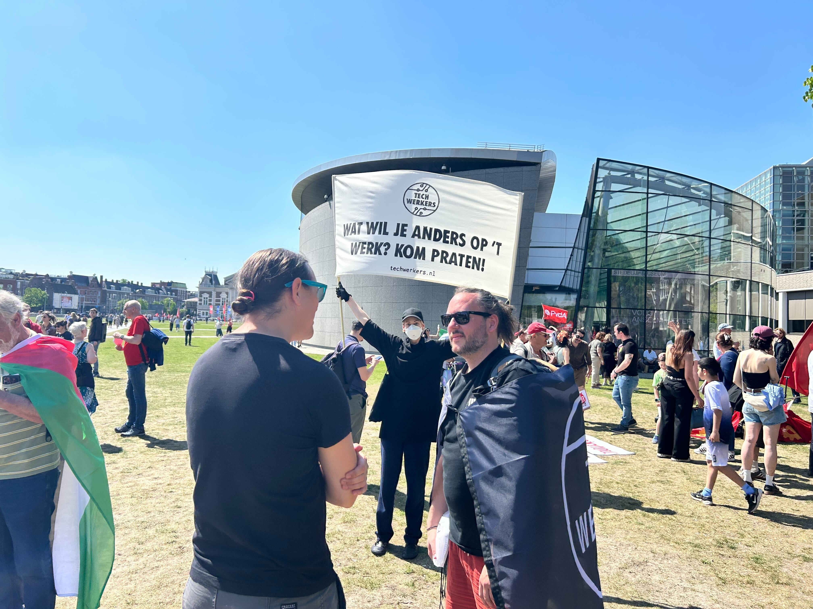

1 May is not a public holiday in The Netherlands. Yet that didn't stop a number of collaborators from Tech Workers Coalition showing up at the FNV Union's [Labour Day manifestation](https://www.fnv.nl/acties/dag-van-de-arbeid) in Amsterdam. The event started at Museumplein at 1pm, where flags were flown and tech workers showed up to support the day. Around 9000 people strong, the crowd then walked at 2pm from Museumplein to Martin Luther Kingpark, arriving at 4pm. FNV had additional festivities which tech workers attended.

This was a nice event to meet up at, and was a first time for a number of tech workers to meet on site after collaborating online almost every 2 weeks over the last year. Yes, tech workers are indeed humans!

The tech workers were prepared --- ready with custom flags, a DIY banner, stickers, and flyers to promote the [Tech Workers for Palestine campaign](https://techwerkers.nl/en/campaigns/palestine/). The banner asked people what they wanted to change on their work floor. 'No more work!', one person shouted passing by --- which is a totally valid response when it comes to wage labour. Above all, the prompt was great at starting conversations with fellow tech workers. Some of the conversations touched on what people would like to change not only at work, but also in the tech industry more broadly. It was clear that our mission has purpose, and that tech workers need to be equipped with education, training, and community support so that people in tech (is that you?) can organize in their workplace, and take back power.

For the future, there were some practical lessons too:

* Bring water. 3 hours in Amsterdam sun and walking needs some thirst quenching
* Wear sunblock, even though it's not summer yet
* Start conversations, ask questions, be open, be curious, gain momentum, move forward

Let's double the number of tech workers in attendance next year!
