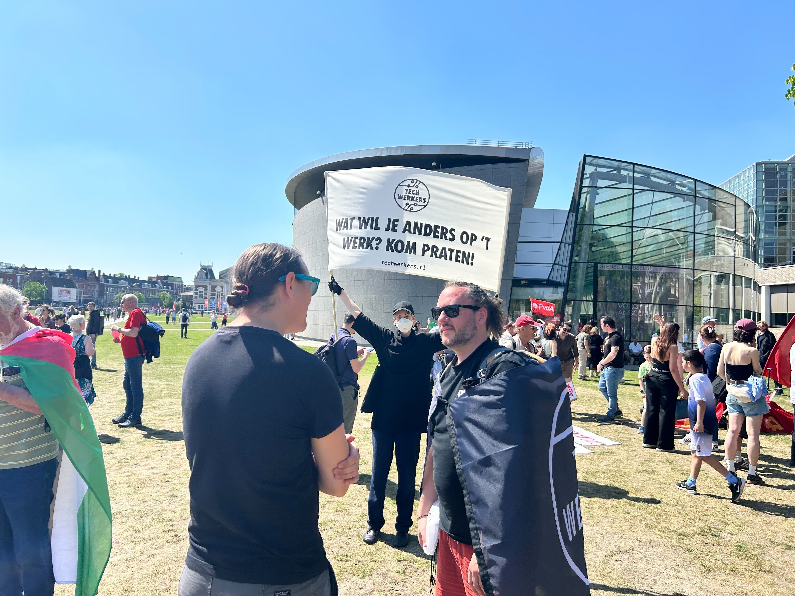

1 mei is geen officiële feestdag in Nederland. Toch weerhield dat een aantal medewerkers van de Techwerkers er niet van om naar de [Dag van de Arbeid-manifestatie](https://www.fnv.nl/acties/dag-van-de-arbeid) van de FNV in Amsterdam te komen. Het evenement begon om 13.00 uur op het Museumplein, waar vlaggen wapperden en techwerkers aanwezig waren om de dag te steunen. Met een sterke menigte van ongeveer 9000 mensen vertrok de stoet om 14.00 uur van het Museumplein naar het Martin Luther Kingpark, waar ze om 16.00 uur aankwamen. De FNV had nog extra festiviteiten georganiseerd waar Techwerkers aan deelnamen.

Dit was een leuke gelegenheid om elkaar te ontmoeten, en voor een aantal Techwerkers was het de eerste keer dat ze elkaar in het echt zagen na bijna een jaar lang om de twee weken online te hebben samengewerkt. Ja hoor, Techwerkers zijn inderdaad mensen!

Het Techwerkers team was goed voorbereid --- met op maat gemaakte vlaggen, een zelfgemaakt spandoek, stickers en flyers om de [Techwerkers for Palestine-campagne](https://techwerkers.nl/en/campaigns/palestine/) te promoten. Het spandoek vroeg mensen wat ze wilden veranderen op hun werkvloer. 'Geen werk meer!', riep iemand die voorbijliep --- wat een volkomen valide reactie is als het gaat om loonarbeid. Bovenal was de vraag geweldig om gesprekken aan te knopen met collega-techwerkers. Sommige gesprekken gingen over wat mensen niet alleen op het werk, maar ook in de techindustrie in bredere zin zouden willen veranderen. Het was duidelijk dat onze missie zinvol is, en dat techwerkers moeten worden voorzien van onderwijs, training en gemeenschapssteun, zodat mensen in de tech (ben jij dat?) zich op hun werkplek kunnen organiseren en de macht kunnen terugnemen.

Voor de toekomst waren er ook enkele praktische lessen:

* Neem water mee. 3 uur in de Amsterdamse zon en lopen vraagt om dorstlessing
* Draag zonnebrandcrème, ook al is het nog geen zomer.
* Begin gesprekken, stel vragen, wees open, wees nieuwsgierig, win momentum, ga vooruit.

Laten we volgend jaar het aantal aanwezige techwerkers verdubbelen!
