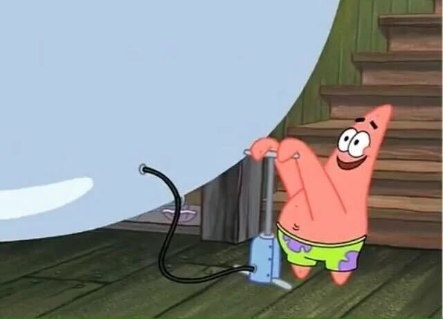

# 1. Strategy

## What is a strategy?

A dynamic plan to achieve outcomes, based on the resources you have, despite your opponent. This statement is composed of the following elements:

* Goals
* Employer (opponent) tactics
* Leverage
* Tactics

Working strategically means building capacity and leverage in order to gain power. 

## Power

* **Power:** the ability to change or maintain a system.
* **Powerlessness:** the inability to make change in a system.

## Goals

What are goals?

1. What are the concrete changes we are fighting for?
2. Why are these goals necessary?
3. How do we evaluate their necessity? 
   (the broadest effected and deepest felt issues)

## Employer tactics

You have to keep your opponent in mind. You need to understand what motivates them and anticipate they will act against you.
