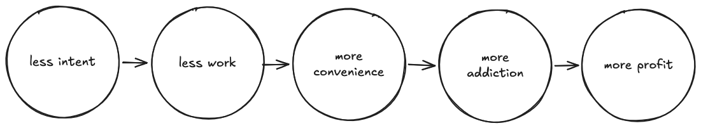
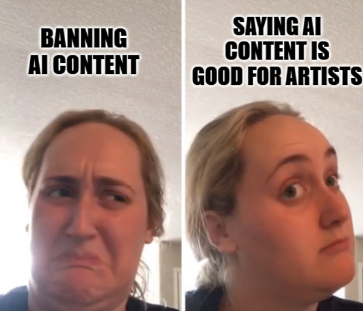

OK, the bad news first: The music streaming business model is trying hard to capture an entire art form and squeeze it into a commodity. We, as artists and listeners, are being pulled into monopolies in the name of convenience or success, whatever either means for art. Meanwhile, our perception of and interaction with a fundamental art form is getting warped and replaced by something honestly quite damn boring.

And now for the good news: Art is undying, uncapturable, untamable, and we can do a lot to give it a hand to thrive, while also enjoying the perks of streaming technology.

## Tape surgery

I have this vivid memory of lying on the carpet at our house when I was about 9 or 10, with our old cassette player sitting right next to my face. I’d wait for any track I liked to come on the radio, press ‘record’ as quickly as I could to capture as much of the song and as little of the ads as possible on a repurposed cassette. These little radio bootlegs soon became an important part of my music collection. Around that time, I started giving surgeries to my cassettes whose shells or tape got too damaged, including whole-ass transplants into a new body! (Equipment checklist: Scotch tape, scissors, a pencil, a screwdriver, and some old cassettes ‘borrowed’ from my parents.)

I began to spend my modest allowance on music zines and bargain bin finds in record stores and ‘90s Turkish supermarkets, grabbing albums with cover art and names that looked different. These excursions expanded my understanding of what music could be with [PJ Harvey](https://youtu.be/D3tD9EPOEik?si=0mLwDmjsabLJj16T), [Tricky](https://youtu.be/w_JSTu2aPhs?si=WPhv-xaVvdaSH7CR), [Sonic Youth](https://youtu.be/oK39Cqa0VX4?si=FtH6A5W1tBayypC9) (and admittedly a bunch of [ska](https://youtu.be/-dy74BELZqw?si=1bm1LGMNafOzhfXK) [bands](https://youtu.be/Br4hBpYhDN8?si=rhKBc63sLtcx66ux)). I still attribute my understanding of musical structure as a musician largely to the iconic Swedish pop-rock duo [Roxette](https://youtu.be/gqKWMue2hi8?si=PmQPRIsx-4MqyZxu). The way Per Gessle wrote simple yet amazing melodies (in his case paired with playful rhythmic delight) soon became my favorite type of musical talent; the likes of which I noticed I had already discovered in [Kayahan](https://youtu.be/nfNur8gxUoc?si=VDOeICGbMXn43W1C) and [Sezen Aksu](https://youtu.be/H7mxXm0Avts?si=oP5dzY4aHBLyslt9), and was soon to discover in [Dolores O'Riordan](https://youtu.be/QScdoQeSJdg?si=y2gnBuhfHSVxkYdf) and [Kurt Cobain](https://youtu.be/QECJ9pCyhns?si=nIfcgZ27KKsiu2Pi). These people, I was convinced, were born to write music. I believed that writing a melody was as natural and effortless to them as breathing. Around the same time, I started playing in random bands (only to find out I don't enjoy playing in bands).

As I became so consumed by this magical entity that is music, it no longer only felt transcendental: it was essential.

## The desensitizing effect of the streaming model

Looking back, it's not hard to see my 10-year-old radio-bootlegging self would have been left speechless by the idea of streaming: accessing nearly any commercial release across the world, anywhere, for pocket money.

But how long would it take for my obsession with music, which in reality lasted well into this day, to wane, and for music to turn from something special I actively chase into a commodity available to me at all times without limits? Would I still have made music and gained the psychological enrichment I get from it, or would music have simply become background noise or content for consumption in a few years, never to be valued or sought again by younger me?

Besides those personal questions that plague my mind, I have more pressing general ones: Is limitless access really a benefit when it comes to art, or does it just lead to inertia via choice overload? What happens to how we value the medium we don't ever have to work for again? And when we go a step further and disregard thousands of years of human labor of love in art and introduce ‘art-inspired content’ created with ethically problematic tech, do we find it harder to care after being so conditioned to be desensitized?

## It’s not the tech, it’s the business

It's not so much the streaming technology itself that is the problem; I think the tech is stellar. It's the way *the streaming business model* does fundamental damage to the medium it so ruthlessly exploits.

You might already be familiar with the ethical discussions around the streaming model, from the horrifyingly low (to no) payout to artists, to being riddled with generative AI content passed off as original music. And within all that, there's the tier of relentlessly harmful platforms like Spotify that give a major pass to [generative AI](https://www.theguardian.com/technology/2025/jul/14/an-ai-generated-band-got-1m-plays-on-spotify-now-music-insiders-say-listeners-should-be-warned), intentionally place [fake artists](https://www.musicbusinessworldwide.com/spotify-is-creating-its-own-recordings-and-putting-them-on-playlists/) in their playlists, [remove payouts to artists with less than 1000 streams per year](https://www.digitalmusicnews.com/2024/01/11/spotify-stream-minimum-impact/) (affecting an estimated 82.7% of the music on the platform at the time of the decision), and [has a CEO who invests in AI military](https://www.theguardian.com/music/2025/sep/18/massive-attack-remove-music-from-spotify-to-protest-ceo-daniel-eks-investment-in-ai-military).

But that mountain of issues is not even my biggest beef with the streaming model. It's the way the streaming business model inevitably wants to monopolize our access to music and has been actively turning music from a form of art with an extremely rich history into ‘content’ for mindless consumption. Background noise for every moment of our lives…

## The erosion of agency

With playlist and ‘vibe’ culture being pushed so hard by Spotify and the like, concept albums—heck, even the concept of ‘albums’—are being replaced with ‘vibe playlists’.

Vibe playlists mean that we end up not knowing the names of some of the artists that we regularly listen to anymore. Sometimes we just know which playlist that one track that we like is in. [As noted by Cory Doctorow and Rebecca Giblin](https://doctorow.medium.com/spotify-steals-from-artists-a-spotify-exclusive-91c564436c9d), this playlist-centric approach also makes streaming platforms big money by locking in players to platform-specific playlists—unlike albums, which are basically the same wherever you listen to them.

There is a lack of intent and erosion of agency that is built into the streaming model by design.

<figcaption>
How the streaming business model erodes agency: the less intent there is behind what you listen to, the less work it takes to listen, the greater the convenience, the more you’ll get addicted to the experience, to more profit for the company.
</figcaption>

If technology serves a purpose while being fair to its medium, it can be a great option. And so can streaming, when it's *one* way to listen to music and not *the only* way. If streaming is supposed to offer freedom and convenience, how come we are listening to the same 11 tracks over and over again, or leaving the entire agency of what is playing to algorithms whose purpose and inner workings are not made clear to us?

## From art to ‘content’

Streaming platforms are now riddled with generative AI content passed off as original music. This content is automatically generated with ethically problematic tech.

Apart from generative AI content prompters themselves and people who are genuinely indifferent to the art, I can't imagine many people wanting to regularly listen to AI-generated music content by choice. Yet the aptly-named ‘AI slop’ is [simply](https://www.androidauthority.com/how-to-spot-ai-music-3637174/) [all over](https://www.youtube.com/shorts/PMhzq563-eg) streaming services, [whether we realize it or not](https://mashable.com/article/ai-generated-music-survey-people-cannot-tell).

It seems like the less we know, the better for the services. Spotify, for example, recently addressed the issue of generative AI in an [article](https://newsroom.spotify.com/2025-09-25/spotify-strengthens-ai-protections/), the sum of which sounds like something like this to me:

> *Like... we're obviously working with partners to label AI slop which is a problem... Buuuut also like AI is technology and weren't synths once new tech? You like auto-tune don't you? Guess what? Technology! BAM! But ofc AI sucks because it makes creatives nervous, but it's soooo good for artists also so idk* 😬 

(Notice how AI is supposedly bad for ‘creatives’ but good for ‘artists’? Some fine language crafting there.)

<figcaption>
Kombucha girl meme sets the perfect tone for Spotify’s stance on generative AI content: it doesn't want to ban AI content, but just claims it's good for artists.
</figcaption>

If streaming platforms had genuine worries about generative AI content, they would enforce labeling or an outright ban against generative AI content on their platform. And that's exactly what Bandcamp did. At the time of writing this article, [Bandcamp is the only music platform that has banned AI-generated ‘music content’](https://blog.bandcamp.com/2026/01/13/keeping-bandcamp-human/). (A quick note: I hope Bandcamp extends its valuable effort to AI-generated content of all forms, such as album covers. Because there is no saving one form of art while another suffers from the same abuse). [Deezer also started AI labeling last year.](https://newsroom-deezer.com/2025/06/deezer-launches-worlds-first-ai-tagging-system-for-music-streaming/)

## Is piracy really evil?

Regulatory bodies, record companies, and some big-name musicians tell me that music piracy is a big evil. As an indie artist with a modest commercial body of work out there, I don't see it that way.

I believe that most people who pirate music do it out of a mix of passion for the art and a lack of means to access it commercially. I grew up in a country where I simply had no access to a lot of music and art I was inspired by and dying to get my hands on, such as that of [bands](https://youtu.be/i2486KipmvE?si=X68uiv5VWstCV6eg) and [works of art](https://youtu.be/vgJ-CbHwxMU?si=XGBFfBawEiLHLazV) that came out of the Riot Grrrl and Queercore movements of the 90s. Thanks to websites like last.fm and off-the-books apps like Soulseek and AudioGalaxy, I made friends, shared insights, and well, music, with people who not only had access but were active in those scenes.

As a person who makes music, I find more excitement in people pirating my music than streaming it, because it feels like they care about the music. Whereas having my tracks randomly come up in the background as filler ‘content’, just because that’s what the algorithm does, feels so much less... soulful.

## Let’s reclaim music as art

All I'm really saying is... Let's reclaim music as a form of art and give artists a pat on the back and some money for making our lives better. While legislation slowly catches up with the damage being done to art and the artist (or if it does that at all), we can still do a lot.

For me, this might involve buying digital or physical albums on Bandcamp (especially on [Bandcamp Fridays](https://isitbandcampfriday.com/), where the entire payment goes to the artist) and merch from official resources. For someone more extroverted, it can look like going to gigs regularly and maybe grabbing some band merch there. This way, I’ll happily stream music and have my own music available on all streaming platforms (except Spotify) while making sure I directly support artists and platforms that are pro-artist and pro-music first. We are many, and as we've seen time and again, we are powerful.

To quote my favorite book, *What Art Does* by Bette Adriaanse and Brian Eno: 

> "In whatever we are doing, we have to make it as though we are in that new world. By making objects, systems, experiences and collaborations that belong to that world, it comes into being. Live the world you want."

So let's make music, buy some albums, go to gigs, get that cool band t-shirt we've been eyeing, and talk to each other about music. Let's always talk to each other about music, deal?

*This article was written by [SUPERDAZE](https://superdaze.bandcamp.com/), with editorial feedback from Kit.*