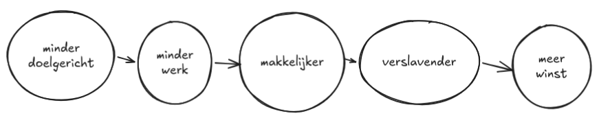

Oké, eerst het slechte nieuws: het bedrijfsmodel van muziek-*streamen* probeert een complete kunstvorm te kapen en er een handelswaar van te maken. Wij, als artiesten en luisteraars, worden in monopolies getrokken in naam van gemak of succes, wat dat ook moge betekenen voor kunst. Ondertussen wordt onze ervaring van en interactie met een fundamentele kunstvorm vervormd en vervangen door iets dat eerlijk gezegd behoorlijk saai is.

En nu het goede nieuws: kunst is onsterfelijk, ongrijpbaar, ontembaar, en we kunnen veel doen om haar te helpen floreren, terwijl we tegelijkertijd genieten van de voordelen van *streaming*-technologie.

## Cassettebandjes opereren

Ik herinner me nog levendig hoe ik op het tapijt lag in ons huis toen ik een jaar of 9 of 10 was, met onze oude cassettespeler vlak naast mijn gezicht. Ik wachtte tot een nummer dat ik leuk vond op de radio kwam, drukte zo snel mogelijk op 'opnemen' om zoveel mogelijk van het nummer en zo min mogelijk van de reclames op te nemen op een hergebruikte cassette. Deze kleine radiobootlegs werden al snel een belangrijk onderdeel van mijn muziekcollectie. Rond die tijd begon ik de cassettebandjes waarvan de behuizing of het bandje te beschadigd was 'op te pknappen', inclusief complete transplantaties naar een nieuwe behuizing! (Benodigdheden: plakband, schaar, potlood, schroevendraaier en een paar oude bandjes die ik van mijn ouders ‘geleend’ had.)

Ik begon mijn bescheiden zakgeld uit te geven aan muziektijdschriften en koopjes in platenzaken en wat er in Turkse supermarkten van de jaren '90 te krijgen was, waarbij ik albums met opmerkelijke hoezen en titels op de kop tikte. Deze uitstapjes hebben mijn begrip van wat muziek kan zijn verruimd, met [PJ Harvey](https://youtu.be/D3tD9EPOEik?si=0mLwDmjsabLJj16T), [Tricky](https://youtu.be/w_JSTu2aPhs?si=WPhv-xaVvdaSH7CR), [Sonic Youth](https://youtu.be/oK39Cqa0VX4?si=FtH6A5W1tBayypC9) (en toegegeven, een heleboel [ska](https://youtu.be/-dy74BELZqw?si=1bm1LGMNafOzhfXK) [bands](https://youtu.be/Br4hBpYhDN8?si=rhKBc63sLtcx66ux)). Als muzikant dank ik mijn begrip van muzikale structuur nog steeds grotendeels aan het iconische Zweedse pop-rockduo [Roxette](https://youtu.be/gqKWMue2hi8?si=PmQPRIsx-4MqyZxu). De manier waarop Per Gessle eenvoudige maar indrukwekkende melodieën schreef (in zijn geval gecombineerd met speelse ritmische verrukking) werd al snel mijn favoriete vorm van muzikaal talent; welke ik eerder ook al had ontdekt bij [Kayahan](https://youtu.be/nfNur8gxUoc?si=VDOeICGbMXn43W1C) en [Sezen Aksu](https://youtu.be/H7mxXm0Avts?si=oP5dzY4aHBLyslt9), en dat later ook zou ontdekken bij [Dolores O'Riordan](https://youtu.be/QScdoQeSJdg?si=y2gnBuhfHSVxkYdf) en [Kurt Cobain](https://youtu.be/QECJ9pCyhns?si=nIfcgZ27KKsiu2Pi). Ik was ervan overtuigd dat deze mensen geboren waren om muziek te schrijven. Ik geloofde dat het schrijven van een melodie voor hen net zo natuurlijk en moeiteloos was als ademhalen. Rond dezelfde tijd begon ik in willekeurige bands te spelen (om er vervolgens achter te komen dat ik het spelen in bands niks voor mij is).

Naarmate ik zo gegrepen werd door die magische entiteit die muziek is, voelde het niet langer alleen maar transcendent aan: het was essentieel.

## Het verstompende effect van het *streaming*-model

Terugkijkend is het niet moeilijk te begrijpen dat mijn 10-jarige, radio-bootlegs makende, zelf sprakeloos zou zijn geweest bij het idee van *streaming*: toegang tot vrijwel elke commerciële uitgave van waar dan ook ter wereld, voor een prikkie.

Maar hoe lang zou het duren voordat mijn obsessie met muziek, die in werkelijkheid tot op de dag van vandaag voortduurt, zou afnemen, en voordat muziek zou veranderen van iets bijzonders waar ik actief naar op zoek was, in een product dat ik altijd en onbeperkt tot mijn beschikking had? Zou ik nog steeds muziek hebben gemaakt en de psychische verrijking hebben ervaren die ik er nu uit haal, of zou muziek simpelweg achtergrondgeluid of consumptiemateriaal zijn geworden, dat ik vervolgens als jongere nooit meer zou waarderen of opzoeken?

Naast die persoonlijke vragen die me bezighouden, heb ik ook dringendere, algemene vragen: Is onbeperkte toegang tot kunst echt een voordeel, of leidt het juist tot inertie door een overvloed aan keuzes? Wat gebeurt er met onze waardering voor een medium waar we nooit meer moeite voor hoeven doen? En als we nog een stap verder gaan en duizenden jaren van menselijke arbeid en liefde in de kunst negeren en 'kunstgeïnspireerde inhoud' introduceren die is gemaakt met ethisch problematische technologie, vinden we het dan moeilijker om erom te geven nadat we zo geconditioneerd en ongevoelig zijn geworden?

## Het is niet de technologie, het zijn de bedrijven

Het probleem zit hem niet zozeer in de *streaming*-technologie zelf; ik vind de technologie fantastisch. Het probleem zit hem in de manier waarop *het bedrijfsmodel van streaming* fundamentele schade toebrengt aan het medium dat het zo meedogenloos uitbuit.

Je bent wellicht al bekend met de ethische discussies rond het *streaming*-model, van de schrikbarend lage (of zelfs geen) uitbetalingen aan artiesten tot het feit dat ze overspoeld worden met door AI gegenereerde inhoud die als originele muziek wordt gepresenteerd. En daarbinnen bevindt zich de categorie van meedogenloos schadelijke platformen zoals Spotify, die [generatieve AI](https://www.theguardian.com/technology/2025/jul/14/an-ai-generated-band-got-1m-plays-on-spotify-now-music-insiders-say-listeners-should-be-warned) volledig tolereren, opzettelijk [nep-artiesten](https://www.musicbusinessworldwide.com/spotify-is-creating-its-own-recordings-and-putting-them-on-playlists/) in hun afspeellijsten plaatsen, [artiesten wiens muziek jaarlijks minder dan 1000 keer wordt afgespeeld niet meer  uitbetalen](https://www.digitalmusicnews.com/2024/01/11/spotify-stream-minimum-impact/) (wat naar schatting 82,7% van de muziek op het platform trof op het moment van de beslissing), en een [directeur hebben die in AI-wapens investeert](https://www.theguardian.com/music/2025/sep/18/massive-attack-remove-music-from-spotify-to-protest-ceo-daniel-eks-investment-in-ai-military).

Maar die berg aan problemen is niet eens mijn grootste bezwaar tegen het *streaming*-model. Het is de manier waarop het *streaming*-bedrijfsmodel onvermijdelijk onze toegang tot muziek wil monopoliseren en muziek actief heeft omgevormd van een kunstvorm met een extreem rijke geschiedenis tot 'inhoud' voor hersenloze consumptie. Achtergrondgeluid voor ieder moment van je leven...

## De uitholling van autonomie

Nu de afspeellijst- en '*vibe*'-cultuur er door Spotify en dergelijke zo sterk worden doorgedrukt, worden conceptalbums–sterker nog, zelfs het concept van een 'album'–vervangen door *vibe*-afspeellijsten'.

*Vibe*-afspeellijsten betekenen dat we uiteindelijk de namen van sommige artiesten waar we regelmatig naar luisteren niet meer kennen. Soms weten we alleen in welke afspeellijst dat ene nummer dat we leuk vinden staat. [Zoals Cory Doctorow en Rebecca Giblin opmerkten](https://doctorow.medium.com/spotify-steals-from-artists-a-spotify-exclusive-91c564436c9d), levert deze op afspeellijsten gerichte aanpak *streaming*-platformen veel geld op, omdat luisteraars gebonden worden aan platformspecifieke afspeellijsten–in tegenstelling tot albums, die in principe overal hetzelfde zijn.

Het *streaming*-model is bewust ontworpen met een gebrek aan intentie en een afbruik van de autonomie van de luisteraar.

<figcaption>
Hoe het <i>streaming</i>-bedrijfsmodel de autonomie ondermijnt: hoe minder intentie er is achter wat je luistert, hoe minder moeite het kost om te luisteren, hoe gemakkelijker het is, hoe verslaafder je raakt aan de ervaring, en hoe meer winst het bedrijf maakt.
</figcaption>

Als technologie een doel dient en tegelijkertijd eerlijk is tegenover het medium, kan het een geweldige optie zijn. En dat geldt ook voor *streaming*, als het *één* manier is om naar muziek te luisteren en niet *de enige*. Als *streaming* vrijheid en gemak zou moeten bieden, hoe komt het dan dat we steeds naar dezelfde 11 nummers luisteren, of dat we de volledige controle over wat er wordt afgespeeld overlaten aan algoritmes waarvan het doel en de interne werking ons niet duidelijk zijn?

## Van kunst naar ‘inhoud’

*Streaming*-platformen staan ​​nu vol met AI-gegenereerd geluid dat wordt gepresenteerd als originele muziek. Deze inhoud wordt automatisch gegenereerd met ethisch problematische technologie.

Afgezien van mensen die AI instructies geven om geluid te genereren en mensen die oprecht onverschillig staan ​​tegenover kunst, kan ik me niet voorstellen dat veel mensen er vrijwillig voor kiezen om regelmatig naar met AI gegenereerde muziek te luisteren. Toch is de toepasselijk genaamde ‘AI-rommel’ [gewoon](https://www.androidauthority.com/how-to-spot-ai-music-3637174/) [overal](https://www.youtube.com/shorts/PMhzq563-eg) te vinden op *streaming*-diensten, [of je het je nu realiseert of niet](https://mashable.com/article/ai-generated-music-survey-people-cannot-tell).

Het lijkt erop dat hoe minder we weten, hoe beter het is voor de diensten. Spotify heeft bijvoorbeeld onlangs het probleem van generatieve AI aangekaart in een [artikel](https://newsroom.spotify.com/2025-09-25/spotify-strengthens-ai-protections/), waarvan de conclusie op mij ongeveer als volgt overkomt:

> *Dus... we werken uiteraard samen met partners om AI-rommel te labelen wat een probleem is... Maaaaar AI is ook technologie en waren synthesizers niet ooit nieuwe tech? Je bent dol op autotune? Raad eens? Technologie! BAM! Maar tuurlijk is AI waardeloos omdat het creatievelingen nerveus maakt, maar het is ook zooooo goed voor artiesten, dus kweenie* 😬

(Merk op hoe AI zogenaamd slecht is voor ‘creatievelingen’ maar goed voor ‘artiesten’? Mooi woordspelletje.)

<figcaption>
Kombucha-vrouw meme vat perfect de insteek van Spotify’s standpunt over generatieve AI inhoud: het wil AI-inhoud niet verbieden, maar zegt gewoon dat het goed is voor artiesten.
</figcaption>

Als *streaming*-platformen zich echt zorgen maakten over generatieve AI-inhoud, zouden ze labels of een volledig verbod op generatieve AI-inhoud op hun platform invoeren. En dat is precies wat Bandcamp heeft gedaan. Op het moment van schrijven is [Bandcamp het enige muziekplatform dat AI-gegenereerde ‘muziek’ heeft verboden](https://blog.bandcamp.com/2026/01/13/keeping-bandcamp-human/). (Even terzijde: ik hoop dat Bandcamp diens waardevolle inspanningen uitbreidt naar alle vormen van AI-gegenereerd materiaal, zoals albumhoezen. Want je kunt de ene kunstvorm niet redden als een andere hetzelfde misbruik ondergaat.) [Deezer is vorig jaar ook begonnen met AI-labelen.](https://newsroom-deezer.com/2025/06/deezer-launches-worlds-first-ai-tagging-system-for-music-streaming/)

## Is piraterij echt zo slecht?

Regulatoren, platenmaatschappijen en sommige bekende muzikanten vertellen me dat muziekpiraterij een groot kwaad is. Als indie-artiest met een bescheiden commercieel oeuvre zie ik dat anders.

Ik denk dat de meeste mensen die muziek piraterij bedrijven dat doen uit een combinatie van passie voor de kunst en een gebrek aan mogelijkheden om er commercieel toegang toe te krijgen. Ik groeide op in een land waar ik simpelweg geen toegang had tot veel muziek en kunst waar ik door geïnspireerd raakte en die ik dolgraag in handen wilde krijgen, zoals die van [bands](https://youtu.be/i2486KipmvE?si=X68uiv5VWstCV6eg) en [kunstwerken](https://youtu.be/vgJ-CbHwxMU?si=XGBFfBawEiLHLazV) die voortkwamen uit de Riot Grrrl- en Queercore-bewegingen van de jaren '90. Dankzij websites zoals last.fm en onofficiële apps zoals Soulseek en AudioGalaxy maakte ik vrienden, deelde ik inzichten en, tja, muziek met mensen die niet alleen toegang hadden tot die scènes, maar er zelfs actief in waren.

Als muzikant vind ik het spannender als mensen mijn muziek downloaden dan wanneer ze het online afspelen, omdat het voelt alsof ze de muziek echt waarderen. Het is veel minder bezielend als mijn nummers willekeurig als achtergrondnummer langskomen ter opvulling, puur omdat het algoritme dat doet.

## Laten we muziek terugwinnen als kunstvorm

Wat ik eigenlijk wil zeggen is... Laten we muziek terugwinnen als kunstvorm en artiesten een schouderklopje geven en wat geld voor het feit dat ze ons leven beter maken. Hoewel wetgeving traag is in het beperken van de schade aan kunst en artiesten (als het dat überhaupt gaat doen), kunnen we zelf nog steeds veel doen.

Voor mij zou dat bijvoorbeeld betekenen dat ik digitale of fysieke albums koop op Bandcamp (vooral tijdens [Bandcamp Fridays](https://isitbandcampfriday.com/), waarop de volledige opbrengst naar de artiest gaat) en koopwaar via officiële kanalen. Voor iemand die meer extravert is, kan het betekenen dat je regelmatig naar concerten gaat en daar misschien wat bandkoopwaren aanschaft. Op deze manier speel ik met plezier muziek online af en heb ik mijn eigen muziek beschikbaar op alle *streaming*-platformen (behalve Spotify), terwijl ik er tegelijkertijd voor zorg dat ik artiesten en platforms die artiesten en muziek vooropstellen direct steun. We zijn met velen en, zoals we keer op keer hebben gezien, zijn we machtig.

Om mijn favoriete boek, *Wat Kunst Doet* van Bette Adriaanse en Brian Eno, te citeren:

> "In alles wat we doen, moeten we het doen alsof we ons in die nieuwe wereld bevinden. Door objecten, systemen, ervaringen en samenwerkingen te creëren die bij die wereld horen, komt die wereld tot stand. Leef de wereld die je wilt."

Dus laten we muziek maken, albums kopen, naar concerten gaan, dat coole bandshirt scoren waar we al zo lang naar uitkijken, en met elkaar over muziek praten. Laten we altijd met elkaar over muziek praten, afgesproken?

*Dit artikel is geschreven door [SUPERDAZE](https://superdaze.bandcamp.com/), met redactionele feedback van Kit.*