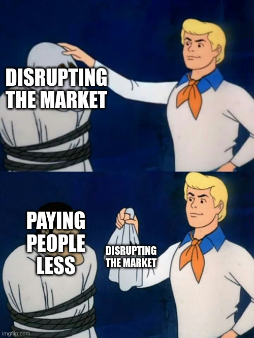

Recently, Picnic (the supermarket delivery company) has [threatened to leave the Dutch market](https://nos.nl/artikel/2579297-picnic-dreigt-met-vertrek-uit-nederland). The reason? A judge recently [decided that Picnic](https://uitspraken.rechtspraak.nl/details?id=ECLI:NL:GHARL:2025:3772&showbutton=true&keyword=ECLI%253aNL%253aGHARL%253a2025%253a3772&idx=1) (and fast delivery service Flink) are actually supermarkets, and not ecommerce/technology companies.

By classifying these companies as Supermarkets, they would be required to follow the Supermarket collective labour agreement (CAO). According to Picnic, this would increase their salary costs by 40%, which means that they could “no longer be competitive”. Read another way - If Picnic weren’t forced to be classified as a supermarket, then it can, at its own free will, pay its employees less than what they deserve.

Collective labour agreements in The Netherlands can be powerful. When a collective agreement is declared generally binding (_Algemeen verbinded verklaard_), anyone that performs certain duties within a certain sector falls under that collective labour agreement. In this case, the warehouse workers and the delivery workers would benefit from Picnic being classified as a Supermarket.

Until recently, Picnic had classified itself as a technology or e-commerce company—even though it had been calling itself a “Supermarket on wheels”—just to get around paying its staff a fair salary.

All of this is to say “tech” companies are forever trying to find ways around the rules to pay their staff less. If Jumbo and Albert Heijn can do supermarket deliveries under the Supermarket CAO, then why couldn’t Picnic? Is it because tech companies are disrupting markets? Or is it because they just find ways to squeeze every last euro out of the people that provide the value?

