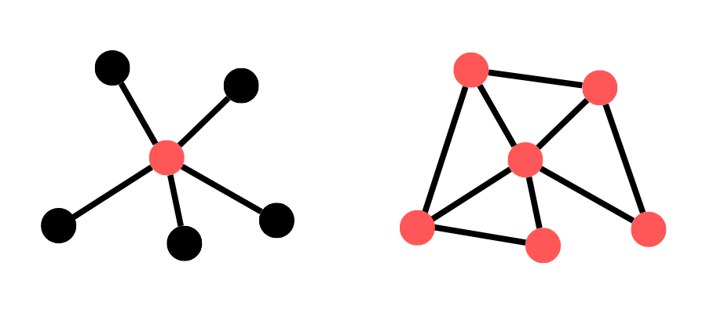
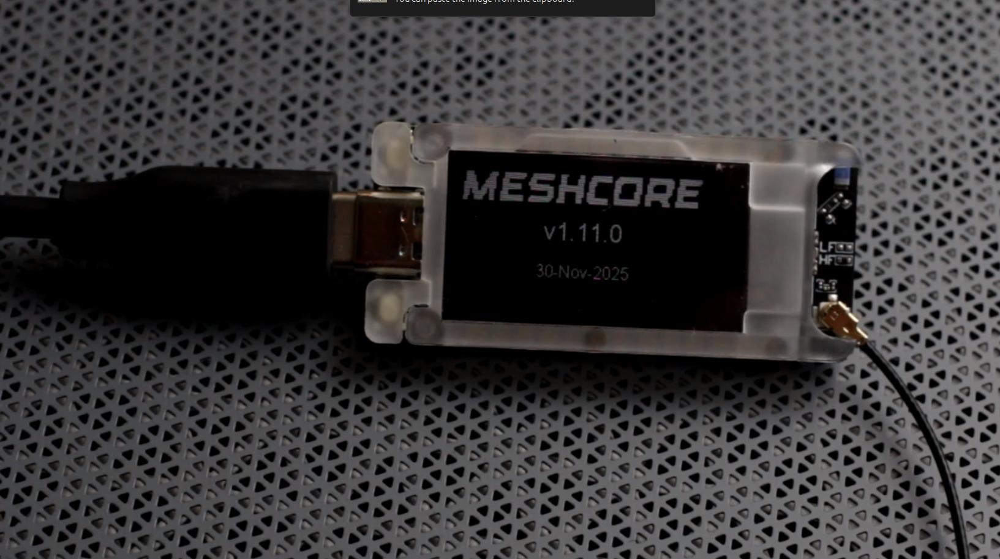

Vorige week [viel de stroom uit in Amsterdam](https://www.parool.nl/amsterdam/stroomstoring-legt-grote-delen-van-amsterdam-anderhalf-uur-plat-trams-stil-winkels-dicht-musea-ontruimd~bea6c508/). Slechts een paar uur, dat wel. Maar lang genoeg om ernstige verstoringen te veroorzaken. Een stroomstoring heeft direct gevolgen voor je wifi thuis, omdat je router niet meer werkt. Mobiele GSM-netwerken hebben vaak wel een reserve-batterij, waardoor ze het een paar uur langer volhouden. Maar als de stroomstoring aanhoudt, valt uiteindelijk alles uit.

Zelfs als je stroom hebt, kan je favoriete internetdienst er nog steeds mee ophouden. In oktober 2025 was de berichtenapp [Signal offline](https://www.techradar.com/vpn/vpn-privacy-security/we-need-to-go-beyond-signal-how-todays-aws-outage-shows-the-weaknesses-of-centralized-apps) vanwege een probleem met Amazon Web Services. [Storingen](https://blog.cloudflare.com/18-november-2025-outage/) [bij Cloudflare](https://blog.cloudflare.com/5-december-2025-outage/) hebben herhaaldelijk grote delen van het internet platgelegd. Duwen vibe-programmeurs hun AI-rommel rechtstreeks naar de gebruikers? Wordt het internet over het algemeen slechter? Of is het gewoon vette pech? Wat de oorzaak ook is, de centralisatie die je in veel delen van het internet ziet, vormt een groot risico.

En vergeet de autoritaire repressie niet, die ook in Europa toeneemt. Overheden en legers kunnen het internet en mobiele telefoonnetwerk vaak naar believen uitschakelen. Zo legt de Israëlische bezetting in Palestina [regelmatig de communicatie-infrastructuur in Gaza plat](https://7amleh.org/post/total-internet-blackout-expands-across-gaza,-threatening-complete-telecommunications-collapse), in een poging de zelforganisatie van de lokale bevolking te ondermijnen, of journalisten te beletten verslag te doen van de genocidale misdaden die de bezettingsmacht begaat.

Nu samenlevingen bezwijken onder de gevolgen van klimaatverandering en kapitalisme, is de vraag niet óf, maar wanneer, werkers moeten kunnen communiceren en organiseren zonder internet.

## Het probleem: Hoe blijf je in contact zonder internet?

De vraag waar ik en kameraden binnen Techwerkers en Extinction Rebellion - Justice Now! ons voor gesteld zagen was: Hoe kunnen we met elkaar in contact blijven als het internet uitvalt? Hoe kan een gemeenschap van honderden kameraden verspreid over heel Nederland dan blijven functioneren?

## Het doel: Communicatie-infrastructuur, voor het geval dat

Er moest iets van een reserve communicatie-infrastructuur opgezet worden, nog vóórdat het internet of de telefoonnetwerken zouden uitvallen. Op die manier zouden mensen al weten wat ze moesten doen en zo op hun gemak overschakelen naar de alternatieve kanalen, wanneer dat nodig zou zijn. Het doel van de proefgroep zou zijn om dit nieuwe systeem uit te gaan proberen.

## De vereisten

Welke functionaliteiten moest de groep echt behouden? Het reservesysteem moest uiteraard werken zonder internet- of telefoondiensten. Maar daarnaast had de groep een aantal specifieke eisen.

### Middellange afstanden

Techwerkers heeft aangesloten werkers verspreid over het Nederlandse vasteland, van Groningen tot Utrecht, Amsterdam, Den Haag en Eindhoven. Het systeem moest dus verder kunnen reiken dan de volgende straat, maar hoefde nu ook weer niet helemaal Dakar of Ürümqi te kunnen bereiken. Iets dat afstanden van tussen de 0 en 500 km zou overbruggen, zou voorlopig volstaan.

### Gedecentraliseerd

Zoals de storing bij Signal nog maar weer eens bevestigde, is het inbouwen van één enkel centraal punt waar alles van afhangt geen optie. Een dergelijke opstelling zou het hele communicatiesysteem plat kunnen leggen. Daarom moest het reservesysteem een gedecentraliseerd communicatienetwerk zijn.

Soort netwerk | Beschrijving | Voorbeeld
-- | -- | --
Gecentraliseerd | Een netwerk waarin één element alle verbindingen tussen de verschillende eindpunten in het netwerk mogelijk maakt. | Communicatie met Signal (net zoals met WhatsApp, Instagram, of Zoom) is gecentraliseerd. Al het dataverkeer loopt via de servers van Signal om de bestemming te bereiken.
Gedecentraliseerd | Een netwerk waarin meerdere knooppunten verbinding maken met meerdere andere knooppunten, zonder dat er één enkel punt is waar al die verbindingen van afhangen. | De Nederlandse luchtalarmen vormen een gedecentraliseerd communicatienetwerk, waarin elk alarm rechtstreeks kan communiceren met andere alarmen en besturingspunten om instructies te ontvangen om het alarm te laten afgaan.

### Geen speciale vergunningen

De oplossing mocht geen speciale vergunningen of brevetten vereisen. We konden niet verwachten dat alle werkers een officieel examen zouden moeten gaan afleggen om deel te kunnen nemen aan het reserve-communicatiesysteem. Het moest relatief laagdrempelig zijn om mee te doen.

### Relatief goedkoop

Het systeem moest ook relatief goedkoop zijn. Mensen moeten niet hoeven investeren in dure apparatuur om deel te kunnen nemen aan het nieuwe systeem. Omdat veel werkers hun telefoon al gebruiken om te communiceren via berichten-apps, zou een oplossing die aansluit bij die bestaande gewoontes ideaal zijn.

### Niet afhankelijk van autoriteiten

De oplossing mag niet afhankelijk zijn van officiële overheidsdiensten. Mensen in Nederland vertonen over het algemeen een verrassend hoge mate van gehoorzaamheid aan autoriteit. Noodsituaties verergeren deze neigingen vaak nog eens, waardoor mensen nóg meer naar de staatsmacht gaan opkijken. Misschien begrijpelijk, omdat de staat vaak nog de controle heeft over de infrastructuur die nog wél werkt. Maar het is al eeuwen duidelijk dat binnen een kapitalistisch systeem de staatsmacht de belangen van bedrijven en de rijken mensen dient, terwijl gewone werkers worden uitgebuit.

Je wilt niet dat mensen sympathie krijgen voor de staat. Door je eigen communicatienetwerken te beheren, kun je in noodsituaties autonomer blijven.

Nu de uitdaging duidelijk was gedefinieerd, ging de pilotgroep op zoek naar de juiste oplossing.

## De oplossing: *Mesh*-netwerkcommunicatie met een LoRa-bordje en Meshcore

De volgende opties werden overwogen, maar afgewezen:

- **Even langslopen voor een praatje?** Prima als er iemand in de buurt is, maar het duurt veel te lang als de mensen die je wilt bereiken verspreid over het land wonen.
- **Bluetooth?** Bijna alle telefoons hebben het, en er is software voor het opzetten van peer-to-peer Bluetooth-verbindingen. Maar het bereik is te beperkt; meestal maximaal een paar meter.
- **Een kaartje sturen?** Nog steeds vrij traag. Bovendien zou je afhankelijk zijn van een steeds slechter wordend geprivatiseerd bedrijf, tenminste in dit land.
- **Amateurradio (HAM-radio)?** Radio is snel en maakt communicatie over lange afstanden mogelijk. Maar je hebt een vergunning en dure apparatuur nodig om een ​​goed bereik te krijgen.
- **Postduiven?** Voor zover ik weet hebben ze zich georganiseerd in een vakbond en weigeren ze nu voor mensen te werken. Goed zo.

Onze testgroep ontdekte iets dat aan de kernvereisten voldeed: *mesh*-netwerkcommunicatie, met behulp van relatief goedkope LoRa-bordjes en Meshcore-software.

### Wat is *mesh*-netwerkcommunicatie?

*Mesh*-netwerkcommunicatie is een vorm van communicatie die gebruikmaakt van een *mesh*-netwerk (‘mesh’ staat voor ‘gaas’, naar de vorm die zo’n netwerk aanneemt als je het grafisch weergeeft). Een *mesh*-netwerk is een gedecentraliseerd soort netwerk, waarbij elk knooppunt rechtstreeks verbinding kan maken met elk ander knooppunt, zonder dat een derde partij nodig is om zo’n verbinding te faciliteren. In een *mesh*-netwerk kunnen veel knooppunten samenwerken om uitgebreide ketens van verbindingen te vormen, zodat twee knooppunten die ver van elkaar verwijderd zijn, indirect verbinding kunnen maken.

Wanneer je een *mesh*-netwerk gebruikt voor communicatie, kun je een bericht het netwerk insturen, waar het door andere knooppunten naar nog verder gelegen knooppunten kan worden doorgezonden, waardoor een keten van informatieoverdracht ontstaat, totdat het bericht de bestemming heeft bereikt. Berichten 'springen' als het ware van het ene knooppunt naar het andere. Op deze manier kan er, zelfs als jouw apparaat en mijn apparaat elkaar niet direct kunnen bereiken, een keten van andere apparaten in het *mesh*-netwerk zijn die ervoor zorgt dat een bericht van jou naar mij kan worden doorgegeven.

Het voordeel van *mesh*-communicatie is dat als een apparaat uitvalt, een ander apparaat het kan overnemen en toch een verbinding kan creëren tussen jou en de persoon die je probeert te bereiken. Er is overtolligheid ingebouwd, wat het netwerk beschermt tegen calamiteiten, sabotage, enzovoort.

Oké, kun je zelf iets met de voordelen van *mesh*-communicatie? Jazeker. Daarvoor heb je LoRa.

### Wat is LoRa?

LoRa is een radiocommunicatietechnologie die is ontworpen voor energiezuinige communicatie over lange afstanden tussen apparaten. LoRa werd in 2009 ontwikkeld door het Franse bedrijf Cycleo. 'LoRa' staat voor Long Range (lange afstand). Hoe ver is lang? In de praktijk is dat meestal iets van 10 kilometer, dus bijvoorbeeld van Maastricht naar Valkenburg. Maar als er een vrije zichtlijn tussen de apparaten is, kun je mogelijk wel een afstand van meer dan 300 kilometer overbruggen. Dat is van Maastricht helemaal naar Parijs!

In Europa mag je LoRa gebruiken op de frequenties rond 433 MHz en 868 MHz. Iedereen mag deze frequenties zonder vergunning gebruiken. Maar kun je LoRa-radio ook gebruiken om elkaar tekstberichten te sturen? Jazeker! Je hebt alleen speciale software nodig.

#### Voorbeeld: Elektriciteitsmeter

LoRa-radiocommunicatie wordt al veel gebruikt door sensoren en meters. In sommige landen vormen de elektriciteitsmeters in huizen een *mesh*-communicatienetwerk, waarbij meterstanden van meter naar meter worden doorgegeven totdat ze het energiebedrijf bereiken. Dus als je zo'n surveillance-meter (ook wel een 'slimme meter' genoemd) in huis hebt, is de kans groot dat je al een LoRa-apparaat hebt!

### Wat is Meshcore?

Meshcore is software die een eenvoudige LoRa-radiozender verandert in een berichtenplatform. Je neemt zo'n radiozender, een [kleine computer met één bord](#gear-used) die je voor ongeveer 15-30 euro kunt kopen. Je installeert de Meshcore-software erop. Vervolgens maak je via Bluetooth verbinding met de computer met je surveillance-telefoon (ook wel 'slimme’ telefoon genoemd).

Nu is je kleine radiozender een knooppunt in het Meshcore *mesh*-netwerk. Het kan berichten verzenden en ontvangen naar andere Meshcore-knooppunten. Je bestuurt het met je telefoon, waarmee je berichten kunt typen en verzenden, en de ontvangen berichten kunt lezen.

## Ervaringen tot nu toe

Met deze Meshcore-configuratie heeft de groep de afgelopen twee maanden een proef uitgevoerd. Met redelijk succes. In ieder geval een aantal van de groep kan nu betrouwbaar berichten naar elkaar sturen en ontvangen via het *mesh*-netwerk. We hebben ook directe communicatie in afgelegen gebieden uitgeprobeerd, en ook dat werkt goed. En omdat berichten van apparaat naar apparaat 'springen' totdat ze de ontvanger bereiken, hebben we zelfs berichten kunnen verzenden en ontvangen vanuit andere landen.

(Met Meshcore is het maximale aantal sprongetjes 64. Om je een idee te geven hoe ver je daarmee komt: ik heb vanuit Amsterdam tegenwoordig ongeveer 20 sprongen nodig om iemand in België te bereiken.)

Als je het zelf wilt proberen, kun je de apparatuur gebruiken die wij ook hebben gebruikt.

### Gebruikte apparatuur

Er zijn verschillende manieren om te beginnen met *mesh*-communicatie met LoRa-zenders. Ik zal hier alleen ingaan wat voor ons werkte. De meesten in de proefgroep zijn begonnen met de volgende configuratie:

- **Bordje:** LoRa-zender. Heltec Mesh Node T114. Het bordje wordt geleverd met een antenne.
- **Software:** De Meshcore-software is volledig openbron en kan gratis worden gedownload. Ook de Meshcore-app voor telefoons is gratis.

En om je bord draagbaar te maken (optioneel, maar wel zo leuk):

- **Behuizing:** Je kunt een behuizing maken of kopen. Heltec verkoopt een behuizing als optionele extra om de T114 in te plaatsen.
- **Batterij:** Om je apparaat los te kunnen gebruiken, heb je een 3,7V LiPo- of Li-ion-batterij nodig. Ik heb een batterij van 350 mAh, maar er zijn batterijen verkrijgbaar die het per oplaadcyclus nog langer volhouden.

### Het apparaat instellen

Het instellen van het apparaat was makkelijker dan ik dacht. Het duurde niet langer dan een half uur voordat ik aan de slag kon.

> Wil je hulp bij het instellen van je bordje? Morgen publiceren we een video-tutorial op het [Techwerkers youtube-kanaal](https://www.youtube.com/@Techwerkers) die je langs alle stappen begeleidt, van het uitpakken tot het versturen van je eerste bericht.

### Wat goed werkt

- Met LoRa-zenders en Meshcore hebben leden van de groep met succes directe berichten aan elkaar verzonden en ontvangen, evenals berichten in openbare en privékanalen. Het werkte zowel thuis als tijdens een wandeling in het bos.
- Toen de groep begon, ontdekten we dat er al een flinke *mesh*-gemeenschap bestaat. Het aantal mensen dat Meshcore gebruikt groeit, wat betekent dat de dekkingsgraad constant verbetert. Op de [Meshcore-kaart](https://map.meshcore.dev/) kun je zien waar mensen Meshcore-repeaters hebben opgezet. In Nederland is de dekking nog niet overal, maar toch al behoorlijk goed.
- Het opzetten van de eigen apparatuur en infrastructuur was leuk en leerzaam. Ik heb veel geleerd over radiocommunicatie, signaalsterkte en de verschillende factoren die het verzenden van radioberichten over grote afstanden bevorderen of belemmeren.

### Beperkingen

- Niet alle gebruikers hebben verbinding kunnen maken met alle andere gebruikers. Dit komt grotendeels doordat er nog niet overal voldoende repeaters staan.
- Dit communicatienetwerk is nog steeds op verschillende manieren kwetsbaar. Gezien het open karakter van het netwerk, bestaat het risico dat het tijdelijk overbeladen raakt door spam en bots. De beperkte radiobandbreedte waarop het werkt zou het daarbij ook makkelijk kunnen maken om het netwerk te verstoren.
- Hoewel ze enorm energiezuinig zijn, hebben de LoRa-apparaten nog steeds iets van elektriciteit nodig. Om ze volledig los van het electriciteitsnet te gebruiken heb je wat geknutsel met een batterij en zonnepaneel nodig. Veel mensen in de groep zijn nog steeds bezig om dat goed voor elkaar te krijgen. (Je hebt waarschijnlijk gewoon een groter zonnepaneel nodig.)

## Conclusie

Het beheersen van je communicatie-infrastructuur is belangrijk, zowel praktisch als politiek. Maar een reserve-systeem vereist wel enige voorbereiding. Begin dus nu al na te denken over de infrastructuur die je in geval van nood gaat gebruiken om met je kameraden in contact te blijven! Voor de Techwerkers x Extinction Rebellion - Justice Now!-groep belooft het gebruik van LoRa-radiozenders en Meshcore-software in ieder geval een haalbare oplossing te zijn.

Als je gedecentraliseerde communicatie met LoRa wilt uitproberen, is er een groeiend *mesh*-netwerk in en buiten Nederland waar je verbinding mee kunt maken. Ook als het internet uitvalt.

*Dit artikel maakt deel uit van een pilotproject voor communicatie via een LoRa-meshnetwerk, opgezet door Techwerkers in samenwerking met [Extinction Rebellion Nederland - Justice Now!](https://extinctionrebellion.nl/community/justice-now/).*
