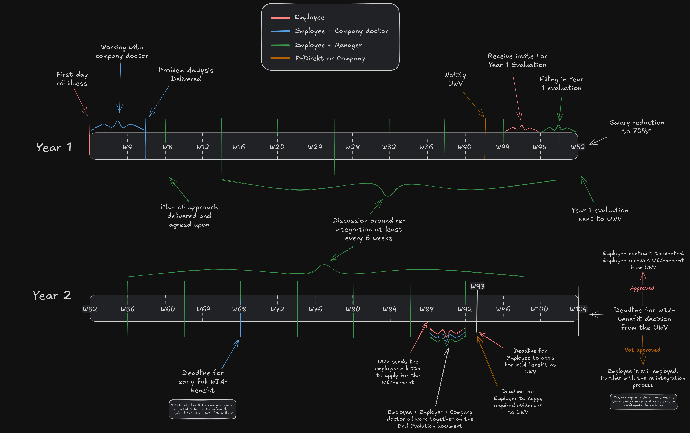

All things long-term illness (*langdurige ziekte*) in the Netherlands are covered by the [*Ziektewet*](https://wetten.overheid.nl/BWBR0001888/2026-01-01/0).

This resource discusses the sections in the *Ziektewet* that cover long-term illness. It addresses what counts as long-term illness, what your rights and obligations are when you've been ill for a while, and provides answers to some frequently asked questions. 

Any steps taken while you're ill should always focus on supporting your health. Understanding your rights, obligations, and processes for long-term illness is key for your future.



## A personal note

Are you currently not feeling your 100% normal self? Then go see your general practitioner (GP, *huisarts*). This resource will be here when you get back. Look after your own health first before worrying about admin and processes.

Are you feeling overwhelmed by the amount of information in this resource? Then you're a normal human being. There's a lot to digest here, so take your time. If you need support, reach out to [hey@techwerkers.nl](mailto:hey@techwerkers.nl) and a fellow worker will try to point you in the right direction.

## Terminology

| Term | Other names | Description | 
| --- | --- | --- |
| *Arbo-arts* | Occupational health physician | The term '*arbo-arts*' is sometimes mistakenly used to refer to a *bedrijfsarts* (company doctor). An *arbo-arts* is a health care professional that can work under the supervision of a company doctor. They aren't allowed to perform independent medical assessments. |
| *Arbodienst* | Working conditions service   Health and safety service | A broad term for a collection of services that a company may provide under the heading of health and wellness, often with the thought of reducing operational risks. Although not mandatory, many large companies hire external providers for managing their *arbodienst*. Many *arbodienst* companies provide not only a *bedrijfsarts* but also others services, such as additional counseling services, wellness plans, risk management, and the like. If your company wants to change its *arbodienst* provider, and if you have a works council, then your works council must be asked for consent on any such change. |
| *Bedrijfsarts* | Company doctor | A primary care doctor, paid by the employer who works in conjunction with a worker -- their patient. A company doctors focus is on their patients health, and is obliged to keep the workers medical information private, and not share it with the company that pays for their services. The company doctor evaluates and reports back an advice to the company on their patients capabilities to perform their regular duties. Company doctors are chosen by the company and, if there's a works council, the company's works council. |
| Employee | Patient   Individual | This resource uses the term 'employee' when referring to contracts or the employee-employer relationship. 'Patient' will be used in conjunction with healthcare related information. |
| Employer | Company   Workplace | The registered company with which the employee has a signed contract to perform their work duties |
| *Huisarts* | General practitioner (GP)   Home doctor | A primary care doctor who's often the first point of contact when someone's ill and requires medical support. A GP can be involved in diagnosing and treating medical conditions, as well as referring to specialists for further support and treatment -- this can include physical (such as orthopedic) and mental (such as therapy) treatments. GPs must keep their patient's medical information private, though they can share it with third parties with the patient's consent. In the Netherlands people can choose their own GP. |
| Illness | Sickness | Anything that prevents someone from performing their regular duties |
| Illness period | | A period of time that spans from the first day that someone's declared ill to their last day of illness. An illness period can include multiple different illnesses, for example the flu and then a broken leg. |
| Illness period, first day of | | 
The first day that the employee was unable to perform their regular duties. ([Burgerlijk Wetboek 7:629 lid 1](http://wetten.overheid.nl/jci1.3:c:BWBR0005290&amp;boek=7&amp;titeldeel=10&amp;afdeling=2&amp;artikel=629&amp;lid=1))   ℹ️ <strong>Note:</strong> Illness during vacation should be transferred to sick leave, and as such the first day of illness might be whilst someone is on vacation.
 |
| Illness period, last day of | | The day at which an employee who was previously registered sick has worked at 100% of their regular duties for 4 weeks without interruption. ([Burgerlijk Wetboek 7:629 lid 10](http://wetten.overheid.nl/jci1.3:c:BWBR0005290&amp;boek=7&amp;titeldeel=10&amp;afdeling=2&amp;artikel=629&amp;lid=10)) |
| Medical information | Patient dossier   Private medical information   Medical details | Medical information includes, among other things:<ul><li>Diagnosis</li><li>Treatments or therapies and the contents thereof</li><li>Details of conversations at medical appointments</li></ul>Anything you'd share in private with your doctor is very likely medical information. |
| Obligation | | Something that's required, whether you like it or not. For example, you're obliged to tell your employer you're calling in sick, unless it's physically impossible for you to do so. |
| Occupational impairment | *Arbeidsongeschikt* | You have an occupational impairment if the prognosis of an illness results in a permanent reduction in a your ability to perform 100% of your regular duties. In other words: illness without full recovery. Occupational impairment is usually measured in a percentage of the person's inability to perform their regular duties. 40% occupationally impaired, implies you can work at 60% of your original capacity |
| *Personeelshandboek* | Employee handbook   Company policy | An optional document that details the rules and procedures on how things are done at a particular company. For example, it may describe how to request leave, call in sick, or report an incident. |
| <a href="https://www.uwv.nl/nl/ziek/loondoorbetaling/plan-van-aanpak">Plan of action</a> | *Plan van aanpak* | The plan is generated  and agreed upon between the employee and the employer based on outputs from the company doctor. It should contain a plan of action about the reintegration trajectory. Basic principles: <ul><li>Work tasks should remain relevant to your original job description. For example, you can't be required to mop floors if that wasn't part of your job.</li><li>It should ideally be a step for step plan for the re-integration with goal dates, not with target dates.</li><li>You may agree to additional company provided therapy, counciling, etc, but you are under no obligation to do so./li></ul>Some employers may be pushy for dates about when you'll return to work. The reality is that health doesn't work that way. Take the plan of action one step at a time, and revise with your employer when needed. |
| Recovered | | When a person who was declared as ill is now able to perform 100% of their regular duties, and has done so for at least 4 consecutive weeks. |
| Regular duties | Work duties   Job tasks | The definition of the work in the employee's contract. What would be expected in a normal day of work, including the hours of work. 100% regular duties implies working at the contracted hours (for example 32 hours if that is stated in the contract). |
| UWV | *Uitvoeringsinstituut Werknemersverzekeringen*   Employee Insurance Agency | The government department that is responsible for evaluating eligibility for, and eventually paying, a number of collectively provided benefits. UWV checks that companies follow the correct procedures when applying for benefits, and will hold companies accountable if processes aren't followed correctly. |
| *Verzekeringarts* | Insurance doctor | This doctor works at the UWV and is responsible for evaluating how the patient has been handled during the long-term illness trajectory. |
| WIA benefit | *WIA-uitkering*, from *[Wet werk en inkomen naar arbeidsvermogen](https://wetten.overheid.nl/BWBR0019057/2026-01-01)*  Sickness benefit | The WIA benefit is specifically for people who are occupationally impaired, either fully or partially. When a person is declared as occupationally impaired, they generally receive a portion (or all) of their future income from the WIA benefit. This benefit is paid from collective provisions, instead of through the employer.   Note that the UWV often rejects applications for WIA benefits from people who are still able to work at 65% or more of their previous capacity (less than 35% occupationally impaired). |
| WW benefit | *WW-uitkering*, from *[Werkloosheidswet](https://wetten.overheid.nl/BWBR0004045/2026-01-01)*   Unemployment benefit | The general unemployment benefit for individuals without paid work in the Netherlands. |
| *Ziektewet* | Sickness benefit act | The law that encompasses what happens when someone is declared ill. This covers, amongst others, long-term illness. It provides protections for both businesses and individuals. |

## I'm not okay, what should I do?

As a human being writing this document: that honestly sucks. Let's figure this one out:

1. **Notify**: Before anything else, tell your manager you're calling in sick. Check your [company policy](#how-can-i-find-my-companys-sick-leave-policy) on how to do so. If your manager is unavailable and you can't find your company policy, check with a coworker. Make sure someone knows that you're not working.
2. **Get help**: Next, figure out what you need for yourself. Depending on the illness, you may want to reach out to your GP. For now, look after yourself.

Company expectations during first days of illness can vary. It's best practice clarify to your manager what they can expect from you over the coming days. 

Company policy may say that you need to contact someone who's actually contributed to your being unwell, for example a manager who's assaulted you. If that's the case, many companies have a trust person (*vertrouwenspersoon*) who you could contact. Alternatively, you could contact your manager's manager, or someone in human resources (HR).

Note that, although uncommon in tech, Dutch law allows companies to withold pay during the first 2 days of sick leave -- sometimes called *[wachtdagen](https://www.rijksoverheid.nl/onderwerpen/ziekteverzuim-van-het-werk/vraag-en-antwoord/hoe-lang-krijg-ik-loon-doorbetaald-als-ik-ziek-ben)*. If so, this should be stated in the company policy. 

## What is long-term illness?

Someone counts as being long-term ill if they're unable to perform their regular duties for at least 4 weeks in a row. Some examples:

- You're a truck driver and you've broken your leg, which prevents you from driving for 2 months
- You're undergoing cancer treatment and are unable to work as a result
- You've had a stroke and have been advised to not work
- You're experiencing extreme stress due to which you're unable to work

In the Netherlands, time that someone isn't able to work due to illness is paid by the employer. (Insurance companies will insure businesses from any losses they might incur as a result of long-term illness. As a worker you don't need to worry about this.)

### A note on burnout

You can be long-term ill due to burnout. Unfortunately, burnout is all too common in the Netherlands, [including](https://www.burnoutpoli.com/feiten-en-cijfers-burn-out/) at [tech](https://www.rivm.nl/mentale-gezondheid/monitor/werkenden/burn-out-klachten) [companies](https://ruudmeulenberg.nl/bedrijven/5-stressvolle-beroepen/). High workloads, toxic culture, unrealistic expectations and transgressive behaviour can lead to an unhealthy work environment. But whether you're working in construction or sitting behind a computer, you need a safe working environment.

Note that 'burnout' isn't a generally recognized diagnosis term. Burnout can get classified as 'generalised anxiety disorder', 'depression', 'insomnia', or other diagnoses. While what you have should ideally only matter to you as a person, insurance companies might request an official diagnosis before covering treatment costs.

[More information on burnout.](https://www.undercoveractivist.com/post/what-can-we-do-about-burnout)

## Your rights and obligations during long-term illness

During long-term illness, specific events and actions must take place at specific times. Some of these obligations are on the employee, and some on the employer. Some are needed for you to be able apply for [WIA benefit](#terminology).

### Rights

As an employee, you have at least the following general rights (non-exhaustive):

- Right to manage their own health
- Right to choose their own healthcare providers
- Right to a second opinion from an alternative company doctor, at the company's expense

### Obligations

As an employee, you have at least the following general obligations (non-exhaustive):

- Work with your employer on the plan of action (the reintegration plan) in conjunction with advice from the company doctor
- Regularly meet with the employer, as per the plan of action
- Stick to any agreements made with the employer, usually as stated in the plan of action
- Work with the company doctor if any agreements with the employer can't be met or are unachievable. 
    - For example, if treatment isn't working as expected, the number of hours a week you work may have to be adjusted down.
- Participate in any required events, such as the [Year 1](#year-1) review or the End evaluation.

## The role of company doctors

A company doctor a primary care doctor paid by the employer. Their professional goal is for you to get well, so that you're able to resume your regular work activities. Company doctors should observe strict patient-doctor confidentiality and shouldn't share medical information with the employer.

The company doctor is, however, allowed to [share non-medical information with your employer](https://www.arboned.nl/nieuws/wat-zijn-de-taken-van-een-bedrijfsarts), concerning:

- Your capabilities and limitations, and the extent to which you're able to work
- An indication as to how long they expect you to be absent
- Any advice regarding adjustments, work arrangements, or interventions that the employer must implement for you to be able to reintegrate

For example, a company doctor may indicate to an employer:

- 'It is unadvised for the patient to be working at this time. The next evaluation is on 25 June.'
- 'The patient is undergoing a form of treatment which requires them to be absent from work for several hours, around 2-3 times a week.'
- 'It is advised that the patient reintegrates by doing light, desk-based work for 10 hours a week.'
- 'The patient is expected to be able to reintegrate over a period of 9 weeks. This is subject to change.'
- 'The patient should not be expected to reintegrate at this time.'

Again, the company doctor **isn't allowed** to share your medical information without your consent.

## Who's allowed to know my medical information?

The *Autoriteit Persoonsgegevens* (Dutch authority on the use of Personally Identifying Information, or PII) [states on medical information](https://www.autoriteitpersoonsgegevens.nl/themas/gezondheid/gezondheidsgegevens-in-een-dossier/toegang-tot-het-dossier-met-gezondheidsgegevens):

> … no information from the medical file may be shared with others outside the practice or institution without the patient's or client's consent.

There are strict penalties in the Netherlands for accessing or sharing personal information without consent, a process that's guarded by the *Autoriteit Persoongegevens*.

This means that you're under **no obligation** to share medical information with your manager or boss. 

You're also under no obligation to share information with the company doctor. That said, providing your company doctor with relevant information may improve their ability to treat you. And like any other health care provider, company doctors are just as much required to keep your information confidential or they may face professional penalties. 

## Timeline

If you're long-term ill, certain events and actions need to take place at specific times. Here's a diagram that gives a visual overview of what should happen when during the first two years of long-term illness:

*Overview of what needs to happen during year 1 and year 2 of long-term illness.*

This section describes what should happen during the first two years of long-term illness. 

You can also [exit the long-term illness trajectory](#exiting-long-term-illness) at any point before two years have passed.

ℹ️ **Note:** Keep specific dates (such as the first date of the illness, appointment dates with company doctors) in a calendar somewhere. Having a record of what happened when can help you, especially during the latter stages of long-term illness.

### Year 1

| Timeline | Description | Responsibility of | 
| --- | --- | --- |
| <b>Day 0</b>  First day of illness | First day of illness or reporting in sick. This generally involves talking to your manager or informing someone at your company. If you're unsure what the process is, check with a colleague or your company policy. | Employee |
| <b>Week 1</b> Contact with the company doctor | Usually someone at your company will inform the company doctor within the first week. The company doctor might reach out to you, or you may be given the company doctor's contact information and be asked to reach out.  ⚠️ <b>Important:</b> Contact your company doctor in line with your company's policies. | Employee + Employer |
| <b>By week 6</b> Delivery of problem analysis | The company doctor should deliver a problem analysis of your long-term illness to the company. This can contain information such as:<ul><li>Cause of illness, that is, whether it's home related, work related, or a combination (no medical information)</li><li>What sort of work you can still do, and how much (if any)</li><li>What the key next steps are in the reintegration trajectory</li><li>Future outlook in terms of work tasks and ability to perform your regular duties</li></ul> | Company doctor, in consultation with the employee |
| <b>By week 8</b>, or within 2 weeks of the problem analysis <a target="_blank" rel="noopener noreferrer nofollow" href="https://www.uwv.nl/nl/ziek/loondoorbetaling/plan-van-aanpak">Plan of action</a> delivered | Employee and employer agree on a plan of action, generally based on the input from the company doctor. This can include:
<ul><li>Adjustments to work tasks, such as no heavy lifting</li><li>Adjustments to working hours</li><li>Adjustments to the working environment, for example a different chair, better ventilation</li><li>Additional company-provided treatment or therapies.</li><li>Additional company-provided counseling or training, if applicable</li></ul>
 ℹ️ <b>Note:</b> Adjustments to working hours can mean 100% staying at home and rehabilitating.   ℹ️ <b>Note:</b> The employer isn't legally required to follow the advice of the company doctor. However, they generally do, as the company doctor's recommendations are used if disputes happen later in the trajectory. | Employee + Employer |
| <b>Week 8</b> until the exit from long-term illness, every 6 weeks at a minimum   Evaluation meetings| Meeting to assess how the reintegration trajectory is going in light of the plan of action. What's working, what isn't, do you require any adjustments?  If, for whatever reason, the plan of action isn't working, then you need to contact the company doctor and follow their advice.  ⚠️ <b>Important:</b> You're required to be present in these catch-up meetings (within reason). The employer must ensure the meetings take place at suitable times. | Employee + Employer |
| <b>Week 42</b> Illness declared to UWV | Generally the government agency called 'P-Direkt' reports your long-term illness to the UWV. If P-Direkt doesn't perform this task, then the employer needs to do so. | Employer |
| <b>Weeks 44-48</b> Prepare for year 1 evaluation | The UWV informs the employer about the process of the year 1 evaluation. The employer gets relevant information and advice from the company doctor and submits that to UWV. | Employer |
| <b>By week 52</b> Year 1 evaluation | You'll meet with your employer to evaluate your reintegration trajectory -- what works, what doesn't, what the future entails -- along with feedback from the company doctor. The focus is on your capability to perform your regular work duties. The conversation will likely include questions along the lines of:
<ul><li>Are you likely to reintegrate at all? If not, could you consider applying for early WIA benefit?</li><li>Can you likely reintegrate into your current role? <ul><li> If not, can you reintegrate into another role at the same company? ([*Eerste spoor*](#eerste-spoor-first-track))</li><li>If not, can you reintegrate into a similar role at another company? ([*Tweede spoor*](#tweede-spoor-second-track))</li></ul><li>What is the plan of action for the coming year?</li></ul>   ⚠️ <b>Important:</b>This conversion should only concern your ability to perform your regular work tasks, and shouldn't consider specific medical details. The company doctor can advise what your capabilities are without providing medical information.  ℹ️ <b>Note:</b> The year 1 evaluation reports is supplied as evidence to the UWV at the end of the 2-year period. | Employee + Employer |
| <b>Week 52+</b> Salary reduction likely | Dutch law requires companies in the Netherlands to pay at minimum 70% of your salary for the whole 2-year period of long-term illness. That said, it's common for companies to pay 100% of your salary for most if not all of the first year, and then reduce that to 70% from the start of year 2. (They're also allowed to pay 100% for the whole 2 years.) Check your company policy for details. | Employer |

#### Additional company benefits

Why might a company offer additional training, therapy, or other treatments when you're ill? Two core reasons:

- They are genuinely nice people at the company who care about your health
- There's a salary-sized fiscal incentive, as the company is required to pay your wages while you're away on sick leave

⚠️ **Important:** That your company pays for any additional resources does *not* mean they're entitled to your medical information. To be explicit: if your company is paying for a psychologist, they're *in no way* entitled to information about any of the conversations you had. That would be a severe breach of privacy, professional confidentiality, and data protection duties.

### Year 2

| Timeline | Description | Responsibility of |
| --- | --- | --- |
| <b>From week 8</b>, continued every 6 weeks at a minimum  Evaluation meetings | Meetings to evaluate how your reintegration is going in light of the plan of action continue. The content of the discussions may change though in year 2. If it's unlikely that you'll return to a role at your current company (a trajectory called '[eerste spoor](#eerste-spoor-first-track)'), then alternatives (so-called '[tweede spoor](#tweede-spoor-second-track)') may be discussed and your plan of action might get adjusted. | Employee + Employer |
| <b>By week 68</b>   Deadline to apply for early WIA benefit | If it's clear that you won't be able to return to your role (for example due to terminal illness), then you can apply early for the WIA benefit. Your application needs to be in by week 68. | Employee + Company doctor |
| <b>Weeks 86 to 93</b>  Start compiling end evaluation | If it's clear that you're unlikely to return to your role, then you can now start creating an end evaluation. The end evaluation gives an overview of the reintegration process, along with some documents produced along the way. This includes the year 1 evaluation, as well as your medical dossier compiled by the company doctor. You'll submit the end evaluation and accompanying documents when applying for the WIA benefit. The insurance doctor at the UWV evaluates the information to ensure that the diagnosis and treatments were within guidelines. | Employee + Company doctor | 
| <b>Week 88</b> | The UWV notifies you to outline how you can apply for the WIA benefit. | UWV |
| <b>By week 93</b>   Apply for WIA benefit | If you're unlikely to reintegrate, and if you're applying for WIA benefit, then you must now submit the end evaluation and accompanying documents to the UWV. The employer submits their application for a permit to end your contract, together with supporting evidence. In exceptional cases, the UWV can extend this deadline if you're on a reintegration trajectory and are very likely to reintegrate before the end of the 2 year period. | Employee + Employer |
| <b>Week 104</b> UWV decision known | The UWV should by now have communicated: <ul> <li>whether you'll receive the WIA benefit or not</li> <li>whether your employer is allowed to end your contract unilaterally or not</li></ul> If the employer is allowed to unilaterally end your contract, then you're now officially without a job. If your WIA benefit application got approved, then from now on you'll paid directly by the UWV.   ⚠️ <b>Important:</b> If you're in the Netherlands on a work-related visa, check whether you're still allowed to stay in the country. | UWV |

### After year 2

The UWV must ensure that your employer has followed all the rules and regulations in the process of long-term illness correctly. If the UWV denies the employer's request to unilaterally terminate your contract, then the UWV can require the employer to continue with the reintegration trajectory. This can happen for up to another 52 weeks, and is at the discretion of the UWV.

#### Disputing the UWV's decision

If the UWV permits your employer to [unilaterally end your contract](https://www.uwv.nl/nl/ontslag/ontslag-na-2-jaar-arbeidsongeschiktheid-ziekte), but you believe they shouldn't have, then you have the right to challenge the UWV's decision. 

For example, when requesting permission from the UWV to end your contract, the employer must provide certain documents as evidence. If you have indication that some of the documents that your employer submitted are incorrect, then you can argue that this invalidates their case. And that the employer's request to be allowed to fire you shouldn't be granted.

If you dispute the UWV's decision and the UWV rules in your favour, then you keep your contract. You remain employed, the reintegration process will generally continue, and your boss must continue to pay you.

ℹ️ **Note:** Unsure whether your case was handled correctly? You might want to contact a labour lawyer.

#### Reasons why the UWV might reject the employer's request

Some of the reasons why the [UWV may deny the employer's request to be allowed to unilaterally terminate your contract](https://uwverzuimregisseur.nl/kennisbank/afwijzing-wia-aanvraag/):

- Employer has made insufficient efforts to facilitate your reintegration
- There are signs that you could still recover and reintegrate
- Evidence as to how occupationally impaired you are is unclear
- Your medical dossier, compiled by the company doctor, contains insufficient information to justify terminating your contract
- Procedural errors
- You've challenged the UWV's earlier decision to allow the employer to terminate your contract, and the UWV agrees with your challenge

## Exiting long-term illness

You can exit the long-term illness trajectory in various ways:

* Reintegration ...
  * ... [into your current company (*Eerste spoor*)](#eerste-spoor-reintegrate-into-current-company) 
  * ... [into a different company (*Tweede spoor*)](#tweede-spoor-reintegrate-into-a-different-company)
* [Employer terminates the contract](#employer-terminates-the-contract)
* [Resigning? Generally not advised](#resigning-dont-do-it-in-most-cases)

The following sections give more information on each of these options.

There's no 'correct' way to exit a long-term illness trajectory. Which path you take depends on many factors, and should always focus on what's best for you given your personal circumstances.

### Reintegration

Reintegration involves going back to formal, paid work in some form or other, and in some capacity or other---whether that's in your current role, a different role, at your current company or a different one.

Your reintegration strategy should be part of the plan to action [LINK]. You're considered as having successfully reintegrated when you:

1. Are working your agreed contracted hours
2. Are performing your regular duties, or agreed adjusted duties
3. Have been doing (1) and (2) for 4 consecutive weeks

#### *Eerste spoor*: Reintegrate into current company

The *Eerste spoor* (roughly, 'first track') way of exiting a long-term illness trajectory involves reintegrating into the company where you're currently working. *Eerste spoor* generally assumes a non-terminal disability, which could either be temporary or permanent. Examples of re-integrating through *eerste spoor* include:

| Situation | Comment |
| -- | -- |
| Reintegrate into your current role | Bluntly put, 'back to the day job'. |
| Reintegrate into the same role, but in a different part of the business | Mostly applicable if your illness was related to the specific work environment, and you work at a larger organization. For example, a project manager may experience high stress in one department, but might thrive doing the same work in a different department. |
| Reintegrate into a different, equivalent role in the same company | This could apply if a physical injury prevents you from doing your current job, and your work environment couldn't be adjusted to suit this role specifically. For example, if an injury leaves you unable to walk. |
| Reintegrate into the same role, but at a permanently reduced capacity | Some illnesses can leave you at a permanently reduced capacity to work. For example, if you've experienced repeated concussions or strokes, at the end of the 2-year trajectory you may have the prognosis that you'll be able to work at at most 70% capacity. |

#### *Tweede spoor*: Reintegrate into a different company

The *[Tweede spoor](https://www.fnv.nl/werk-inkomen/ziekte-re-integratie/re-integratie/2e-spoor)* (second track) involves reintegrating into a different company. Your contract with the current company would end, and a new one at another company begins.

Is this strange? It can actually make a lot of sense in certain situations. For example:

- You work in a call centre. Your long-term illness is related to the subject matter of the calls, which induces anxiety and make you relive past trauma.
- You're reintegrating, but it's clear that the work environment isn't conducive to your recovery.
- In consultation with the company doctor, you start looking at job postings for call centre work at other companies where the subject matter doesn't hamper your recovery.

If a suitable position is found, then the *tweede spoor* has benefits to all the parties:

- You get to work in an environment that suits you better. You're likely allowed to continue your reintegration trajectory, and are less likely to require WIA or WW benefits.
- The previous company no longer has to pay your wages and facilitate the reintegration trajectory.
- The new company gets certain tax benefits and can get insurance to absorb the risk of onboarding someone who's reintegrating from long-term illness.

⚠️ **Important:** You shouldn't ever be pressured to apply for jobs in other companies during your reintegration. Only consider *tweede spoor* in consultation with the company doctor, never at the initiative of the employer.

#### A note on reintegrating at a reduced capacity

If you're still able to work to some extent, though not 100% of your prior hours, then you could consider reintegrating at a reduced capacity. This option for exiting the long-term illness trajectory might come up in conversation with the company doctor.

Note, though, that the option to reintegrate at a reduced capacity might not be available in all cases. While the company must facilitate your reintegration, they aren't required to offer you reduced hours if they can argue it wouldn't be feasible.

For example: You're reintegrating and the company doctor expects that you might be able to reach 60% of your previous capacity. The company, however, argues that they need someone at 80% capacity, otherwise it'll negatively impact their business. 

In this case, the UWV decides what happens to your contract.

### Employer terminates the contract

If you fulfill your obligations as a worker who's long-term ill (see: [Timeline](#timeline)), it's pretty much impossible for your employer to unilaterally end your contract during the first 2 years illness. 

Your employer can only unilaterally end your contract during long-term illness if the UWV gives them permission to do so. But the UWV has strict rules on when it'll give such permission, and generally won't do so during the first two year of reintegration.

The only exception to this is at the end of the long-term illness trajectory where the employer applies for a permit to unilaterally end the contract.

At the end of the 2 years, two applications made to the UWV:

- You apply for the WIA Benefit
- The employer applies for a permit to end the contract unilaterally

The UWV has the last say on whether the employer can end your contract or not.

If the UWV approved the employer's request (though see here for [some reasons they might not](#reasons-why-the-uwv-might-reject-the-employers-request)) and your WIA benefit application, then you'll now get paid monthly by the UWV.

ℹ️ **Note**: You don't *resign* at the end of the two-year process. Instead, assuming you applied and are eligible, you'll transfer to receiving the WIA or WW benefits. So never resign if anyone in the company asks or pressures you to do so!

⚠️ **Important**: Many work visas, such as the *kennismigrant* (knowledge migrant, highly-skilled migrant) visa, require you to be formally employed. When your contract ends, then you're no longer formally employed. The WIA benefit is not seen as employment. Hence, you're no longer meeting your work visa requirements. Without a valid visa, you may need to leave the country after two years of long-term illness.

### Resigning? Don't do it! (in most cases)

Your work environment itself may be anxiety-inducing and hampering your recovery. On top of that, the long-term illness reintegration process can be bureaucratic, and at times stressful. Especially if you're not sure if obligations are being followed correctly. (This happens more often than it should.)

As a result, some people decide it's just not worth the hassle to try to reintegrate. They want to cut the process short and resign.

_**Think very carefully if you're planning to resign!**_

If you resign, then you may become ineligible for the most important benefits available in the Netherlands for people who experience long-term illness or unemployment. Benefits that you'd be fully entitled to otherwise.

Here's why. 

The WW and WIA benefits are designed to cover situations where you're unable to work due to factors outside of your control. However, when you resign from a job, authorities in the Netherlands will frame that as you being *able* to work, but simply *choosing* not to do so. Choosing not to work is within your control. Hence, in the worst case scenario, resigning may leave you ineligible for the WIA or WW benefits that you'd normally be entitled to.

Of course whether you resign or not is still a personal choice. There's always a choice. Decide what's best for you, and ideally discuss your choices with someone you trust and a healthcare provider.

## FAQ

### How can I find my company's sick leave policy? 

Not all companies have a published policy, however if there is one, it should always be accessible on some intranet or document archive. If all else fails:

- Ask a coworker
- Ask someone in HR
- Ask your manager

### Will people think I'm just on a paid vacation? 

People might think that, but they're wrong and it couldn't be any further from the truth. Some people lack empathy in these situations, and they just may not know how to interact in that case. The reality is, if you're ill and can't work, then you need time to recover---as would anyone else in those circumstances.

### Can my doctor say I'm not allowed to work?

You might feel you need to ask your doctor: 'Am I allowed to work?'. However, it's not for a doctor to give or refuse *permission* to work like that to their patients. 

What doctors, and any other healthcare provider, can do is give you personal *advice* on what's best for your treatment. For example, they might say: 'I would recommend you take at least 3 weeks rest to recover', and state how (not) following their advice could affect your treatment. Hence as a patient, it's more helpful to ask your healthcare provider what sort of activities you can best do and avoid, and for how long, given the specific treatment you're undergoing. 

### How can I be 30% occupationally impaired (*arbeidsongeschikt*)? 

The extent to which you're impaired can vary depending on what specific illness you have and the expected prognosis. For example, you may have suffered an acquired brain injury (such as a stroke) which leaves you still able to work, but at a reduced capacity.

### My manager keeps giving me random medical advice. What should I do?

In general, your manager shouldn't have medical details of your illness.

From a social perspective, maybe they're trying to be overly helpful? If the advice is unwelcome, you can tell them that you appreciate that they're trying to help, but that it's not helping you right now. If that doesn't resolve the situation, then you can escalate matter internally, for example by speaking to HR.

### Can my boss or line manager ask about my diagnosis? 

No. Really no. 

They can ask 'When will you come back?', or 'What work will you be able to perform?'. But anything related to what illness you have, a specific diagnosis, or medical information, is a hard no.

The reality is that people are curious, however you're under no obligation to share medical details with anyone in your company.

### Is my manager allowed to share my reintegration plan with my teammates?

Medical information: No. Your manager shouldn't have medical details of your illness in the first place. And if they do, medical information is protected data and mustn't be shared without your explicit consent.

However, your manager can share information insofar as it's relevant in the context of performing work duties. For example, it can be useful for your coworkers to know which tasks you're picking up right now.

Information about where you are in your reintegration (such as how many hours you're building up), are less relevant though. Discuss with your manager what you're comfortable sharing.

Your company doctor, GP, and any specialists you might be seeing are all heathcare providers. In theory, they should all have your well-being and recovery at heart.

However, only the company doctor's advice forms the direct input to your plan of action, which ultimately you and your employer should agree upon. Your company doctor can ask for additional information from your other healthcare providers, however this needs to be under strict written consent from you, the patient. The information should always be sent between the health care providers (there is a formal channel for this), and the patient shouldn't be requested to gather this information directly.

If you're concerned about the advice your company doctor is giving you, then you're fully entitled to a second opinion from an alternative company doctor -- at the company's expense.

### I disagree with my company doctor's advice. What should I do? 

You can get a second opinion fron an alternative company doctor. The employer is required to pay for it.

### Is the company doctor allowed to share my medical details with the company? 

Medical details: No. Where it concerns their advice on what work duties you're able to perform: Yes. 

For example, the company doctor might have advised you that while you're receiving certain medical treatment, it's best for you not to perform your usual work duties. Only the company doctor's *advice* should be communicated both to you (their patient) and your employer (the company), not any confidential medical information.

### Can the company doctor tell me to leave the company?

A company doctor can only advise; they're not here to tell you what to do or not do. 

If the cause of the illness is related to the work environment at the specific company, then the company doctor may suggest you consider *[Tweede Spoor](#reintegrate-into-a-different-company-tweede-spoor)*, a trajectory where you'd reintegrate at a different company. But outright instructing you to leave the company? No. 

### I'm reintegrating, but my health is getting worse. Can I go back to full sick leave? 

Yes of course. Your reintegration should match what you are capable of doing. If you're unable to work right now, then you shouldn't be working right now. That said, it's best practice to consult with your company doctor on any change you make. The *Ziektewet* requires you as a worker to [consult with the company doctor and your employer at regular intervals](#timeline), so make sure you meet those requirements.

### What happens if I was ill, recovered, and then got ill again with something else?

In the eyes of the *Ziektewet*, long-term illness is defined in terms of a [long-term illness period](#terminology), not by what illness you have. A long-term illness period starts on the first day of your sick leave, and automatically ends after you've worked 100% of your contracted work duties for 4 weeks in a row. 

If a second illness occurs during those 4 weeks which prevents you from performing your regular duties, then in the eyes of the law it's the *same illness period* -- regardless of whether the illness is something completely different form what you had before.

For example, say you've been reintegrating from burnout just gone back to working at 100%. If in week 3 you break a leg and need to go back to 20%, that technically counts as the same illness period, even though a broken leg is not the same as burnout.

Why does this matter? It matters, because after 2 years of illness, your employer can ask the UWV for permission to end your contract unilaterally.

In an extreme example, you may have been reintegrating over 22 months, went back to 100%, but then break your leg after 3 weeks. Your employer could now ask the UWV for permission to get rid of you if you're not back at 100% within a matter of weeks.

If you're in this situation, talk to your employer and company doctor. At their discretion, it might be possible to count the second illness as a separate illness period -- giving you space to recover instead of going on a fast-track to losing your job. 

### I'm on probation or on a fixed-term contract. Does that make a difference?

Yes, and sadly not in the worker's favour. 

Employers can end your contract during the probation period, or not renew a fixed-term contract, [without giving any reason whatsoever](https://www.uwv.nl/nl/ontslag/werknemer-ontslaan). This means that if you get ill during your probation period or while on a fixed-term contract, the employer can end your contract without you having recourse on the provisions provided through the *Ziektewet*. 

Depending on your circumstances, you [may not even be entitled to the WW-benefit](https://www.uwv.nl/nl/ww/wanneer-recht-op-ww).

This absolutely sucks, especially given the rise in the use of short-term contracts, but it's the reality of the law as it currently is.

### How will long-term illness affect my work visa? 

🤷 What happens to your work visa at the end of the 2 year long-term illness trajectory really depends on the specifics of your visa. Many work visas require a condition of employment to remain valid. If you've been ill for 2 years, your employer can ask the UWV for permission to unilaterally end your contract. If the UWV gives that permission, then at the end of the 2 year period you're officially without a job. 

To be sure, check the specific requirements of your visa, maybe consult with the government immigration department (IND). And you might want to consult a labour lawyer too.

### Things aren't going well. How can I escalate?

It depends on what the issue is:

- If you have concerns about the advice given to you by your company doctor, you can ask for a [second opinion](#can-i-request-second-opinion-from-a-different-company-doctor), and the company will have to pay for it.
- If your manager is exhibiting transgressive behaviour, for example by trying to pressure you into working more than you're able to, then you can escalate to HR.
- If you disagree with the UVW's decision to give your employer permission to end your contract unilaterally, then you can mount a [dispute](#disputing-the-uwvs-decision).

Also, keep a paper trail. If you feel you're not being treated correctly, then ask for any requests in writing (email). If your manager doesn't send you things in writing, you can create the paper trail yourself. Write up your own summary with your understanding of what was agreed, send it to your manager, and ask them to point out any errors. This way, you're ensuring a paper trail exists even with uncooperative managers.

### Where can I get legal advice? 

Are you a member of a labour union? That's a great place to start. Disputes have been happening for centuries, and in a union you can find other workers who support you. You might also be able to get a lawyer directly through your labour union, if needed.

## Get help

Still feeling stuck? Feel free to contact <a target="_blank" rel="noopener noreferrer nofollow" class="link" href="mailto:hey@techwerkers.nl">hey@techwerkers.nl</a> and a fellow worker will try to give you some contacts.
