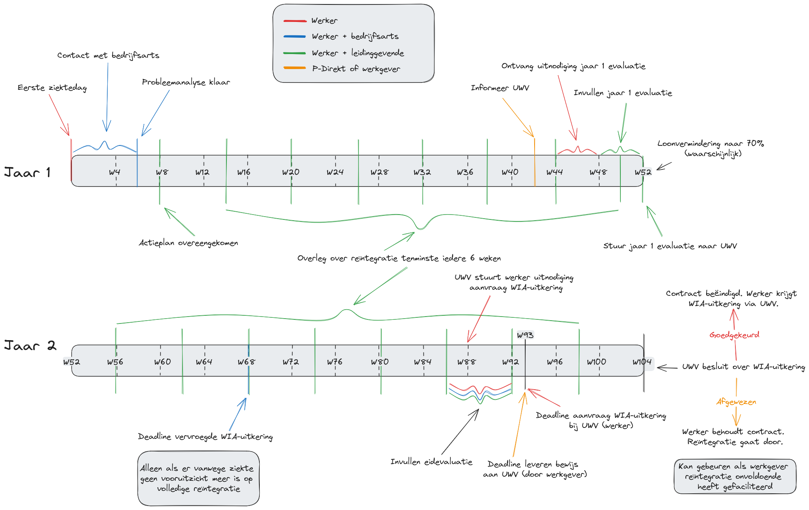

Alles wat met langdurige ziekte te maken heeft valt in Nederland onder de [Ziektewet](https://wetten.overheid.nl/BWBR0001888/2026-01-01/0).

Dit document bespreekt wat langdurige ziekte is, wat binnen de Ziektewet je rechten en plichten zijn als werker, en geeft antwoorden op veelgestelde vragen.

Als je ziek bent moet het ondersteunen van jouw gezondheid centraal staan. Weten hoe alles werkt en wat er van je verwacht wordt kan dus essentieel zijn voor je toekomst.



## Persoonlijk woord vooraf

Voel je je niet goed? Ga dan naar je huisarts. Deze informatie is er nog gewoon als je terugkomt. Zorg eerst voor jezelf voordat je je zorgen gaat maken over administratieve procedures.

Raak je een beetje overweldigd door alle informatie die er op je afkomt? Je bent ben je niet alleen! Neem je tijd. Als je wat hulp kunt gebruiken, stuur dan een mailtje naar [hey@techwerkers.nl](mailto:hey@techwerkers.nl) en iemand gaat proberen om je verder te helpen.

## Woordenlijst

| Term | Ook bekend als | Wat is het |
| --- | --- | --- |
| Arbeidsongeschikt | Afgekeurd | Vrij harde, soms negatief geladen term die in de praktijk toch losjes gebruikt wordt. Je telt als 'arbeidsongeschikt' voor zover je permanent minder dan 100% van je reguliere werktaken kunt uitvoeren. Kortom: ziekte zonder volledig herstel. Arbeidsongeschiktheid wordt meestal uitgedrukt als een percentage. Als je bijvoorbeeld nog 60% kan doen van wat je eerst deed, dan ben je 40% arbeidsongeschikt. Wanneer iemand 100% arbeidsongeschikt is wordt ook wel gesproken van 'afgekeurd' zijn.|
| Arbo-arts |  | Een arbo-arts is een zorgverlener die onder toezicht van een bedrijfsarts kan werken. Arbo-artsen mogen niet zelfstandig iemand medische beoordelen. Lete op: een arbo-arts wordt soms verward met een bedrijfsarts, maar da's een andere functie. |
| Arbodienst |  | Een reeks diensten die een werkplek kan aanbieden onder het mom van 'gezondheid en welzijn', om te voorkomen dat werkers gewond of ziek raken. Het aanbod omvat vaak een bedrijfsarts, maar het kan bijvoorbeeld ook om extra begeleiding of welzijnsplannen gaan. Grote bedrijven huren vaak externe leveranciers in voor hun arbodienst. Wil jouw bedrijf van arbodienst-leverancier wisselen? Als je een ondernemingsraad hebt, dan moet het bedrijf de ondernemingsraad eerst om toestemming vragen. |
| Bedrijfsarts | | Een arts, betaald door de werkgever, die een werker (diens patiënt) begeleidt om weer aan het werk te kunnen. De focus van een bedrijfsarts ligt op de gezondheid van de patiënt. De bedrijfarts is verplicht de medische gegevens van de werker vertrouwelijk te behandelen en mag deze niet delen met het bedrijf dat hen betaalt. De bedrijfsarts beoordeelt in hoeverre jij je reguliere werkzaamheden nog kunt uitvoeren en brengt hierover advies uit aan je baas. Bedrijfsartsen worden gekozen door het bedrijf. Als er een ondernemingsraad is, kan moet deze toestemming geven. |
| Hersteld | | Je telt als hersteld wanneer je na ziekte tenminste 4 weken lang 100% van je reguliere werkzaamheden hebt uitgevoerd. |
| Huisarts | | Vaak het eerste aanspreekpunt wanneer je ziek bent en medische hulp nodig hebt. Een huisarts kan diagnoses stellen, aandoeningen behandelen, en patiënten doorverwijzen naar specialisten. Dit kan zowel fysieke (zoals orthopedische) als psychische (zoals therapie) behandelingen omvatten. Een huisarts moet de medische gegevens van diens patiënten vertrouwelijk behandelen. Als jij toestemming geeft mag een huisarts jouw medische gegevens wel delen met derden. In Nederland kan iedereen diens eigen huisarts kiezen. |
| Medische informatie | Patiëntendossier   Persoonlijke medische informatie   Medische gegevens | Medische informatie omvat onder andere:<ul><li>Diagnosegegenves</li><li>Behandelingen of therapieën die je volgt</li><li>Details van wat je tijdens medische afspraken bespreekt</li></ul>Alles wat je privé met je arts deelt is zeer waarschijnlijk medische informatie. |
| Personeelshandboek | Bedrijfsbeleid | Een optioneel document waarin de regels en procedures voor een bepaald bedrijf worden beschreven. Het kan bijvoorbeeld beschrijven hoe je verlof aanvraagt, je ziek meldt of een incident rapporteert. |
| <a href="https://www.uwv.nl/nl/ziek/loondoorbetaling/plan-van-aanpak">Plan van aanpak</a> | Plan van aanpak (Actieplan, Reïntegratieplan) | Een plan voor hoe je gaat reïntegreren. Het plan wordt opgesteld en overeengekomen tussen de jou en de werkgever, op basis van het advies van de bedrijfsarts. Basisprincipes: <ul><li>De werkzaamheden moeten relevant blijven voor je oorspronkelijke functie. Je kunt bijvoorbeeld niet verplicht worden om de vloer te dweilen als dat niet tot je takenpakket behoort.</li> <li>Een reïntegratie moet geen deadlines bevatten. Het is stappenplan, waarbij je pas doorgaat naar de volgende stap als je de eerdere stap goed aankunt.</li> <li>Het bedrijf kan je gratis aanvullende therapie of behandelingen aanbieden. Je bent niet verplicht die te volgen.</li></ul>Sommige bazen willen graag weten op welke datum je weer aan het werk gaat. Maar zo werkt gezondheid niet. Doorlop het plan stap voor stap aan, en pas het waar nodig aan met je werkgever.|
| Reguliere taken | Werkzaamheden   Functieomschrijving | De taken die in je arbeidscontract staan; watat er op een normale werkdag van je verwacht wordt, inclusief  werkuren. 100% reguliere taken houdt in dat je al je contractuele uren werkt (bijvoorbeeld 32 uur als dat in je contract staat). |
| UWV (afkorting van [Uitvoeringsinstituut Werknemersverzekeringen](https://www.uwv.nl/nl)) |  | De overheidsinstantie die beoordeelt of een bedrijf reïntegratie correct faciliteert, wie recht heeft op uitkeringen voor langdurige ziekte of werkloosheid, en die de gelden uit deze collectieve verzekeringen ook uitkeert. | 
| Verplichting | | Iets dat vereist is, of je nu leuk vindt of niet. Je bent binnen de Ziektewet bijvoorbeeld verplicht om het je werkgever te melden als je ziek bent (tenzij je bijvoorbeeld in coma ligt en dat dus écht niet zelf kunt doen). |
| Verzekeringsarts | | Een arts die voor het UWV werkt en beoordeelt wat voor zorg jij als werker (patiënt) hebt ontvangen tijdens je ziekteverloop. | 
| Werker | Patiënt   Individu   Werknemer | Deze bron gebruikt de term 'werker' wanneer het gaat over een arbeidsrelatie, en 'patiënt' wanneer het gaat over gezondheidszorg. |
| Werkgever | Bedrijf   Werkplek | Het bedrijf waarmee jij als werker een contract hebt om bepaalde werkzaamheden uit te voeren. |
| WIA-uitkering | Ziekte-uitkering | Een uitkering op basis van de [Wet werk en inkomen naar arbeidsvermogen](https://wetten.overheid.nl/BWBR0019057/2026-01-01) (WIA) is voor als je geheel of gedeeltelijk 'arbeidsongeschikt' bent. Met een WIA-uitkering ontvangt je het een deel van (of al) je inkomen uit collectieve voorzieningen, in plaats van via de werkgever.   Let op: het UWV wijst aanvragen voor WIA-uitkeringen vaak af als je nog 65% of meer van je oorspronkelijke capaciteit kunt werken (dus als je minder dan 35% arbeidsongeschikt). |
| WW-uitkering (afkorting van [Werkloosheidswet](https://wetten.overheid.nl/BWBR0004045/2026-01-01)) | Werkloosheidsuitkering | De algemene werkloosheidsuitkering voor personen zonder betaald werk in Nederland. |
| Ziekte | Aandoening | Elke aandoening die je ervan weerhoudt om je normale werkzaamheden uit te voeren. |
| Ziekteperiode | | De periode die ingaat op de eerste dag dat je je ziek meldt tot en met de laatste dag van ziekte. Eén ziekteperiode kan meerdere verschillende ziektes omvatten, bijvoorbeeld eerst de griep en dan een gebroken been. |
| Ziekteperiode, eerste dag van | | 
De eerste dag dat je als werker je normale werkzaamheden niet kan uitvoeren. ([Burgerlijk Wetboek 7:629 lid 1](http://wetten.overheid.nl/jci1.3:c:BWBR0005290&amp;boek=7&amp;titeldeel=10&amp;afdeling=2&amp;artikel=629&amp;lid=1))   ℹ️ <strong>Opmerking:</strong> Ziekte tijdens vakantie telt als ziekteverlof. De eerste ziektedag kan dus in de vakantie vallen.
 |
| Ziekteperiode, laatste dag van | | De dag waarop iemand die eerder ziek was 4 weken ononderbroken 100% van diens reguliere werkzaamheden heeft verricht. ([Burgerlijk Wetboek 7:629 lid 10](http://wetten.overheid.nl/jci1.3:c:BWBR0005290&amp;boek=7&amp;titeldeel=10&amp;afdeling=2&amp;artikel=629&amp;lid=10)) |
| Ziektewet |  | De wet die regelt wat er gebeurt wanneer een werker ziek wordt. De wet biedt bescherming aan zowel bedrijven als individuen. |

## Ik voel me niet goed, wat moet ik doen?

Even van mens tot mens: dat zuigt. Hier zijn de eerste stappen:

1. **Meld**: Meld je allereest ziek bij je manager. Check het [personeelshandboek](/nl/resources/long-term-illness#hoe-vind-ik-het-ziekteverlofbeleid-van-mijn-bedrijf) voor hoe je je ziekmeldt. Als je het personeelshandboek niet kunt vinden, vraag het dan aan een collega. Zorg ervoor dat in ieder geval iemand weet dat je niet werkt.
2. **Zoek hulp**: Bedenk nu wat jij zelf nodig hebt. Afhankelijk van wat je hebt, kun je naar je huisarts. Zorg goed voor jezelf.

Wat er tijdens de eerste dagen van ziekte van je verwacht wordt kan per bedrijf verschillen. Het is slim om je manager te laten weten wat die de komende dagen van je kan verwachten.

Het kan zijn dat je bedrijf voorschrijft dat je contact moet opnemen met iemand die daadwerkelijk heeft bijgedragen aan je ziekte, zoals een manager die je heeft geïntimideerd. In dat geval is er misschien een vertrouwenspersoon met wie je contact kunt opnemen? Je kunt ook contact opnemen met de manager van je manager, of met iemand van personeelszaken.

Let op: Hoewel het in de techsector niet gebruikelijk is, mogen bedrijven volgens de Nederlandse wet je loon inhouden tijdens de eerste twee dagen dat je ziek bent (ook wel 'wachtdagen' genoemd). Als dat zo is moet dit in het bedrijfsbeleid of personeelshandboek staan.

## Wat is langdurige ziekte?

Je telt als langdurig ziek wanneer je 4 of meer weken achter elkaar niet in staat bent om je reguliere werkzaamheden uit te voeren. Bijvoorbeeld:

- Je rijdt op de vrachtwagen en hebt je been gebroken, waardoor je 2 maanden niet kunt rijden.
- Je ondergaat een behandeling voor borstkanker en kunt daardoor niet werken.
- Je hebt een beroerte gehad en bent geadviseerd om niet te werken.
- Je ervaart enorme stress waardoor je niet kunt werken.

Als je door ziekte niet kunt werken moet je werkgever je loon blijven doortaald. (Bedrijven hebben vaak een verzekering voor dit soort kosten. Daar hoef jij als werker je geen zorgen over te maken.)

### Over burnout

Je kunt langdurig ziek zijn door burnout. Helaas komt burnout maar al te vaak voor in Nederland, [ook](https://www.burnoutpoli.com/feiten-en-cijfers-burn-out/) [bij](https://www.rivm.nl/mentale-gezondheid/monitor/werkenden/burn-out-klachten) [techbedrijven](https://ruudmeulenberg.nl/bedrijven/5-stressvolle-beroepen/). Hoge werkdruk, een giftige sfeer en grensoverschrijdend gedrag kunnen allemaal leiden tot een ongezonde werkomgeving. Maar of je nu in de bouw werkt of achter een computer zit, je hebt een veilige werkomgeving nodig.

Let op: 'Burnout' is geen algemeen erkende diagnose; soms wordt burnout geclassificeerd als bijvoorbeeld 'angststoornis', 'depressie', of 'slapeloosheid'. Wat je precies hebt zou alleen voor jouzelf moeten uitmaken, maar soms kunnen zorgverzekeraars een officiële diagnose eisen voordat ze behandelkosten vergoeden.

[Meer informatie over burn-out.](https://www.undercoveractivist.com/post/what-can-we-do-about-burnout)

## Rechten en plichten tijdens langdurige ziekte

Tijdens langdurige ziekte moeten er volgens de ziektewet op bepaalde momenten dingen gebeuren. Soms door jou als werker, soms door de werkgever. Sommige zijn nodig om in aanmerking te komen voor een [WIA-uitkering](/nl/resources/long-term-illness#woordenlijst).

### Rechten

Als werker hebt je in ieder geval de volgende rechten (voorbeelden, niet volledig):

- Recht om voor je eigen gezondheid te zorgen
- Recht om je eigen zorgverleners te kiezen
- Recht op een tweede opinie van een andere bedrijfsarts, op kosten van het bedrijf

### Plichten

Als werker heb je in ieder geval de volgende plichten (voorbeelden, niet volledig):

- Samen met je werkgever een plan van aanpak (actieplan/reïntegratieplan) overeenkomen, in overleg met de bedrijfsarts
- Regelmatig overleggen met je werkgever, zoals vastgelegd in het plan van aanpak
- Je houden aan afspraken die je met je werkgever maakt in het plan van aanpak
- Overleggen met je bedrijfsarts als het plan van aanpak niet werkt en moet worden aangepast
  - Als de behandeling bijvoorbeeld niet aanslaat, moet je misschien je minder uren per week draaien.
- Deelnemen aan alle verplichte bijeenkomsten, zoals de [jaar 1](/nl/resources/long-term-illness#jaar-1)-evaluatie.

## De rol van de bedrijfsarts

Een bedrijfsarts is een huisarts die door de werkgever wordt betaald. Hun professionele doel is om te zorgen dat je herstelt, zodat je je normale werk weer kunt doen. Bedrijfsartsen moeten jouw patiëntgegevens strikt vertrouwelijk behandelen. Ze mogen geen medische informatie met de werkgever delen.

De bedrijfsarts mag echter wél [niet-medische informatie met je werkgever delen](https://www.arboned.nl/nieuws/wat-zijn-de-taken-van-een-bedrijfsarts), bijvoorbeeld over:

- Je mogelijkheden en beperkingen, en in hoeverre je kunt werken
- Een indicatie van hoe lang zij verwachten dat je afwezig zult zijn
- Advies over aanpassingen, werkregelingen of interventies die de werkgever zou moeten doorvoeren om jou te helpen met reïntegreren

Een bedrijfsarts kan bijvoorbeeld tegen je baas zeggen:

- 'De patiënt kan op dit moment beter niet werken. De volgende beoordeling is op 25 juni.'
- 'De patiënt ondergaat een behandeling waardoor deze 2-3 keer per week een paar uur afwezig moet zijn van het werk.'
- 'De patiënt wordt aangeraden om weer te beginnen met 10 uur licht bureauwerk per week.'
- 'De patiënt kan waarschijnlijk binnen 9 weken weer aan het werk. Dit kan echter veranderen.'
- 'Het is op dit moment niet te verwachten dat de patiënt weer aan het werk kan.'

Voor de duidelijkheid: de bedrijfsarts mag jouw medische gegevens *niet* delen zonder jouw toestemming.

## Wie mag mijn medische gegevens inzien?

De Autoriteit Persoonsgegevens (de Nederlandse autoriteit voor het gebruik van persoonsgegevens) [stelt over medische informatie](https://www.autoriteitpersoonsgegevens.nl/themas/gezondheid/gezondheidsgegevens-in-een-dossier/toegang-tot-het-dossier-met-gezondheidsgegevens):

> Dat wil zeggen dat zonder toestemming van de patiënt of cliënt geen informatie uit het dossier met anderen buiten de praktijk of instelling mag worden gedeeld.

De Autoriteit Persoonsgegevens legt strenge sancties op voor het inzien of delen van persoonsgegevens zonder toestemming.

Dit betekent dat je **niet verplicht** bent om medische informatie te delen met je baas of leidinggevende.

Je bent ook niet verplicht om medische informatie te delen met de bedrijfsarts, maar het kan hen wel helpen om je te helpen met reïntegreren. Ook de bedrijfsarts moet jouw informatie vertrouwelijk behandelen, op straffe van professionele sancties.

## Tijdslijn

Als je langdurig ziek bent, moeten er op bepaalde momenten dingen gebeuren. Dit gedeelte geeft een tijdslijn van wat er moet gebeuren tijdens de eerste twee jaar van langdurige ziekte.

Het volgende plaatje geeft een visueel overzicht:

{data-medium-zoom="1"}

*Overzicht van wat er moet gebeuren tijdens jaar 1 en jaar 2 van langdurige ziekte.*

Je kunt de langdurige ziekteperiode ook op elk moment beëindigen voordat er twee jaar zijn verstreken.

ℹ️ **Opmerking:** Noteer specifieke data---zoals wanneer je ziek werd, alle bijeenkomsten met je baas en de bedrijfsarts---in een document of je agenda. Dit kan enorm handig zijn, vooral voor later in het proces als je een WIA- of WW-uitkering zou willen aanvragen.

### Jaar 1

| Wanneer | Wat | Wie doet het? |
| --- | --- | --- |
| **Dag 0**   Eerste dag ziek | Eerste dag waarop je je ziek meldt. Informeer je manager of iemand op je werkplek dat je ziek ben en niet werkt. Als je niet weet hoe je je ziek moet melden, zoek het dan op in het personeelshandboek of vraag het aan een collega. | Werker |
| **Week 1**   Contact met bedrijfsarts | Als je een week of langer ziek bent schakelt iemand waarschijnlijk de bedrijfsarts in. Misschien neemt de bedrijfsarts direct contact met je op, of moet je de bedrijfsarts zelf even bellen of mailenn.  ⚠️ **Belangrijk:** Volg het beleid van jouw bedrijf over contact met de bedrijfsarts. | Werker + werkgever |
| **Uiterlijk week 6**   Probleemanalyse | De bedrijfsarts overhandigt een probleemanalyse van jouw langdurige ziekte aan het bedrijf. Die analyse kan informatie bevatten zoals:<ul><li>Oorzaak van de ziekte, dat wil zeggen of dit gerelateerd is aan je werk, privésituatie, of een combinatie (geen medische informatie)</li><li>Wat voor werk je nog kunt doen en hoeveel (helemaal niks is ook een optie)</li><li>Wat de volgende stappen zijn in jouw reïntegratietraject</li><li>Toekomstperspectief over in hoeverre je je reguliere taken weer zou kunnen uitvoeren</li></ul> | Bedrijfsarts, in overleg met werker |
| **Uiterlijk in week 8**, of binnen 2 weken na de probleemanalyse <a target="_blank" rel="noopener noreferrer nofollow" href="https://www.uwv.nl/nl/ziek/loondoorbetaling/plan-van-aanpak">Plan van aanpak</a> | Werker en werkgever komen een plan van aanpak overeen, over het algemeen gebaseerd op het advies van de bedrijfsarts. Dit kan het volgende omvatten:
<ul><li>Aanpassingen van werktaken, bijvoorbeeld zwaar tillen vermijden</li><li>Aanpassingen van de werktijden (dit kan ook betekenen 100% rust en revalideren)</li><li>Aanpassingen aan de werkomgeving, bijvoorbeeld een andere stoel, betere ventilatie</li><li>Aanvullende behandelingen op kosten van het bedrijf</li><li>Aanvullende begeleiding of training op kosten van het bedrijf</li></ul>
 ℹ️ **Opmerking:** De werkgever is niet verplicht om het advies van de bedrijfsarts op te volgen. Toch doen bedrijven dat vaak wel om gedoe te voorkomen. De aanbevelingen van de bedrijfsarts wegen namelijk mee als er later geschillen zijn. | Werker + werkgever |
| **Week 8** tot het einde van de langdurige ziekte, tenminste elke 6 weken   Evaluatiegesprekken| Bijeenkomst om te evalueren hoe het reïntegratietraject verloopt in het licht van het plan van aanpak. Wat werkt, wat niet, zijn er aanpassingen nodig?  Als het plan van aanpak om welke reden dan ook niet werkt, neem dan contact op met de bedrijfsarts en volg diens advies op.  ⚠️ <b>Belangrijk:</b> Je bent als werker volgens de Ziektewet verplicht om (waar redelijkerwijs haalbaar) bij deze overlegmomenten aanwezig te zijn. De werkgever moet ervoor zorgen dat het overleg op een redelijk tijdstip plaatsvindt. | Werker + werkgever |
| **Week 42** Ziekte melden bij UWV | Normaal gesproken meldt de overheidsinstantie [P-Direkt](https://www.p-direkt.nl) aan het UWV dat je langdurig ziek bent. Als P-Direkt dit niet doet, moet de werkgever het doen. | P-Direkt of werkgever |
| **Week 44-48** Voorbereiding op jaar 1-evaluatie | De bedrijfsarts stuurt de werkgever relevante informatie en advies voor de evaluatie van het eerste jaar van je ziekteperiode. De werkgever stuurt deze informatie door naar het UWV. | Werkgever |
| **Tegen week 52**  Evaluatie jaar 1 | Gesprek met je baas om je reïntegratietraject te beoordelen, op basis van feedback van de bedrijfsarts. Wat werkt er wel, wat niet, hoe ziet de toekomst eruit? In hoeverre kun je je reguliere werkzaamheden uitvoeren? Vragen die je kunt bespreken:
<ul><li>Kun je überhaupt reïntegreren? Zo nee, kun je dan vervroegd een aanvragen?</li><li>Kun je reïntegreren in je huidige rol? <ul><li>Zo nee, kun je dan reïntegreren in een andere rol bij hetzelfde bedrijf? ([Eerste spoor](/nl/resources/long-term-illness#eerste-spoor-re%c3%afntegratie-in-je-huidige-bedrijf))</li><li>Of misschien een soortgelijke rol bij een ander bedrijf? ([Tweede spoor](/nl/resources/long-term-illness#tweede-spoor-re%c3%afntegratie-bij-een-ander-bedrijf))</li></ul><li>Wat is het plan van aanpak voor jaar 2?</li></ul>   ⚠️ <b>Belangrijk:</b> Dit overleg mag alleen gaan over wat je nu en straks nog kunt doen, niet over jouw specifieke medische gegevens.  ℹ️ <b>Opmerking:</b> Als je 2 jaar ziek bent, dan wordt het evaluatierapport van jaar 1 naar het UWV gestuurd als bewijs van hoe de werkgever jouw reïntegratie heeft gefaciliteerd. | Werker + werkgever |
| **Week 52+**  Loonverlaging waarschijnlijk | De wet eist dat werkgevers minimaal 70% van je salaris doorbetalen tijdens de eerste twee jaar dat jij ziek bent. Veel bedrijven betalen het eerste jaar echter 100% van je loon door, en verlagen dit vanaf het tweede jaar naar 70%. (Uiteraard mogen werkgevers ook 2 jaar lang 100% betalen.) Raadpleeg het persoonshandboek van jouw bedrijf voor meer informatie. | Werkgever |

#### Aanvullende steun vanuit de werkgever

Waarom zou een bedrijf extra training, therapie, of andere behandelingen aanbieden als je ziek bent? Twee mogelijkheden:

- Het bedrijf geeft écht om jouw gezondheid
- Hoe sneller je weer beter wordt, hoe financieel gunstiger dat is voor het bedrijf, omdat ze tijdens ziekteverlof je loon moeten doorbetalen

⚠️ **Belangrijk:** Betaalt jouw werkgever voor aanvullende behandelingen? Dat geeft ze géén recht op toegang tot jouw medische gegevens! Dus als jouw werkgever bijvoorbeeld voor een psycholoog betaalt, heeft die nog steeds *op geen enkele manier* recht om te weten wat jij met die psycholoog bespreekt. Zulke informatie delen zou een ernstige schending zijn van privacy, beroepsgeheim, en de plicht om jouw persoonlijke gegevens te beschermen.

### Jaar 2

| Wanneer | Wat | Wie doet het? |
| --- | --- | --- |
| **Vanaf week 8**, minimaal elke 6 weken  Evaluatiegesprekken | Blijf doorgaan met gesprekken om te evalueren hoe je reïntegratie verloopt. De inhoud van de gesprekken kan in jaar 2 wel veranderen. Als je waarschijnlijk niet terugkeert bij je huidige bedrijf (het zogenaamde 'eerste spoor'), dan kun je alternatieven overwegen (het zogenaamde 'tweede spoor') en je plan van aanpak zonodig aanpassen. | Werker + werkgever |
| **Uiterlijk week 68**   Deadline aanvraag vervroegde WIA-uitkering | Als je duidelijk niet meer gaat reïntegreren (bijvoorbeeld bij een terminale ziekte), dan kun je vervroegd een WIA-uitkering aanvragen. Je aanvraag moet uiterlijk in week 68 binnen zijn. | Werker + bedrijfsarts |
| **Week 86 tot en met 93**  Begin met samenstellen eindevaluatie | Als je hoogstwaarschijnlijk niet meer gaat reïntegreren, kun je nu beginnen met een eindevaluatie. De eindevaluatie bespreekt hoe je reïntegratieproces is verlopen. Ook voegt het ondersteunend bewijs toe, zoals de evaluatie van jaar 1 en je medisch dossier opgesteld door de bedrijfsarts. Dien je eindevaluatie en de bijbehorende documenten in als je de WIA-uitkering aanvraagt. De verzekeringsarts van het UWV controleert of de diagnose en behandelingen binnen de richtlijnen vallen. | Werker + bedrijfsarts |
| **Week 88** | Het UWV informeert je over hoe je een WIA-uitkering kunt aanvragen. | UWV |
| **Uiterlijk in week 93**   Deadline aanvraag WIA-uitkering | Als je een WIA-uitkering gaat aanvragen, moet je deze week je aanvraag bij het UWV indienen. Tegelijkertijd vraagt je werkgever het UWV waarschijnlijk om toestemming om jouw contract eenzijdig te mogen beëindigen. Ga je nog wél voor het einde van de 2 jaar ziekte reïntegreren en kom je in tijdnood? Dan kan je in uitzonderlijke gevallen het UWV om uitstel vragen. | Werker + Werkgever |
| **Week 104** Beslissing UWV bekend | Als het goed is heeft het UWV je nu laten weten: <ul> <li>Of je een WIA-uitkering krijgt</li> <li>Of je werkgever jouw contract eenzijdig mag beëindigen</li></ul> Als je werkgever je contract eenzijdig mag beëindigen, dan ben je nu officieel werkloos. Als je WIA-uitkering is goedgekeurd, dan betaalt het UWV je vanaf nu rechtstreeks.   ⚠️ <b>Belangrijk:</b> Ben je in Nederland op een werkvisum? Controleer dan of je nog in het land mag blijven. | UWV |

### Na jaar 2

Het UWV kan het verzoek van je werkgever om jouw contract eenzijdig te mogen beëindigen ook afwijzen, bijvoorbeeld als het oordeelt dat jouw baas zich niet aan de regels heeft gehouden. In dat geval kan het UWV jouw werkgever verplichten om jouw reïntegratie te blijven ondersteunen. Het UWV kan reïntegratie tot maximaal 52 weken langer opleggen. Het UWV heeft het laatste woord.

#### Bezwaar maken tegen de beslissing van het UWV

Geeft het UWV je baas toestemming geeft om jouw contract [eenzijdig te beëindigen](https://www.uwv.nl/nl/ontslag/ontslag-na-2-jaar-arbeidsongeschiktheid-ziekte)? En ben je het daar niet mee eens? Dan kun je bezwaar maken tegen de beslissing van het UWV.

Het kan bijvoorbeeld zijn dat je aanwijzingen hebt dat je werkgever onjuiste documenten heeft ingediend. Als dat zo is, dan kan je vragen om de aanvraag van de werkgever ongeldig te verklaren en jouw ontslag niet toe te staan.

Heb je bezwaar gemaakt tegen de beslissing van het UWV en het UWV het nu toch met je eens? Dan behoud je je contract. Je blijft in dienst, je reïntegratie gaat door en je baas moet je loon blijven doorbetalen.

ℹ️ **Let op:** Weet je niet zeker of jouw zaak correct is behandeld? Neem dan contact op met een arbeidsjurist.

#### Op grond waarvan kan het UWV een verzoek van de werkgever afwijzen?

Jouw werkgever vraagt het UWV om je contract eenzijdig te mogen beëindigen. Het UWV geeft geen toestemming. Wat zou hier achter kunnen zitten? Een paar voorbeelden:

- De werkgever heeft de aanvraag verkeerd ingediend
- De werkgever heeft te weinig gedaan om te zorgen dat jij goed kunt reïntegreren
- Er zijn aanwijzingen dat je nog kunt herstellen en reïntegreren
- Het is onduidelijk in hoeverre je werkelijk arbeidsongeschiktheid bent
- Je medisch dossier (afkomstig van de bedrijfsarts) geeft onvoldoende basis om jouw ontslag te rechtvaardigen
- Je hebt bezwaar gemaakt tegen een eerdere beslissing van het UWV, en het UWV is het nu met je eens

## Einde van een langdurige ziekte-traject

Hoe stap je uit een traject van langdurige ziekte? Hier zijn de voornaamste manieren:

* Reïntegreren ...
  * ... [in je huidige bedrijf (eerste spoor)](/nl/resources/long-term-illness#eerste-spoor-re%c3%afntegratie-in-je-huidige-bedrijf)
  * ... [in een ander bedrijf (tweede spoor)](/nl/resources/long-term-illness#tweede-spoor-re%c3%afntegratie-bij-een-ander-bedrijf)
* [Werkgever beëindigt contract](/nl/resources/long-term-illness#werkgever-be%c3%abindigt-contract)
* [Ontslag nemen? Doe het niet! (doorgaans)](/nl/resources/long-term-illness#ontslag-nemen-doe-het-niet-in-de-meeste-gevallen)

De volgende secties geven meer informatie over elk van deze opties.

Er is geen 'juiste' manier om een langdurig ziektetraject te verlaten. Welk pad jij kiest hangt af van wat het beste voor jou is, gezien jouw persoonlijk omstandigheden.

### Reïntegratie

Reïntegratie houdt in dat je op een manier terugkeert naar officiëel betaald werk---dat nu in je huidige rol is, een andere rol, bij je huidige bedrijf of een ander bedrijf.

Een reïntegratiestrategie is onderdeel van het [plan van aanpak](/nl/resources/long-term-illness#woordenlijst). Je bent succesvol gereïntegreerd wanneer je:

1. Je overeengekomen contracturen werkt
2. Je overeengekomen reguliere of aangepaste taken uitvoert
3. Punt (1) en (2) voor tenminste 4 opeenvolgende weken hebt gedaan

#### Eerste spoor: Reïntegratie in je huidige bedrijf

Het 'eerste spoor' houdt in dat je reïntegreert in het bedrijf waar je nu werkt. Dat kan op verschillende manieren, bijvoorbeeld:

| Situatie | Opmerking |
| -- | -- |
| Terug naar je huidige rol | Oftewel 'zoals vanouds'. |
| Terug naar dezelfde functie, maar in een ander deel van het bedrijf | Vooral van toepassing in grote bedrijven, en als je ziekte verband hield met de specifieke werkomgeving. Een projectmanager kan bijvoorbeeld veel stress ervaren op de ene afdeling, maar op een andere afdeling juist opbloeien. |
| Terug naar een andere, gelijkwaardige functie binnen hetzelfde bedrijf | Dit kan van toepassing zijn als een fysieke blessure je verhindert je huidige werk te doen en je werkomgeving niet specifiek voor deze functie kan worden aangepast. Bijvoorbeeld als je door een aandoening niet meer kunt lopen. |
| Terug naar dezelfde functie, maar met permanent minder uren | Soms ben je permanent minder in staat om te werken. Bijvoorbeeld als je herhaaldelijk een hersenschudding of beroerte hebt gehad, kan het zijn dat je nog maximaal 70% kunt doen van wat je voorheen deed. |

#### Tweede spoor: Reïntegratie bij een ander bedrijf

Het [tweede spoor](https://www.fnv.nl/werk-inkomen/ziekte-re-integratie/re-integratie/2e-spoor) houdt in dat je reïntegreert bij een ander bedrijf. Je contract bij je huidige werkgever stopt en je krijgt een nieuw contract bij een ander bedrijf.

Is dit vreemd? Het kan soms juist heel logisch zijn. Bijvoorbeeld:

- Je werkt in een *call centre*. Je ziekte houdt verband met de onderwerpen van de telefoongesprekken, die je trauma's uit het verleden doen herbeleven.
- Het wordt duidelijk dat deze specifieke werkomgeving je herstel niet makkelijker maakt.
- In overleg met de bedrijfsarts ga je op zoek naar vacatures voor *call centre*-werk bij andere bedrijven waar de onderwerpen je herstel niet belemmeren.

Vind je een geschikte functie? Dan biedt het tweede spoor voor iedereen voordelen:

- Jij kunt werken in een omgeving die beter bij je past. Je kunt waarschijnlijk je reïntegratietraject voortzetten en hoeft misschien geen WIA- of WW-uitkering.
- Je vorige werkgever hoeft jouw loon niet meer te betalen.
- Je nieuwe werkgever krijgt bepaalde belastingvoordelen en kan zuch verzekeren voor eventuele risico's dat je opnieuw toch weer langdurig ziek zou kunnen worden.

⚠️ **Belangrijk:** Je mag tijdens je reïntegratie nooit onder druk worden gezet om bij andere bedrijven te solliciteren! Overweeg het tweede spoor alléén in overleg met de bedrijfsarts, nooit op initiatief van je baas.

#### Over reïntegratie met minder uren

Als je nog wel kunt werken, maar niet 100% van wat je eerst deed, dan kun je eventueel met minder uren reïntegreren. Overweeg je dit? Bespreek het dan met je bedrijfsarts.

De optie om met een minder uren reïntegreren is niet altijd beschikbaar. Bedrijven zijn namelijk niet verplicht om je terug te nemen met minder uren.

Bijvoorbeeld: Je reïntegreert. De bedrijfsarts verwacht dat je nog 60% kunt doen van wat je eerder deed. Maar je baas stelt dat de écht iemand nodig hebben die tenminste 80% kan werken, anders zou dit voor het bedrijf problemen opleveren. In dit geval beslist de UWV wat er met je contract gebeurt.

### Werkgever beëindigt contract

Als jij als werker al je [verplichtingen](/nl/resources/long-term-illness#plichten) tijdens het langdurig ziek-traject vervult, dan is het voor je werkgever vrijwel onmogelijk om je tijdens de eerste twee jaar van ziekzijn te ontslaan.

Je werkgever kan jouw contract tijdens langdurige ziekte namelijk alleen eenzijdig beëindigen als het UWV hiervoor toestemming geeft. Maar het UWV hanteert strikte regels en staat ontslag tijdens de eerste twee jaar van ziekte over het algemeen niet toe.

Dit verandert na twee jaar. Na twee jaar dienen doorgaans zowel jijzelf als je baas een aanvraag in bij het UWV:

- Jij vraagt de WIA-uitkering aan
- De werkgever vraagt toestemming om jouw contract eenzijdig te beëindigen

Het UWV heeft over deze aanvragen altijd het laatste woord.

Geeft het UWV jouw werkgever toestemming om je te ontslaan en keurt het je WIA-uitkering goed? Dan  ontvang je nu maandelijks je geld van het UWV.

ℹ️ **Let op**: Aan het einde van 2 jaar reïntegratie neem jij zelf geen ontslag. Je baas beëindigt je contract en (als dat is goedgekeurd) jij ontvangt nu een WIA- of WW-uitkering. Neem dus nooit ontslag als iemand binnen het bedrijf je vraagt om dat te doen of onder druk zet! Door zelf ontslag te nemen raak je namelijk een heleboel rechten kwijt die je anders wel zou hebben.

⚠️ **Belangrijk**: Veel werkvisa, bijvoorbeeld het *kennismigrant*-visum, vereisen dat je officiëel ergenst werkt. Wordt je contract na 2 jaar beëindigt? Dan ben je niet langer in dienst. (De WIA-uitkering wordt niet beschouwd als werk.) Je voldoet dan dus niet langer aan de voorwaarden van zo'n werkvisum. Zonder geldig visum moet je mogelijk na twee jaar langdurige ziekte het land verlaten.

### Ontslag nemen? Doe het niet! (in de meeste gevallen)

Je werkomgeving kan stressvol zijn en je herstel belemmeren. Ook het reïntegratieproces is vaak behoorlijk bureaucratisch, vooral als je niet zeker weet of alle regels wel gevolgd worden. (Dat gebeurt vaker dan je zou wensen.)

Daardoor kan je denken: 'Is dit het waard? Kan ik niet gewoon beter ontslag nemen?' 

_**Denk goed na voordat je ontslag neemt!**_

Als je ontslag neemt, komt je mogelijk niet meer in aanmerking voor de belangrijkste uitkeringen voor ziekte en werkloosheid waar je anders wel recht op zou hebben. 

Dat zit zo.

De WW- en WIA-uitkeringen zijn bedoeld voor situaties waarin je buiten je eigen toedoen om niet kunt werken. Maar als je ontslag neemt, dan interpreteren de autoriteiten als dat een geval waarin je wel *kunt* werken, maar dat gewoonweg niet *doet*. In het ergste geval kan ontslag nemen er voor zorgen dat je geen recht meer hebt op een WIA- of WW-uitkering waar u normaal gesproken wel recht op zou hebben.

Uiteraard blijft ontslag nemen een persoonlijke keuze. Er is altijd een keuze. Bepaal wat voor jou het beste is en bespreek je opties met iemand die je vertrouwt en een zorgverlener.

## Veelgestelde vragen

### Hoe vind ik het ziekteverlofbeleid van mijn bedrijf?

Het beleid rondom ziekte staat waarschijnlijk ergens op het intranet van je bedrijf of in een personeelshandboek. Maar niet alle bedrijven hebben een gepubliceerd beleid. Mocht je niks kunnen vinden:

- Vraag het aan een collega
- Vraag het aan je manager
- Vraag het aan iemand van personeelszaken

### Gaan mensen denken dat ik gewoon met betaald verlof ben?

Misschien denken ze dat, maar dan zouden ze het mis hebben want dat is echt iets anders. Wie hebben hebben sommige mensen gewoon weinig empathie? Weten ze niet hoe ze ermee om moeten gaan? Feit blijft dat als je ziek bent en niet kunt werken, je tijd nodig hebt om te herstellen---net als ieder ander in zo'n situatie.

### Kan mijn huisarts me verbieden om te werken?

Je zou je huisarts kunnen vragen: 'Mag ik wel werken?'. Maar het is niet aan een huisarts om diens patiënten *toestemming* te geven (of te ontzeggen) om te werken.

Wat artsen en andere zorgverleners kunnen doen, is jou persoonlijk *advies* geven over wat het beste is voor je behandeling. Ze kunnen bijvoorbeeld zeggen: 'Ik raad je aan om minstens 3 weken rust te nemen om te herstellen'. En dan aangeven hoe het (niet) opvolgen van hun advies je behandeling kan beïnvloeden. Vraag je zorgverlener daarom liever wat je het beste kunt doen en vermijden om zo goed mogelijk te kunnen herstellen.

### Hoe kan ik nou 30% arbeidsongeschikt zijn?

De mate waarin je arbeidsongeschikt bent, kan afhangen van jouw specifieke aandoening en prognose. Als je bijvoorbeeld een NAH (niet-aangeboren hersenletsel, b.v. beroerte) hebt gehad, dan kun je misschien nog wel werken, maar gewoon minder dan voorheen.

### Mijn manager geeft me steeds ongevraagd medisch advies. Wat nu?

Je manager zou geen medische details over jouw aandoening of behandeling moeten hebben.

Misschien probeert je manager een beetje te hard om vriendelijk te zijn? Als je het advies niet op prijs stelt, geeft dit dan aan. Stopt het maar niet? Dan kun je de zaak intern escaleren, bijvoorbeeld door met personeelszaken te praten.

### Mag mijn baas vragen naar mijn diagnose?

Nee. Echt niet.

Je baas mag vragen: 'Wanneer kom je terug?' of 'Welk werk kun je doen?'. Maar alles wat te maken heeft met je ziekte of medische informatie is absoluut verboden.

Mensen zijn nu eenmaal nieuwsgierig, maar je bent op geen enkele manier verplicht om medische details met iemand binnen je bedrijf te delen.

### Mag mijn manager mijn reïntegratieplan delen met mijn collega's?

Medische informatie: Nee. Medische gegevens beschermd en mogen niet zonder jouw uitdrukkelijke toestemming worden gedeeld. Daarbij zou je manager sowieso geen medische details over je ziekte moeten weten.

Je manager mag wél informatie delen die relevant is voor de uitvoering van werkzaamheden. Het kan bijvoorbeeld nuttig zijn voor je collega's om te weten welke taken je momenteel oppakt.

Informatie over bijvoorbeeld hoeveel uren je aan het opbouwen bent is minder relevant. Bespreek met je manager wat je wel en niet wilt delen.

### Mag de bedrijfsarts aan m'n baas vertellen wat ik heb?

Medische details: Nee. 

Advies over welke werkzaamheden je wel of niet kan uitvoeren: Ja.

De bedrijfsarts kan je bijvoorbeeld adviseren dat je tijdens een bepaalde medische behandeling beter even niet kunt werken. Dan mag de bedrijfsarts alleen dit advies aan je baas (de werkgever) doorgegeven, niet de  vertrouwelijke medische informatie waar dat advies op gebaseerd is.

### Mijn huisarts en de bedrijfsarts zijn het oneens over of ik nog kan werken. Wie heeft gelijk?

Je bedrijfsarts, huisarts en eventuele andere specialisten zijn allemaal zorgverleners. Uiteindelijk willen ze allemaal dat jij beter wordt.

Tegelijkertijd vormt alleen het advies van de bedrijfsarts de basis voor het plan van aanpak waar jij en je baas het over eens moeten worden. Als jij hiervoor schriftelijk toesteming geeft, kan je bedrijfsarts aanvullende informatie opvragen bij je huisarts of andere zorgverleners. Als jij dit okee vindt, dan wordt die informatie direct tussen de zorgverleners onderling uitgewisseld, dat hoef je niet zelf te doen.

Maak je je zorgen over het advies van de bedrijfsarts? Dan heb je recht op een tweede opinie van een andere bedrijfsarts---op kosten van je werkgever.

### Ik ben het oneens met het advies van de bedrijfsarts. Wat nu?

Je kunt een tweede opinie vragen bij een andere bedrijfsarts. De werkgever is verplicht de kosten hiervan te betalen.

### Kan de bedrijfsarts zeggen dat ik bij dit bedrijf weg moet?

Een bedrijfsarts kan alleen adviseren. Deze kan jou niet vertellen wat je wel of niet moet doen.

Als je werkomgeving heeft bijgedragen aan jouw ziekte, dan kan de bedrijfsarts je adviseren om te overwegen om bij een ander bedrijf te reïntegreren (het zogenaamde [tweede spoor](/nl/resources/long-term-illness#tweede-spoor-re%c3%afntegratie-bij-een-ander-bedrijf)). Maar je direct vertellen om het bedrijf te verlaten? Nee, dat mag niet.

### Ik ben aan het reïntegreren, maar m'n gezondheid verslechtert. Kan ik weer terug naar 100% ziekte?

Ja, natuurlijk. Je reïntegratie moet aansluiten bij wat je aankunt. Als je nu niet kunt werken, moet je nu ook niet werken. Het is wel verstandig om bij elke verandering die je maakt te overleggen met je bedrijfsarts. De Ziektewet vereist dat jij als werker [regelmatig overlegt met de bedrijfsarts en je baas](/nl/resources/long-term-illness#tijdslijn), dus zorg dat je aan die eis voldoet.

### Wat als ik ziek was, herstelde, en toen weer ziek werd?

De Ziektewet kent alleen [periodes van langdurige ziekte](/nl/resources/long-term-illness#woordenlijst), ongeacht wat voor ziektes je tijdens zo'n period hebt. Een ziekteperiode  begint op de eerste dag dat je je ziek meldt en eindigt automatisch als je 4 weken achter elkaar 100% van je contractuele werk verricht.

Raak je tijdens die 4 weken plotseling ziek met een tweede ziekte? Dan telt dit volgens de wet alsnog als *dezelfde ziekteperiode*. Ongeacht of het iets compleet anders is dan wat je eerst had.

Een voorbeeld: Je bent aan het herstellen van griep en bent weer volledig aan het werk. Maar in week 3 breek je plotseling je been en moet je weer terug naar 20%. Voor de wet telt dit als dezelfde ziekteperiode, ook al is griep iets heel anders dan een gebroken been.

Waarom is dit belangrijk? Dat komt doordat je baas na een ziekteperiode van 2 jaar het UWV om toestemming kan vragen om jou te mogen ontslaan.

Een extreem voorbeeld: Je bent 22 maanden aan het reïntegreren geweest, werkt nu weer 100%, maar na 3 weken breek je je been waardoor je terug moet naar 20%. Je werkgever kan het UWV dan om toestemming vragen om je te ontslaan als je niet binnen een paar weken weer volledig herstelt.

Zit je in deze situatie? Overleg dan met je werkgever en de bedrijfsarts. Zij kunnen besluiten om de tweede ziekteperiode toch als een aparte ziekteperiode te beschouwen. Dat zou jou tijd geven om te herstellen, in plaats van binnen een mum van tijd je baan te verliezen.

### Ik zit in mijn proeftijd of heb een contract voor bepaalde tijd. Maakt dat uit?

Ja, en helaas niet in jouw voordeel.

Tijdens je proeftijd, of als je een contract voor bepaalde tijd hebt, dan kan de werkgever dit [zonder opgave van redenen](https://www.uwv.nl/nl/ontslag/werknemer-ontslaan) beëindigen of niet verlengen. Dus als je ziek wordt tijdens je proeftijd of met een contract voor bepaalde tijd, dan kan je baas dit beëindigen of niet verlengen, zonder dat je een beroep kunt doen op de bepalingen van de Ziektewet.

Afhankelijk van je omstandigheden heb je mogelijk [zelfs geen recht op een WW-uitkering](https://www.uwv.nl/nl/ww/wanneer-recht-op-ww).

Dit is absoluut waardeloos, vooral gezien de toename van het gebruik van kortlopende contract. Maar het is de realiteit van de wet zoals die nu is.

### Wat voor gevolgen heeft langdurige ziekte voor mijn werkvisum?

🤷 Wat er met je werkvisum gebeurt na twee jaar ziekte hangt helemaal af van wat voor voorwaarden er aan je visum gekoppeld zijn. Veel werkvisa zijn alleen geldig zolang je een actief dienstverband hebt. Ben je twee jaar ziek bent geweest? Dan kan je werkgever het UWV om toestemming vragen om je te mogen ontslaan. Als het UWV die toestemming geeft, dan ben je na die twee jaar officieel werkloos.

Controleer voor de zekerheid de specifieke voorwaarden van je visum. Neem eventueel contact op met de immigratie- en naturalisatiedienst (IND). Je kunt ook overwegen om een arbeidsrechtadvocaat te raadplegen.

### Het gaat niet goed. Hoe kan ik dit escaleren?

Dat hangt af van het probleem:

- Als je twijfelt aan het advies van je bedrijfsarts, kun je een tweede opinie vragen bij een andere bedrijfsarts. De kosten hiervan zijn voor rekening van je werkgever.
- Als je manager zich misdraagt, bijvoorbeeld door je onder druk te zetten om meer te werken dan je aankunt, dan kun je dit melden bij personeelszaken.
- Heeft het UWV jouw werkgever toestemming gegeven om jou te mogen ontslaan, en ben je het daar niet mee eens? Dan kun je bezwaar maken.

Zorg er ook voor dat je alles op schrift vastlegt. Vraag je baas en de bedrijfarts om jou alles ook schriftelijk (per email of post) toe te sturen. Doe je manager dat niet? Dan doe je het gewoon zelf. Schrijf na afloop van elke bijeenkomst een samenvatting van wat er is afgesproken. Stuur dit naar je manager, met het verzoek om eventuele fouten te corrigeren. Op deze manier heb je schriftelijk bewijs, zelfs als je manager niet meewerkt.

### Waar kan ik juridisch advies krijgen?

Ben je lid van een vakbond? Dat is een goed begin. Onenigheid om de werkplek bestaat al eeuwen. Vakbonden hebben hier ervaring mee. Bij een vakbond vind je als het goed is andere werkers die je kunnen bijstaan. Sommige vakbonden kunnen ook rechtstreeks een advocaat inschakelen, als je dat nodig hebt.

## Hulp nodig?

Kom je er nog steeds niet uit? Neem dan gerust contact op met <a target="_blank" rel="noopener noreferrer nofollow" class="link" href="mailto:hey@techwerkers.nl">hey@techwerkers.nl</a> en een iemand zal proberen je in contact te brengen met de juiste personen.
